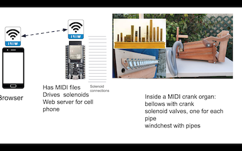

# crank-organ
MIDI based crank organ software and hardware

# Overview

This animation shows how a crank organ with MIDI control works:

The crank moves the bellows. The air is pumped into a reservoir, which connects to the windchest with the pipes. A single pipe is shown, but usually a crank organ has anywhere between 15 and 100 or more pipes. Under the foot of the pipe is a electromagnetical valve (a solenoid valve). The microcontroller stores a MIDI files that have the exact time each note starts and stops, and energizes the solenoid through a driver (a electrical current amplifier). The solenoid opens the airflow at the foot of the pipe, air enters the pipe and vibrates, producing sound. 

This repository has a complete hardware and software solution for these devices of mechanical music. This diagram shows how this system works:

The microcontroller stores the MIDI files with the tunes and also has a web server for the cell phone (or a tablet, or PC). On the cell phone a browser such as Chrome or Firefox is used to select the MIDI files that are going to be played. Once a setlist or a tune have been selected, the microcontroller plays the files.

Please note that you really don't need a cell phone or tablet to perform: If you define a setlist, you just turn on the microcontroller and start going. You'll only need a cell phone during performance if you want to change the order of the setlist.

No special application is needed on the cell phone. Just a standard web browser like Firefox or Chrome.

The microcontroller used is a ESP32-S3. It has about 26 pins available to manage pipes and peripherals, simplifying enormously the electronics for a 20 note organ. It also manages touch pads,counters/encoders, lots of RAM and flash at a very low battery load, so I think it is a good choice for a microcontroller.  With the available I2C capabilities, the ESP32-S3 could manage many (hundreds?) of pipes.

The repository describes the complete solution:
* hardware schematics
* list of materials
* instructions on how to build the hardware
* complete software (open source) written in a high level language: MicroPython
* a easy installation procedure for the software (no programming skills necessary)
* ready to use configuration files for common crank organ setups

There are many places on internet to describe how to build a crank organ, how to design and cut the pipes, make bellows, windchests, etc.  That description is not part of this repository.

Please post an github issue for any question you might have. Please star this repository if you like what you have seen.

## How is this solution used?

Once the hardware is built (see hardware plans in the doc-hardware folder), install the software, and copy your MIDI files to the microcontroller via WiFi or USB (See software documentation for detailed instructions). You can add more information such as title, genre and lyrics to the music.

You control the order of the tunes with the cell phone. You select tunes to play by tapping on them on the tunelist page on the cell phone. This is done with a very intuitive and easy to use interface using a common browser like Chrome or Firefox. Everything is done over web pages: select a tune, control setlists, configuration, etc.

There are several ways to select tunes to be played:

The creative mode: Tap on a tune on the tunelist, and turn the crank (or touch and release the touchpad) and the tune plays. Then select the next tune, etc. You stay on the tunelist page.

The very creative mode: You can tap several tunes and queue them to play one after the other.

The diligent mode: Before a performance, you can tap several tunes and organize them into a setlist on the performance page. You save the setlist on flash to be ready for the next performance. When the performance begins, you power on the microcontroller, turn the crank (or touch and release the touchpad) and the setlist plays. No need to pull out the cell phone or to push buttons.

The diligent and flexible mode: You can modify the setlist on the fly with the performance page. You can delete or skip a tune, reorder tunes, or select a new tune and move to the top of the list, according to the audience and your wishes.

The very lazy mode: Don't use your cell phone. Don't define a setlist. Turn the microcontroller on. Turn the crank or touch the touchpad. All available tunes will be shuffled randomly and played. 

# Detailed description of software and hardware, schematics, plans

Please see [here](https://github.com/bixb922/crank-organ/blob/main/doc-software/README.md) for a detailed description of the software.

See [here](https://github.com/bixb922/crank-organ/blob/main/doc-hardware/README.md) for schematics of the hardware and detailed instructions on how to build the hardware.

This is work in progress, but I am actively using this solution on a daily basis, so I feel it is pretty stable. Please post an issue in the issue section of this repository for questions or observations.  I'll be happy to correct any problem and will try to help if there is an issue.

# To see the a demo
To see this software in operation, see a demo here: https://drehorgel.pythonanywhere.com/demo/.

This demo simulates the operation of the software in this repository closely. The pages have some guidance at the beginning.

# Folders
These are the folders in this GITHUB repository. On a cell phone, select "Browse code". On a PC or MAC just navigate to https://github.com/bixb922/crank-organ to see the folders.

| Folder     | Contents                             |
|------------|--------------------------------------|
|doc-software|[Description of the controller software.](https://github.com/bixb922/crank-organ/blob/main/doc-software/README.md) |
|doc-hardware|[Description of the controller hardware and construction plans](https://github.com/bixb922/crank-organ/blob/main/doc-hardware/README.md))|
|src| Full source code (MicroPython) |
|static| Web pages for the microcontroller (html, css, javascript)   |
|data| Pinout templates for 20, 26 and 31 note organs |
|install|Installation files                      |

# License
This license and disclaimer also covers the hardware design documents. The hardware design is part of the software published here.

Copyright (c) 2023 Hermann Paul von Borries

Permission is hereby granted, free of charge, to any person obtaining a copy
of this software and associated documentation files (the "Software"), to deal
in the Software without restriction, including without limitation the rights
to use, copy, modify, merge, publish, distribute, sublicense, and/or sell
copies of the Software, and to permit persons to whom the Software is
furnished to do so, subject to the following conditions:

The above copyright notice and this permission notice shall be included in all
copies or substantial portions of the Software.

THE SOFTWARE AND DESIGN IS PROVIDED "AS IS", WITHOUT WARRANTY OF ANY KIND, EXPRESS OR
IMPLIED, INCLUDING BUT NOT LIMITED TO THE WARRANTIES OF MERCHANTABILITY,
FITNESS FOR A PARTICULAR PURPOSE AND NONINFRINGEMENT. IN NO EVENT SHALL THE
AUTHORS OR COPYRIGHT HOLDERS BE LIABLE FOR ANY CLAIM, DAMAGES OR OTHER
LIABILITY, WHETHER IN AN ACTION OF CONTRACT, TORT OR OTHERWISE, ARISING FROM,
OUT OF OR IN CONNECTION WITH THE SOFTWARE OR THE USE OR OTHER DEALINGS IN THE
SOFTWARE.

