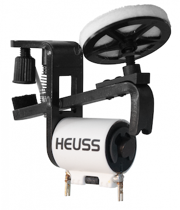
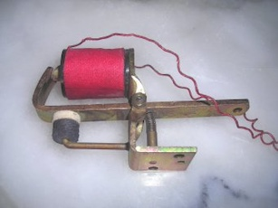
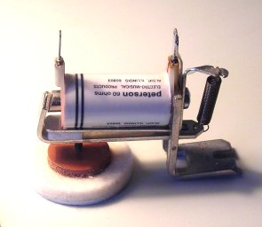
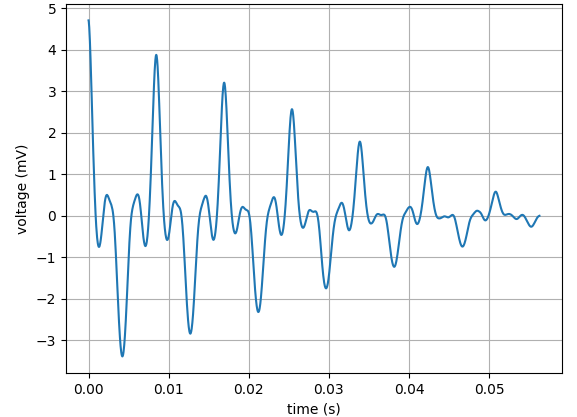
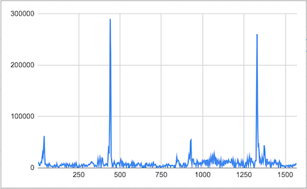

# Software design and development for the crank organ

See https://github.com/bixb922/crank-organ#1-overview for a description on how a MIDI crank organ works.

See http://www.github.com/bixb922/crank-organ for complete source of the software and hardware schematics and instructions.

See https://www.youtube.com/@bixb922 to see and hear the crank organ playing music.

See https://www.tapatalk.com/groups/buskerorgan/what-organ-plans-are-available-t38.html for a list of organ plans.

See http://drehorgel.pythonanywhere.com/iot/static/gallery.html for a photo log of the construction of my crank organ.


# Contents
1.  [General requirements](#1-general-requirements)
2.  [MIDI requirements](#2-midi-requirements)
     * [MIDI file analysis](#midi-file-analysis)
3.  [Microcontroller](#3-microcontroller)
4.  [MicroPython docs](#4-micropython-docs)
5.  [Proof of concept](#5-proof-of-concept)
6.  [Real time requirements](#6-real-time-requirements)
7.  [Web server](#7-web-server)
8.  [Asyncio](#8-asyncio)
9.  [Garbage collection](#9-garbage-collection)
10.  [Using standard MicroPython .bin images](#10-using-standard-micropython-bin-images)
11.  [Tuner](#11-tuner)
     * [Zero crossing algorithm](#zero-crossing-algorithm)
     * [FFT algorithms](#fft-algorithms)
     * [FFT implementation for the tuner](#fft-implementation-for-the-tuner)
12.  [Installation and provisioning](#12-installation-and-provisioning)
13.  [MIDI File compression](#13-midi-file-compression)
14.  [Crank sensor and ESP32 PCNT pulse counter](#14-crank-sensor-and-esp32-pcnt-pulse-counter)
15.  [Local time](#15-local-time)
16.  [Stability](#16-stability)
17.  [File manager](#17-file-manager)
18.  [Battery load measurement](#18-battery-load-measurement)
19.  [Logging](#19-logging)
20.  [Language](#20-language)
21.  [Passwords and security](#21-passwords-and-security)
22.  [A IOT crank organ](#22-a-iot-crank-organ)
23.  [Some metrics](#23-some-metrics)
24.  [About my crank organ](#24-about-my-crank-organ)
# 1. General requirements

* Invisible technology: turn the power on and turn the crank, and music starts.
* Battery operated, a battery of at most 500 grams should last at least 5 hours.
* Capabilities to define a setlist (a list of tunes to be played at a performance)
* Space to store at least 500 tunes.
* Very stable operation. It is embarrassing when the software fails while performing in front of public, isn't it?
* Low component count (i.e. easier to build the electronics).

Since this is a development without a deadline, I had the time to try out different options and to rewrite whatever part of the software I did not like, and to try out different options and features.


# 2. MIDI requirements

MIDI files are the ideal format to store music for mechanical instruments. In essence, they contain note on and note off events (i.e. events when a solenoid has to be turned on and off) and the related timing. The complete MIDI file format is much more complex than that, however. But in a nutshell, the note on and note off events have to turn on and off the solenoid valves, and the pressurized air from the bellows will make the pipes sound.

The solenoid valves used for a crank organ can be made with solenoids, but for best result church organ valves are used, like this one:






## MIDI file analysis

MIDI files are small. Fortunately there are about one hundred MIDI files suitable for crank organ on the internet, and a bit of research yielded:
* Average size of 20 kbytes, meaning that for 500 files, 10 Mb of flash were needed, hopefully integrated in the microcontroller (i.e. no external chip). I preferred to have no moving parts like a SD card reader.
* Average number of notes on at a certain time: 3. Yes, three notes, not more than that. Organ solenoids are typically 12V 90 Ohm, so that means a power consumption of 4.8W plus 10% for the drivers = about 5.5 Watt. Hopefully the microcontroller and the rest of the electronics could consume a bit less than that.
* Typical tune length: 2 to 3 minutes, i.e. about 0.3 Watt-hours of energy per song. A 10000 mAh battery stores about 33 Wh, so a charge should last 110 songs if the microcontroller consumes little energy.

# 3. Microcontroller

CPU and RAM: I purchased some ESP32 because there were boards such as the ESP32-S3 in the product line with 16Mb and 8Mb of RAM. Compared to previous projects I did, I thought a 240 Mhz CPU should be more than enough and 8Mb of RAM seems a luxury compared to some other projects I remember. But a Proof of Concept (POC) was needed.

I did not want to use a small display, keyboard nor buttons. A display is either large and power hungry or the display is small and does not allow you to scroll text and select a tune among several hundreds of MIDI files. So what I wanted as a display/keyboard is basically what a cell phone, tablet or PC offers. One less component to purchase, but the microcontroller needs to have WiFi. A browser is the ideal tool to communicate with the microcontroller, since no extra software is needed on the cell phone, so no worries there about a future software update on the cell phone.


The ESP32 and ESP32-S3 have plenty of GPIO pins, so there is the possibility to connect I2C port expanders such as the MC23017, microphone, touch pad, etc.

Compared with a Raspberry Pi, the ESP32 consumed much less energy. At the time I did the selection, there were no other affordable microcontrollers with 16Mb of flash, large RAM and WiFi available.

So now I had to read a bit about MicroPython and make a POC.


# 4. MicroPython docs

I started with MicroPython 1.17. At that time the MicroPython documentation was, well... scarce? scant? terse? Today the documentation
has gotten considerably better. I am one of those people who reads the documentation over and over before starting to do something. Aspects that irked a bit at that time:
* I could see no "getting started" for a beginner at that time.
* When mpremote appeared, it took me about a year until I found out how to copy a whole folder (you
have to append / to the folder names, but I have a Windows background where you don't do that. Now the mpremote examples show that)
* I found out about some modules like ```shutil``` in the micropython-lib only after about 2 years of development. There are so many useful modules buried in micropython-lib. 
* The header of the asyncio chapter in MicroPython is "asyncio — asynchronous I/O scheduler".
Well, I was not planning to do any asynchronous I/O , so I thought "This is not for me" (and much later I learned I was *very* wrong). Then I found out about generators and coroutines, and for microcontroller programming, this is what I always
wanted to have when programming in C, so that was a big win. After about 6 months into the project, I stumbled on Peter Hinch's asyncio tutorials, and that definitely
changed everything. I rewrote what I had at that time, and now the software runs as a collection of about 25 asyncio tasks. I believe that without asyncio it is considerably more difficult tackle a larger development. 
* It was very difficult to find some data like "How much RAM did I have on each port after MicroPython started?" or "How much flash is left free after MicroPython is installed on each microcontroller?" which are important to select a microcontroller.
* Port specific information was minimal. For example, on the ESP32, the interrupts are soft interrupts. That's documented. File and WiFi operations can make sure that interrupts are lost. That part is not so clear in the docs, but made several developments unfasible.
* Another port specific information that was important, is that there are some parameters when mounting the VFS LittleFS2 file system (readsize and progsize, see https://docs.micropython.org/en/latest/library/vfs.html). Changing these parameters gave a significant performance improvement reading and writing files, to the point that the software had to be redesigned to take advantage of this. Boot time dropped from 15 seconds to 5 seconds. Reading large JSON files (e.g. 100 kb) now became quite feasible. It would be interesting to have that information in the documentation.

As said before, most of these issues have long been addressed in the MicroPython docs.

# 5. Proof of concept

I wanted to establish early on if MicroPython + ESP32 was a viable solution. 
I wrote a MIDI file parser as a POC. It parses the full MIDI file standard. The resulting source code is here: https://www.github.com/bixb922/umidiparser

These were the results:
* The parser needed about 20 kb RAM of footprint. I thought at that time that the complete software might be about 5 times larger, so I planned to have 100 kb of RAM at least. At that point in time, the ESP32 had about 120 kb of RAM free, so there seemed to be room for growth. Configuration and management function were not neede while playing MIDI files, so with all needed overhead, the software should be able to work with that amount of RAM. Well, there also was the ESP32-S3 N16N8 with 8 Mb of RAM, so it seemed that RAM was no issue.
* With garbage collection, I learned (by experimenting) I should plan for using about, say, 80% of the memory to leave enough RAM to counter defragmentation.
* Processing of a MIDI event took less than 1 msec. That meant that for typical MIDI files,
the MIDI parser would occupy around 3% of the CPU. I had expected MIDI file processing to be much slower, so this was a very promising result. Still 97% of the CPU is free for other stuff.
* It helped to learn about how to optimize MicroPython. I rewrote several parts and measured CPU and memory usage, to compare different programming techniques. One interesting conclusion was that generators are very useful to get well structured and speedy code, since most state variables go away and the state variables that still are required are local variables that allow fast access and good readability of the code,

# 6. Real time requirements

As in many applications, real time here means to get responses on time for certain events.

The most time critical task in this software is to play the MIDI events on time. Delays tend to
accumulate, so if each delay makes the music late, this will be perceived as sluggishness.
So I changed the MIDI file parser to yield MIDI events on absolute time, counting time from the start 
of the MIDI file and not relying on the relative time to the previous event (the normal processing of MIDI files uses relative time). This ensures that a delay of one note does not affect any future note, i.e. the 
musical tempo is kept. That difference can be perceived, and it made the impact of any delay easier to tolerate.

If only one note is slightly delayed, that does not matter much. A delay of that
type is perceived as "laid back"  or "unhurried" instead of "sluggish", and since the tempo is kept, the musical effect is minor.

Chords can play 4 or 5 notes simultaneously (6 or more note chords are not that common). At 1 msec per event, if the rest of the software to be developed added another 1 or
2 milliseconds, then a chord is initiated well under 10 milliseconds. That delay is so low that is very
difficult to hear.

So this convinced me to go ahead with MicroPython and the ESP32 processors.

Parsing a MIDI file took about 3% of the CPU usage at 240 Mhz. If the complete process should take 3 times that, it's still about 10% of the CPU that is used. This also was a good sign. (That prediction was quite close to the mark, final CPU usage is around that value while playing back music).

Parsing a MIDI file took about 20 to 25 kb of RAM. With about 100 kb of RAM available on the ESP32, this aspect was also promising. Although I was planning to have tuning and configuration capabilites, these did not need to be loaded into RAM simultaneously with playback and setlist management.

# 7. Web server

The first component to add was a web server to be able to create a setlist and to see the current tune that is performing.

I first selected tinyweb (https://github.com/belyalov/tinyweb) but then switched to Microdot (https://github.com/miguelgrinberg/microdot).
I believe both work well, but Microdot continued to evolve, so that was an easy decision.

Early tests showed that the web services could be written so they don't interfere with the music.
Well, you are not supposed to reconfigure the microcontroller while turning the crank, right?
All functions needed while playing music had to be written so they take less than 10 or 20 msec
to have no impact on the music.

Things learned:
* Use Javascript on the browser to format pages. Don't format/render pages on the server, it uses too much memory. The client (cell phone, tablet or PC) has *considerably* faster CPU and more RAM to render pages than the microcontroller.
* Once a page is loaded, send JSON back and forth between MicroPython and Javascript (REST). JSON is natural for both languages. Traffic is very low, and rendering is fast. Formatting of the JSON is done in Javascript in the browser. To refresh a page, it needs not to be reloaded.
* Use Javascript ```fetch``` to get the JSON data. I like the ```await fetch()``` variant more than ```.then()```, because I feel code is more readable and similar to Python's ```await```.
* The flash memory is for music. So instead of images, emojis were used. They take only a very few bytes, i.e. fast to load. There are emojis for just about everything.
* .html, .js and .css files can be compressed with gzip on the PC. Microdot has an option to indicate that it is serving compressed files, and browsers decompress on the fly. This saves flash space, pages are sent faster, and there is no CPU overhead on the microcontroller.
* Use CSS to have much shorter web pages
* It can be useful to store static resources on the web instead of microcontroller flash. Case in point: graphic Javascript libraries.  There even is a Javascript MIDI player! And no need to install on the microcontroller.
* Enable file caching in the browser, for example for html, js, jpg, png, css files, and for json files that do not change.
* Store persistent data in JSON files. If the browser needs that information, it can request the file directly.

If JSON files shipped to the browser change unfrequently, they can be cached in some of the storages that Javascript offers. I use ```sessionStorage.setItem()``` and ```sessionStorage.getItem()``` to cache these JSON files. 

With these techniques, web response is quite fast, and the load on the microcontroller is minimal.

# 8. Asyncio
```asyncio``` was crucial for this development to be scalable.

Some asyncio tasks:
* The setlist and music playback
* Battery monitor
* Power off/idle monitor
* Touchpad driver
* Crank driver (2 tasks)
* WiFi STA and AP mode supervision. The software allows you to connect to a WiFi router (i.e. home router and cell phone hotspot when not at home), so this task switches between WiFi stations when necessary.
* Register button driver (one task for each button)
* Onboard WS2812 (neopixel) led blinking
* Background garbage collector
* Mini scheduler, see below
* Some tasks at startup that can be delayed a bit to have the system up  faster (get time from NTP  server, purge history, etc)

Advantages:
* Asyncio is about responsiveness. The tasks have to yield frequently.
* [aioprof](https://gitlab.com/alelec/aioprof/-/raw/main/aioprof.py) is a excellent tool to measure responsiveness of tasks and to find tasks that do not yield in time (Thanks to @alelec)
* Most or all of the state of asyncio routines can be kept in local variables. This improves both modularity and performance.
* Many state variables just disappear. For example:
```py
    initialized = False
    while True:
        if not initialized:
            await driver.init()
            initialized = True
        do stuff
```
can be rewritten as:
```py
    await driver.init()
    while True:
        do stuff
```
If an asyncio routine is complex, it usually can be restructured for example as several asyncio tasks. As a result, asyncio code can be much cleaner, shorter and more readable than other code (Python encourages readable code for good reasons!)

Thanks to Peter Hinch's for his tutorial on asyncio on https://github.com/peterhinch/micropython-async/blob/master/v3/docs/TUTORIAL.md

# 9. Garbage collection
On the ESP32, garbage collection took less than 10 msec, and so it was not a big problem for MIDI file playback.

On the ESP32-S3, with 8Mb RAM, formerly MicroPython had very long garbage collection times (150 milliseconds was not uncommon). With the latest versions the garbage collection time is around 50 milliseconds for a 300 kb RAM usage.

But 50 to 150 milliseconds delay while playing music is a show stopper (literally). Garbage collection could be disabled during the 2 to 6 minutes that a tune lasts, but then thought this as too risky, if it kicks in while the music is still playing, there will be an awkward pause.

But there is a nice solution for this.

In MIDI files, the time to the next note is always known. Sometimes notes occur simultaneously or with a few milliseconds between, but a short look at MIDI files shows that there are usually pauses between MIDI events that take 300 to 800 milliseconds. At most, you have to wait 1 or 2 seconds, even with tunes with many notes, and a interval like that appears (The Flight of the Bumblebee comes to mind here).

So there are lots and lots of wait times when playing music. The RequestSlice() object was developed and it is used like this example:
```py
    async with RequestSlice("I want some CPU", 200 ):
        ... do something that may need up to 200 millisec of CPU
```
This queues the code enclosed in the ```async with``` block and waits until its completion. The music playback knows beforehand the time until the next MIDI event and keeps informing the RequestSlice scheduler about these wait times. The RequestSlice object then schedules any waiting task that fits into the available MIDI wait time. 

The code for this *very* primitive scheduler is here https://github.com/bixb922/crank-organ/blob/main/src/scheduler.py

It is a bit simple since there is only one high priority task (music playback) and in each pause, only one task can be scheduled. But even so, this avoids MIDI event delays very nicely.

Also, on the ESP32 family, ```asyncio.sleep_ms()``` is rather imprecise. It is not feasible to use ```asyncio.sleep_ms()``` to wait for the next MIDI event. So RequestSlice() relinquishes control to asyncio 20 milliseconds *before* the wait time expires, and then waits the remainder with time.sleep_us(). This does not impair asyncio responsiveness, and as a result, the time jitter of MIDI events is around 1 millisecond and 5 milliseconds worst case. This jitter is plainly in the realm of the unnoticeable. 


# 10. Using standard MicroPython .bin images

Early on I decided that, if possible, I wanted to use  MicroPython images with no added C code, avoiding generating a .bin file. I have generated .bin files, no problem with that. But I wanted to avoid that task and the dependency on tool chains. For example ESP-IDF changes frequently. And I was not thrilled to write C code.

When PR#8381 becomes available, for sure I'll put all code and HTML pages into ROMFS.

# 11. Tuner

For me, tuning an instrument is crucial. A slightly untuned instrument produces a "rough" or "uneven" sound. If definitely out of tune, the result is ... cringeworthy. There are some that find an out of tune crank organ quaint (whatever that means), I'm not one of them.

Tuning has to be checked about once a month or if temperature changes. 

The microcontroller in the crank organ has a microphone to record the sound. The correct frequency for each MIDI note is known, and the real frequency has to be measured. This is: you mark a note on a note list on the browser, turn the crank, the note will sound, the sound is then recorded on the ESP32 and can be analyzed.

For instruments such as the guitar or the piano, the frequency when playing a note is very stable. Wind instruments such as clarinet or trumpet have an oscillating frequency, because human breath just cannot be controlled that well, and even the heart beat causes a slight frequency deviation.

A crank organ also has a varying frequency. The frequency depends ever so slightly on pressure, and the pressure varies a bit while the turning crank and with the opening and closing of the different bellows valves. 

That means that for a good tuning, a full crank revolution (about 1 second) of signal has to be analyzed and averaged.

That means that the tuning algorithm need not be extremely fast. Signal acquisition for one note will take at least 1 or 2 seconds anyhow (one  or two crank revolution), so adding 0.5 seconds for the frequency analysis algorithm is no big deal.

Precision: for two notes played in succession, the JND (just noticeable difference) is about 10 cents (1 cent = hundredth of a semitone) or 0.5% of the frequency ([see](https://forums.steinberg.net/t/just-noticeable-difference-engineering-concepts/95538)). (When two notes are played together, a lower difference could be heard sensing the frequency difference as beating).
That means that the frequency measurement needs to be a bit more precise than 10 cents. It seemed reasonable to aim for about 1 cent of error, although 2 or 3 cents of error in the frequency measurement would still be enough.

## Zero crossing algorithm

A very fast algorithm is zero crossing (https://en.wikipedia.org/wiki/Zero-crossing_rate). It is very fast, since it only needs count transitions from negative to positive of a signal.

The algorithm is:
* Wait for the signal to have enough amplitude
* Find the first crossing
* Interpolate between adjacent samples to get the start time
* Count a good number crossings
* Interpolate between adjacent samples to get the last time
* Calculate frequency = crossings/(last time - start time)


The limits for this algorithm to work well are:
* At least about 10 periods of signal. This is not much, at 100 Hz for a low note this means 0.1 seconds of sampling, at 2500 Hz for a high note it means less than 5 milliseconds of sampling.
* At least 4 samples per period to detect the zero crossing well, a better rate is 10 samples per period for the interpolation to work well.
best to sample a bit faster than that.

The algorithm is quite fast. Signal acquisition was done with the built-in ADC of the ESP32. The ADC conversion need not be very precise. An autocorrelation was written in viper mode to filter noise (https://github.com/bixb922/viper-examples/blob/main/signal_processing/autocorrelation.py). Processing times for a 1024 element signal array were:
* 34 milliseconds to normalize the signal
* 20 milliseconds for a low pass filter
* 58 milliseconds for autocorrelation to filter noise
* 3 milliseconds zero detection
* Total of 115 milliseconds

This processing time is more than adequate. Precision is better than the goal of 1 cent.

Unfortunately the algorithm did not work well for bass notes (below 150 Hz). The type of pipes (called bourdon or closed pipes) used in the crank organ have a very strong third harmonic. For bass notes, the third harmonic was so strong compared to the fundamental, that there were additional crossings per cycle, and that did not allow the use of zero crossing as an algorithm any more. Probably the frequency response of the microphone also attenuated the low signals, making the effect even stronger.

Here is the waveform of a bass note. You can see that for each cycle, there is an additional dip of the signal that crosses the zero line two times more:



This graph shows the signal after autocorrelation to get rid of noise. 

Although a low pass filter helped a bit, sometimes the frequency measurements were off. More tinkering might do it, but it was time to test another algorithm: FFT (https://en.wikipedia.org/wiki/Fast_Fourier_transform) or rather its digital counterpart DFT. FFT makes low pass filters and noise filtering obsolete.

## FFT algorithms

This is a sample FFT of a 440Hz note on the crank organ. X-axis is frequency, y-axis is intensity. There is the peak for the fundamental at 440 Hz and the peak for the third harmonic at 1320 Hz. The peak for the second harmonic is barely noticeable at 880 Hz.



There were several alternatives tested as FFT algorithms:
* fft_arrays: In place FFT with arrays: https://rosettacode.org/wiki/Fast_Fourier_transform#C changing line for line from C to Python and using lists instead of arrays to enable the use of complex arithmetic. For this purpose, it turned out that MicroPython lists are almost as fast as arrays.
* fft_int: FFT with integers, which makes sense because the original signals are integers between 0 and 4096, and MicroPython Viper mode can be used. See here for the code https://github.com/bixb922/viper-examples/blob/main/signal_processing/fft_int.py
* fft_compact: A very compact algorithm from https://rosettacode.org/wiki/Fast_Fourier_transform#Python
* ```ulab``` was not tried (https://github.com/v923z/micropython-ulab) nor other C based FFT implementations (no C here!).
* Results were compared to CPython/numpy to ascertain the algorithm worked.

These are some results, running the algorithm with frequencies in the needed range, generating a random distribution of frequencies, using a buffer of 1024 elements.

Algorithm       | average error (cents) | max error (cents) | time millisec |
|-------------|-------------------|-----------|----------|
fft_arrays   |              0.45  |     0.79  |  114.6   |
fft_int      |              0.43  |     1.24  |   33.0   |
fft_compact  |              1.04  |     8.66  |  321.2   |

Finally, the fft_arrays (implemented with MicroPython lists) option was selected. It has a low error rate and the speed was adequate.
The FFT code used can be seen here https://github.com/bixb922/crank-organ/blob/main/src/fft_arrays.py.

The Goertzel algorithm could have been an option, but it has to be called several times around the center frequency to find the maximum. It would have to be called more than 10 times in search of the maximum frequency, and with that number of calls, performance would be similar or lower compared to FFT.


## FFT implementation for the tuner

Using FFT (Fast Fourier Transform) allows to get rid of the autocorrelation and low pass filter, and the signal from the microphone can be fed directly to the FFT. A buffer of 1024 samples was sufficient to get a precision detecting the correct frequency within about 1 cent. To have a sharper maximum, a Hann window to the signal was applied prior to FFT (https://en.wikipedia.org/wiki/Hann_function).

The sample rate was calculated for each frequency so that both the fundamental and the third harmonic were visible in the FFT to avoid aliasing between fundamental and third harmonic. Since the nominal frequency was known in advance, the sample rate could be calculated for each note. This means that each frequency is sampled at a different rate. The number of samples per period must be greater than 6 times the frequency for that reason.

The built-in ADC was used, adding a frequency dependent delay using ```time.ticks_us()``` and ```time.ticks_diff()``` between each sample. Using the ```@native``` decorator, sampling can go up to 30,000 samples per second. The highest frequency of the crank organ is an Eb7 at about 2500 Hz, so up to 12 samples per period could be obtained even for the highest frequency.

Once the FFT is done, the software searches for the peak frequency in the range of the nominal frequency plus/minus 3 semitones, and interpolates the maximum with a second degree polynomial using 3 points around the maximum. Since the sampling rate is adjusted for each frequency, the peak always appears in the same region of the spectrum, allowing a local search for a few frequencies. Also, in the search range there will be only one peak.

This search of the maximum can be done nicely with Python functions max() and index() which are very fast.(Once the maximum frequency is located, three points of the spectrum are used to interpolate the maximum with a quadratic polynomial. 

At the required sample rate, the lowest note at 116 Hz needs about 1.3 seconds of signal and the highest note Eb7 at about 2500 Hz needs about 60 milliseconds of signal. For low notes, 3 measurements are done, taking about 4 seconds, and for high notes, 10 measurements are donde, taking about 1.5 second.

The result of the tuning is stored on flash, so the tuning can be reviewed and resumed at any time:


So now the software assists rather well with tuning. The "Tune all" button can be run every once in a while (i.e. when temperature changes), and then the worst offenders can be tuned instead of trying to perfect the tuning for each and every note. 

And no need for C.

# 12. Installation and provisioning

I do not believe there will be many users for this software. Building a crank organ takes several months or even years for an amateur, and there are not many people who do this. There also are few professional builders worldwide.

Nevertheless I wanted some easy way to distribute a complete system with MicroPython code, HTML, .js, .css and .json files, but I did not find an easy way to make a installation kit. Generating an image did not allow to include non-python files easily. ```mpremote``` now has a copy -r that could do it, but when I tried this back at the time I really could not make cp -r work on my Windows PC.

With PR#8381 there will be a very useful effort under way to allow distributing a complete image with files. @glenn20 also has a nice tool [mp-image-tool-esp32](https://github.com/glenn20/mp-image-tool-esp32) now also allows to add files.

So I wrote a small utility program, see https://www.github.com/bixb922/freezefs to make a self-extractable file archive to distribute and update code, HTML, js and data files. It compresses a folder and subfolders into a ```.py``` file. If run with ```mpremote run``` it will extract the files to their destination folders on the microcontroller. It also allows to freeze a complete file system into the MicroPython image and mount that partition as part of the regulsar file system, but I finally did not use that optionr.

Once installed, the user has to configure the system, but to connect, the user needs WiFi. So the system starts up WiFi in AP mode to enable initial configuration. The user can connect with the initial node name and configure what's needed.

The AP mode is also the fallback in case there is no WiFi station available. This might happen while performing when the cell phone fails. If idle, the AP mode is disabled after a few minutes to save battery energy.


# 13. MIDI File compression

MIDI files for the crank organ take about 20 kb on average. On a ESP32-S3 N16R8 (i.e. 16 Mb of flash) MicroPython leaves about 14 Mb free, that means about 700 files.

MIDI files can be very efficient in size if they use a feature called "running status". Also, all MIDI meta messages that carry text information are not strictly needed. Thus, all MIDI files are preprocessed on the PC to maximize running status usage and to strip all text events away. For many MIDI files, this reduced file size by 70% of the original size.

After that optimization, MIDI files are compressed before uploading and decompressed before each use. Decompressing is done with the standard ```deflate``` module included and delays start for about 0.3 seconds. No big deal, but now the flash space allows for 1800 files. When measured in 4096 byte blocks, file size drops to 40% of uncompressed size.

If I can make a new MIDI file every few days, I have space for some decades of arrangements of new tunes :stuck_out_tongue_winking_eye: 

# 14. Crank sensor and ESP32 PCNT pulse counter

One of the important sensors in the crank organ is the crank sensor. It serves two purposes:
* Starting the crank starts the MIDI file playback automatically. It is also nice to have the MIDI file playback pause when the crank is stopped.
* The crank speed can influence the MIDI file playback. This is very realistic, since mechanical crank organs obviously work this way. However, this feature is also a bit annoying, since a higher crank speed is needed in some passages where more air is needed but higher music tempo is not. On the other hand, turning faster and slower adds some expression control to the music. Some crank organ players with mechanical organs found this feature an absolute must!

Having no time constraint, I tested many sensors, [see this document here](https://github.com/bixb922/crank-organ/blob/main/doc-hardware/crank-sensor.md)

So I hooked up a MicroPython interrupt routine and recorded the time between interrupts, discarding very short times for debouncing. With this data it was easy to average some measurements to get a revolutions per second reading for the crank movement.

This worked well on the breadboard with a test program, but did not work when integrated in the crank organ. A sensor with around 12 slots provides enough precision, and that means about one interrupt every 60 to 80 milliseconds. But on the ESP32 family, interrupts are soft interrupts and when WiFi is active, interrupts can frequently be lost. File operations also can cause loss of interrupts, but by design, there are no file operations during music playback. Anyhow, that makes the interrupts useless to determine crank speed. It provides enough support to sense if the crank is turning or not.

This means I had to look for another way to measure crank sensor pulses.

The ESP32 family has a very nice Pulse Count (PCNT) hardware in the CPU, which is a good solution to these problems.
There are several PRs to add PCNT support to MicroPython. PR #12346 is the latest and seems to be in the queue to be merged. But I did not want to have a custom image with that PR, depending on ESP-IDF versions and other nitty-gritties. As said, I prefer MicroPython stock .bin images.

A PCNT driver entirely in MicroPython was written. It uses the ESP32's registers directly, bypassing ESP-IDF. No interrupts are needed, but the PCNT count has to be read before it overflows. In practice, since the overflow is around 32000 counts, and since it is safe to assume that it is possible to read the counter several times a second, this allows to count pulse rates of at least 100 kHz, more than enough for this purpose.

The MicroPython PCNT driver is [here](https://github.com/bixb922/crank-organ/blob/main/src/pcnt.py). The driver works with the ```Counter``` and ```Encoder``` classes of PR#12346, so should that PR be merged some day, I can drop the driver. The driver can work for both a plain ESP32 and a ESP32-S3 (the ESP32 register definitions are commented).

This allows the use of an industrial quadrature encoder of 200 pulses per revolution. It also could be, say, 5000 pulses per second, but there is no gain. In 2 phase mode, this yields 400 pulses per second. Reading 10 times a second with asyncio has very low overhead and yields a precision of around 2% for each reading, which is enough for the task.

L
# 15. Local time

Having the local time is really not needed for this application, but it is nice to record the date and time tunes have been played, and the date when MIDI files are updated to know which tunes are new.

So an asyncio task to get NTP time in the background was added. But time zone information was also needed. Requirements:
* No user actions nor user configuration
* Works immediately after boot
* Precision is not vital, for example, it doesn't need to be perfect for handling time zone transitions (transitions occur deep in the night anyhow, and who plays the crank organ at 11pm or 2am?).

Options are:
* Use some of the existing time zone modules in Python. But most of these need the user to configure the time zone.
* Use a daily call to ```worldtimeapi.org```. This was implemented, but in spite of calling at most once a day, there were lots of rejected calls. This is a free service, and the response was spotty.

So finally the current time offset is obtained with Javascript in the browser. The Javascript code in the browser sends this offset to the microcontroller with a web service. This ensures that when the user interacts, the time zone is always set correctly. This service is called when loading the ```common.js``` file. Since this file is cached, the service is called only every 10 minutes or so (low overhead). The microcontroller also stores the time zone offset in flash to be used after reboot. The same call also sets the UTC time, in case NTP does not respond.


# 16. Stability

I think this is a non-trivial Python software, and it probably uses a high percentage of features and libraries.

Compared to C, debugging was considerably easier. Almost all errors were solid, asyncio leaves little room for race conditions, no runaway pointers, no accidental memory alteration, no memory leaks, no "frozen" microcontroller, so finding bugs was very fast.

MicroPython was very stable. I recall only one MicroPython crash which is long fixed. It involved cancelling a task that had a pending exception, and could be bypassed using a global asyncio error handler and/or using gather instead of await.

Also, exception handling and other techniques allow to write resilient code. Musicians know that software and electronics on stage must be very sturdy and resist some abuse. A failure is, well, embarrassing and literally a show stopper. Things that are easy to add in MicroPython:
* Exception handling, trying to correct whatever is failing, to keep things running
* Several alternatives for each critical functions. For example, to start a tune, the crank sensor is used. Should that not work, there is a touchpad sensor. And as a third option, a page on the browser allows you to start a tune. (Came in handy on a certain performance I remember.)
* Another critical failure point: If the cell phone configured for WiFi connection fails, any cell phone can connect to AP mode. Or, if that's not an option, you turn the crank, and tunes are shuffled and music plays. (I have already used that, it saved the day!)
* Etc.

# 17. File manager

Initially software and MIDI files were uploaded with pyboard.py until I discovered that mpremote existed. Then a FTP daemon (https://github.com/robert-hh/FTP-Server-for-ESP8266-ESP32-and-PYBD) and a FileZilla on Mac was used. This worked well but required another piece of software on the PC/Mac and wasn't very easy to use.

So finally a small dedicated file manager was developed. You can traverse the file tree, upload software and MIDI files, and view or download files. When uploading, the file manager sorts the file automatically to the folder where it belongs, based on type. This is very fast and easy to use.

The file manager also handles compressed (.gz) and uncompressed files as equivalent. Same with  .mpy and .py files, keeping the newest of the pair.

# 18. Battery load measurement

Here is a description of the [battery requirements and selection](/doc-hardware/battery.md).

The user interface shows battery usage.

To achieve this, there must be a calibration. The user must signal when the battery has just been recharged (100%) and when it is empty. It's best to do this two or three times.

With that information, the software makes a correlation with the solenoid use and uptime and calculates coefficients of a two variable linear model to  calculate battery usage. The variables are the operating time (time the microcontroller was on) and the solenoid operating time (time the solenoids were on). This uses a small matrix math module (in MicroPython) that can invert and transpose and do a the two-variable linear regression.

This allows a quite precise indicator of battery load, without using an additional circuit such as a INA220 or similar. 

# 19. Logging

There is a logging module available in MicroPython. As far as I could see, that had some inconveniences:
* The log file is not closed/flushed automatically (that was could be added to add)
* The log files may fill the available flash if an error loop occurs, blocking the software

The logger could be extended to handle that, but a new module (https://github.com/bixb922/crank-organ/tree/main/src/minilog.py) was written. Now it opens a new logfile when the current logfile exceeds some size (say: 20 kb) and purges old logfiles, keeping, for example, 5 log files. 

No way of filling up flash if there is a error loop.

# 20. Language

The user interface is available in spanish, german and english, selected by the browser language. The language phrase substitutions are done all in Javascript.  Only pages that are for daily use have translation. This is not the textbook way of handling internationalization, but the strategy makes translation feasible for a microcontroller. See https://github.com/bixb922/crank-organ/blob/main/static/translations.js.


# 21. Passwords and security

For this application, maybe the only asset that needs some protection are the WiFi passwords. There is really no secure way to protect passwords on the ESP32 on a DEVKITC board, since USB always is available. But AES is installed in MicroPython, so a AES key is generated in NVS storage with the TRNG provided via MicroPython, and the WiFi keys ciphered with that key. To hack the keys, code needs to be injected into the microcontroller, but if that's possible, security is breached anyhow. The files on the microcontroller are visible with the file manager, but the AES keys are not stored in any file. Modifying the configuration requires the user password.

Microdot also allows to manage cookies and this enables to manage sessions and a user password to enable password authorization for changing configuration.

I wouldn't put this microcontroller with it's web server directly on the internet. The goal is to connect to a home network (relatively protected behind a router) or to a cell phone hotspot (behind the firewall the cell phone provides).

# 22. A IOT crank organ

I believe this is the only IOT crank organ there is. There is a module that connects to a website. Spectators can scan a QR code, have access to the tune list, and can request tunes. The microcontroller polls this website and adds the request to the setlist automatically, showing the name of the spectator.

Tune list and lyrics are also synchronized to this web site. The current tune, with info and lyrics, can be seen in real time on the internet.

# 23. Some metrics

The code size is about 5400 lines of MicroPython code (not counting Microdot), plus about 20 HTML pages with 3200 lines of Javascript.

Allocated RAM is around 300 kbytes. Compiled code (.mpy files) measure about 120 kb.

Average CPU usage while playing music is about 10% of a 240Mhz ESP32-S3 with PSRAM.

Start up time is about 5 seconds until ready to play, a time very adequate for this applicaation. Includes the time to load ```mpy``` modules from flash. ALl modules are loaded at start up. If ```.py``` files are used instead of ```.mpy``` files, start up time increases about 1 second (i.e. MicroPython is rather fast to compile). The load time could be shortened loading non-critical modules on demand.


# 24. About my crank organ

My crank organ has 48 notes. The crank moves the bellows for the air pressure. There are 48 pipes, each for one note, 35 bourdon pipes and 13 piccolo pipes. Under each pipe is a solenoid valve that opens and closes the air flow.

The electronics comprise a hand-soldered board for the ESP32-S3, microphone on a breakout board and 3 hand-soldered boards for the MCP23017 plus the ULN2008 drivers. The MCP23017 boards are inside each windchest, connected via cables that carry I2C signals, 3.3V and 13.5V.

The crank organ was designed and built by me. Most of the musical arrangements and adaptations were made by my family.

Well, that's the whole point, isn't it? To make some music for our enjoyment.


