# MIDI controller hardware a crank organ

This document describes a MIDI controller architecture for crank organs. I am updating this document several times a month, so please come back to see more details. If you need clarification, please post an issue or open a discussion item in this repository.

Contents:
* Controller for a 20 note crank organ. This design allows to control up to 20 solenoid valves, like the 90 Ohm valves typically used in organs. It is as simple as it can get.
* Controller for more valves (virtually no limit). This design uses a central microcontroller and valve controller boards in the windchests. 

# Controller for a  20 note crank organ. 
20 voice organs are very common, so here is a design for these:

The goals for the design are:
* Handle standard 90 Ohm organ valve solenoids
* Very simple electronics, easy to build
* Readily available components
* Few but high level components for good reliability
* Able to control 20 notes without further hardware
* Able to play standard MIDI files
* Controllable from any smartphone, tablet or PC
* But: the controller must be able to work without smartphone, tablet or PC
* Able to control solenoid based 90 Ohm valves
* Low power consumption: consumes 0.3W in addition to the power needed for the solenoids

See also the software section for a description of the program that matches the hardware.

# Table of contents
[Description](#description)
[The ESP32-S3](#the-esp32-s3)
[Circuit diagram](#circuit-diagram)
[Board assembly](#board-assembly)
[Circuit for more than 20 Valves](#circuit-for-more-than-20-valves)
[Microphone](#microphone)
[Crank rotation sensor](#crank-rotation-sensor)
[registers][#registers]
[Copyright and license](#copyright-and-license)

# Description
The controller is based on a ESP32-S3 microcontroller. I am using readily available N8R8 (8 MB flash, 8MB RAM) or N16R8 (16 MB flash, 8 MB RAM) models. 8 MB RAM is much more than needed (the application uses about 350 kb of RAM, plus the RAM needed by MicroPython).

8 MB flash means 6 Mb available for use. Assuming a MIDI file has about 20 kb average, this means 300 MIDI files. 16 MB means 14 Mb free, and 700 MIDI files. With compression (see the software section) this goes up to 700 average MIDI files for 8Mb flash and 1800 average MIDI files for 16Mb flash. Although it is possible to add a SD card (and the software supports that well), this should be enough for most purposes. An SD card also means more complexity and more points of failure (the card may come loose), so the SD card reader is really optional.

The ESP32-S3 also has enough GPIO ports to drive 20 solenoids, and hundreds of solenoids with a port expander such as a MCP23017. It has WiFi to connect a smartphone, tablet or PC for control. The capacity is large enough to put a web server in the ESP32-S3, so control is be done with a standard browser. No special app is needed on the PC or smartphone.

The 90 Ohm solenoid valves are driven by a ULN2803A or TBD62003A 7-circuit transistor array. Both ICs have 7 channels (i.e. can drive 7 solenoids). Both are plug compatible. The TBD62003A has a lower voltage drop when operating, so more voltage is available for the solenoids. 

The solenoids are driven by 12V, so this circuit needs a 12V or higher power supply. Some options are:
* 10 AA rechargable NiMH batteries (add a fuse)
* A USB power bank with PD or QC capabilities and a PD/QC decoy trigger set to coax 12V out of the batteries.
* A lithium battery with protections, fuses and BMS
* A 18V tool battery (add a fuse)

For some 12V valves, feeding with 12V can be insufficient, since 0.7V gets lost in the ULN2003A drivers. 

See the manufacturer specs, if they state that the voltage that reach the solenoids must be 12V, you need to use a DC-DC boost converter to get the right voltage. For smaller pipes, 12V may be enough. For bass pipes with foot pipe diameters of 14mm and more, at 10cmH2O or more of pressure, a higher voltage may be necessary. In my case, I use 13.5V.

For example, Peterson Valve (www.petersonemp.com) have a specification sheet here: http://www.petersonemp.com/manuals/manuals/Pipe%20Valves/Pipe%20Valve%20performance%20chart%20revised%2008-14-2014.pdf

The instructions there are for a large organ, such as a church organ, but they state that the valve voltage should be 14V, minus 1 to 2V drop at the switching system = 12V at the valve.

Although MIDI file and software update can be done via WiFi using the software provided, on some occasions, at least initially, it may be of interest to connect a PC or MAC via USB to the USB input of the ESP32-S3. There are several ways to do that safely:
* Remove the ESP32-S3 from the sockets and then plug in
* Put the diode in the circuit as shown in the circuit diagram
* Some ESP32-S3 boards have the diode built in, so it is redundant.

The diode is necessary to prevent current from a USB connection (PC tp ESP32-S3) to flow back into the 5V DC-DC regulator.

# The ESP32-S3
I have tested this setup with some ESP32-S3 boards similar a  ESP32-DEVKITC-1 V1.1 board, although schematics differ. Specifications: quad Flash (QD flash) and Octal SPIRAM (OT PSRAM). These boards are sold as "N16R8" models. The boards have 44 pins.

On Octal Flash boards such as N16R8V, less than 20 pins are available. From the Espressif documents: "In module variants that have embedded OSPI PSRAM, i.e., that embed ESP32-S3R8, pins IO35, IO36, and IO37 connect to the OSPI PSRAM and are not available for other uses."

MicroPython images for N8R8 boards can be downloaded directly from the MicroPython site. For N16R8 boards, there is a tool to resize the MicroPython image, no need to generate new images. See the software installation.

# Circuit diagram 

This is the circuit diagram:

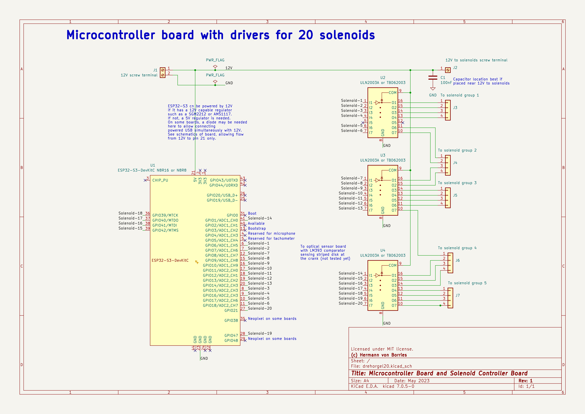

# Board assembly
## Materials needed
For main board
* ESP32-S3 N8R8 or N16R8 DEVKIT-C on 44 pin board
* Two 22 pin contacts to be able to interchange ESP32-S3.
* Three ULN2003A (7 channel darlington transistor array) or three TBD62003APG (7 channel DMOS transistor array) (see note below)
* One 1N4007 or 1N5819 diode (see note below)
* One 100nF capacitor
* One 12V to 5V 2A DC-DC buck converter
* One 7x9 cm solderable bread board
* Six 3xScrew terminals plus one 2x screw terminal for the solenoids
* One 3x screw terminal for 12V and ground
* One 2x screw terminal for touch pad and one available port
* Eight 3x screw terminals 
* 22AWG color wire  (24AWG will also do)
* Four 4-40 hex separators and corresponding screws to fix circuit to board
* One Pin 1x40 Single Row Male 2.54mm Breakable Pin Header
* One Metallic drawer knob as touch pad

Batteries see section below [batteries](#battery-assembly)

Of course, you will need solenoid valves. These are used in big organs (church organs).

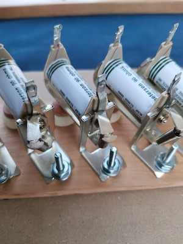

### ESP32-S3 N8R8 or N16R8 DEVKIT-C on 44 pin board
Here is an example:

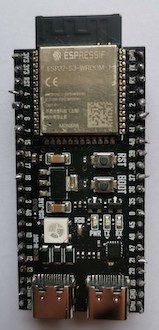 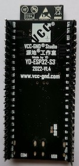

Make sure it is a N8R8 or N16R8 board. N8R8V (with a V in the designator) have less pins available.

"No brand name" boards are of mixed quality, you can be very lucky and get a perfect one or have bad luck. For example, I have some no-name brand boards that have a unreliable WiFi, a problem I haven't seen with brand name boards. Here is a list of brands that I have seen recommended in the MicroPython forums, in no particular order:
* Unexpected Maker
* WeAct Studio
* Lolin Wemos
* M5Stack
* Lilygo/TTGO
* Seeed Studio
* DFRobot
* Sparkfun
* AdaFruit
* Olimex
* Waveshare

If you know another good quality brand, please post in the discussion forums to add that here.

It's better to get a board where the schematic diagram is available online. This aids to solve some questions about the board, namely if a diode is necessary (see section on diodes below) or where the RGB LED (neopixel) is connected, if any.

Some ESP32-S3 have a AMS1117 or SGM2212 regulator to get the voltage at the 5V pin down to the necessary 3.3V. These regulators accept 12V as input and regulate that down to 3.3V, so no additional voltage regulator would be needed.  See the data sheet or ask the vendor to verify if the ESP32-S3 allows to be connected to 12V, in that case the 12V to 5V regulator might not be necessary.

### Two 22 pin contacts for ESP32-S3
These are useful to be able to remove or replace the ESP32-S3. I don't believe the ESP32-S3 fails a lot, I haven't seen it fail, but it is nice to know that it's easy to change.

A better description is "2.54mm single row Female 2~40P PCB socket pin header"

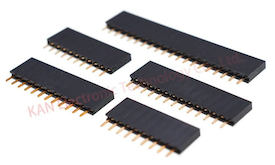

### ULN2003A or TBD62003A

This is a standard current amplifier, that takes the signal from the GPIO ports and sources enough current to move solenoids at 12V.

ULN and TBD are plug compatible. The TBD leaves more voltage available for the solenoids. When on, the TBD takes away about 0.3V while the ULN2003A may take away up to 1V from the 12V. That means a bit more power consumption for the TBD compared to the ULN, but  better behaviour if battery level is low. Solenoids will have a bit more of force to move too.

ULN2003A and TBD62003A have flyback diodes included (also called kickback diodes). No need to worry about these. 

Both IC can handle 90 Ohm 12V solenoids well. If the resistance is lower, you'd have to check the data sheets for the individual and combined current limit.

### 1N4007 or 1N5822 diode
When connecting a PC to the USB port of the ESP32-S3, this diode will prevent the current flowing back into the 12V to 5V DC-DC regulator.

Almost any diode rated 1A average current and 20V minimum will do. Schottky diodes such as the 1N5822 are slightly more appropriate for this function. Zener diodes must not be used here.  The average current is at most 150mA, the suggested diodes work well with 1A average.

*Important note on the diode*

Some ESP32-S3 boards have this diode on the board. If that is the case, *don't* add this diode, since this may lower input voltage too much.

This is an example of the schematic that has the needed diodes that prevent current from the USB connectors to leak back to the 5V supply. The relevant diodes are D1 and D7,

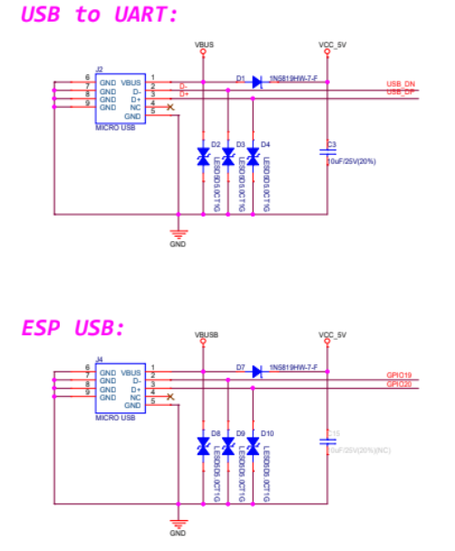

If these diodes are present, don't add another diode but connect the 5V output of the DC-DC regulator directly to the 5V terminal of the ESP32-S3.

### 12V to 5V 2A DC-DC buck converter
Current rating should be 2A but can be higher. These circuits are called "buck converter" or DC-DC regulators. What matters it that they should convert 12V DC to 5V DC. Conversion efficiency should be published by the vendor, and be better than 90%.

This is a possiblity:

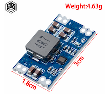

You might wish to have a fancier converter with leds or voltage display, that's fine.

Some ESP32-S3 boards may accept 12V input. See the specs provided by the vendor, or ask the vendor. In that case, the 5V terminal of the ESP32-S3 could go directly to the 12V source and no DC-DC converter is needed. A diode may or may not be necessary, see the section on the diode.

### 7x9 cm solderable bread board
This is probably the smallest size where these components will fit. If you use a larger DC-DC converter you might consider using a larger board.

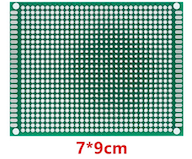

### Screw terminals
Can be any size, but 3x and 2x are convenient to combine.

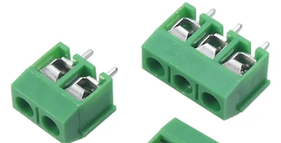

The 12V-GND terminal should be 3x or 4x, one for 12V input, one for 12V to solenoids, one for ground.

The terminal for the wire to the touchpad could be 1x, but it can be convenient to leave another GPIO port avalable on a 2x terminal for some future use.

The 20 terminals for the 20 solenoids can be any combination of 3x or 2x. I depicted six 3x and one 2x = 20 terminals.

### Color wire
It's useful to have different color wire. To wire the board, 22AWG is nice, 24AWG also works.

To connect to 12V it's better to have cable (with many strands) since cable resists some bending and moving. Red for positive, black or blue for negative.

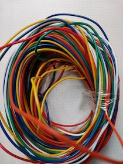

### 4-40 screws 

These are standoff screws to screw the board to a wooden base. Drill small holes for the hex part, put some epoxy on it, and you can screw the microcontroller board with the nuts to the wooden base.

### Pin 1x40 Single Row Male 2.54mm Breakable Pin Header

These are useful to make connectors. In our case, breaking off 4 connectors of 2 pins each makes a good separator and connector for the 5V DC-DC converter. The converter can also be soldered, but must be isolated on its underside to avoid contacts.

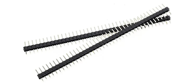

### Metallic drawer knob as touch pad
The ESP32-S3 has the capability to sense hand touch. The connection is extremely simple. The touch pad itself is any metal disk or object, for example a metallic drawer knob:

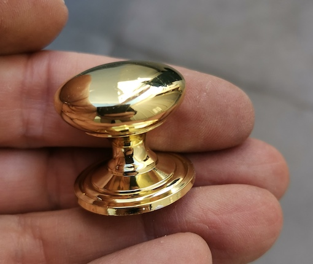

Connect with one single wire to the GPIO input port of the ESP32-S3, for example at GPIO 5.

The touchpad is the simplest way to order the microcontroller to start a tune. Tunes are queued, either in previously prepared setlist, or by tapping the tune on the tunelist page. They are left waiting until any of these event happen:

* You touch and release the touchpad
* If a crank rotation sensor is installed, the crank starts
* The "start" button on the performance page is pressed (needs cell phone)

When the crank rotation sensor is installed, that's certainly the best option of all.

## Tools

Some of the tools that come in handy are:

* Small solder iron, soldering supplies such as solder paste/flux, solder, solder iron sponge. PLease see a tutorial, be careful, you can get burns. Wash your hands after handling solder.
* Small wire cutter and insulation stripping tool (able to handle 22 or 24AWG wire)
* Multitester with continuity sensor (beep sensor)
* Small crocodile clip to free a hand while using the multitester
* Small plier (noose plier) to bend small wires

## Assembly

If not familiar with soldering, search internet for video or instructions on soldering a circuit board.

The general sequence is as follows
* Position all connectors and circuits. Verify.
* Insert the ESP32-S3 to its connectors and then solder at least the 2 or 3 contacts on each connector.
* Solder one pin of each component, so it does not all out.
* Insert wires. 
* Verify
* Solder all wires from the underside
* Clean
* Verify all points against all points for continuity with the multitester in Continuity Test mode (beep for continuity).

### Position connectors 
Insert connectors. Mark position of the ESP32-S3 and the direction (12V to 5V) of the DC-DC voltage regulator. Mark the screw terminal where the touchpad goes (black on the photo). I used blue tape.

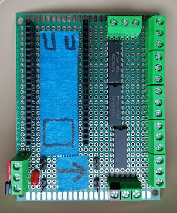

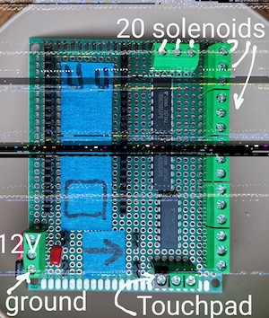

Mark 12V (red) and ground (black) on power input. This is empty insulator stuck with a bit of epoxy glue.

### Insert IC (integrated circuits) and components

Insert diode, if necessary. The side without the ring mark goes to the (+) output of the DC-DC converter. The side with the ring mark goes to the 5V pin of the ESP32-S3.

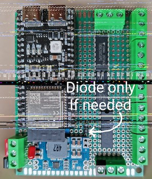

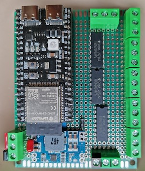

### Solder pins for the ICs

Fix the 22 pin connectors: First plug in the ESP32-S3 to keep the connectors straight and at the correct distance, then solder one pin first, check position, then solder the rest.

Same way with all components: solder one pin first, verify position, then solder rest.

### Pin numbering
The pin numbers for the ULN2803A are as follows. The TBD62003APG is identical.

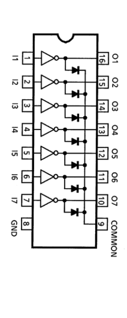

### Insert the wires

It's useful to use colors:
* Insert wires for ground (black or blue)
* Insert wires for 12V (red)
* Insert wires for 5V (orange)
* Insert wires for GPIO to ULN2803 input (white)
* Insert wires for ULN2803 output to screw terminals (yellow)

Here is an example of how to insert the wires, seen from above and from underside

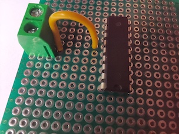 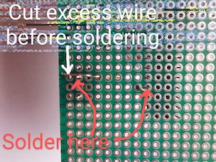

The wires for GPIO pins of the opposite side of the ESP32-S3 are best put below the board. However, soldering should be still from below, use a U-bend like this for these wires:

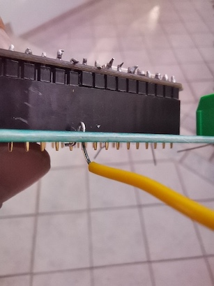

For the ESP32-S3, pin numbering is not very useful since the GPIO numbers are printed on the board next to the pins. The pinout may vary board by board, so the GPIO numbers are the safest way to connect.

### Wires for ground
Connect the power input screw terminal marked black (ground) with the ground (-) IN terminal of the DC-DC converter.

Connect that to:
* Pin 8 "GND" of the three ULN2803A
* To two pins market GND of the ESP32-S3 (any two)

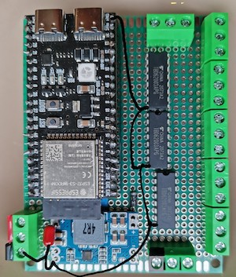

### Wires for 12V and 5V
Join both 12V screw terminals, one of the 100nF capacitor wires with the (+) IN terminal of the DC-DC converter.

Connect that to the three ULN2803A at pin 9 (COMMON).

If using a diode: Connect the side of the diode without the ring to the (+) OUT pin of the DC-DC converter. Connect the side with the ring of the diode to the 5V terminal of the ESP32-S3.

If not using a diode: Connect the (+) OUT pin of the DC-DC converter to the 5V terminal of the ESP32-S3.

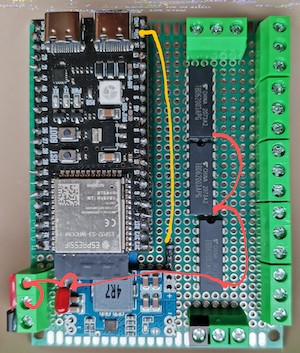

### Wire from GPIO to touchpad screw terminal

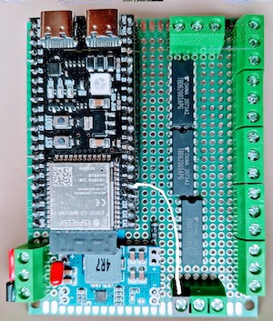

### Wires from GPIO to ULN2803 input

Connect each of the GPIO ports to one input of the ULN2803As.
The GPIO ports to connect are:

6,7,15,16,17,18,8,9,10,11,12,13,14
1,42,51,40,39,47,21

The order written above is probably the order the GPIO pins are on the board. First line: left side, second line: right side Any order is ok, the final setting is configured by software.

The input ports of the ULN2803A are the pins 1 to 7. One pin is left without connection.

It may be easier to wire the pins of the left side of the ESP32-S3 from the underside.

The order is not particularly important since the MIDI to solenoid assignment can be set later with the software configuration. However, it is important that the designated GPIO pins are used, and wired to pins 1 to 7 of the ULN2803A.

White are the contacts that have to be connected for GPIO to ULN2803A connection. Yellow are the output wires from the ULN2803A to the screw terminals.

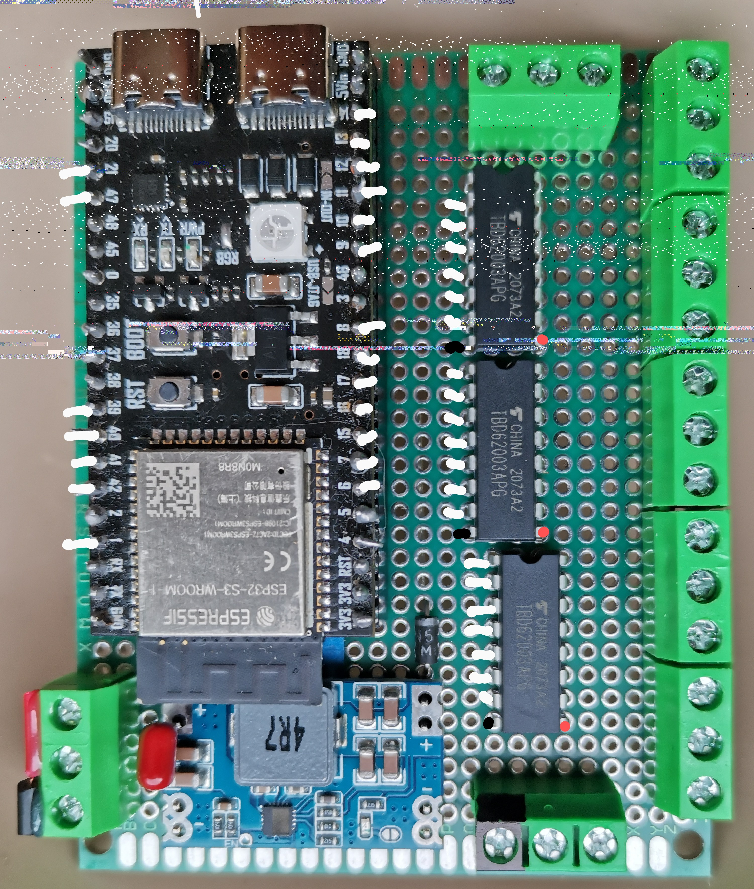

In the picture above, I did not draw the complete wires, only the endpoints.

The wires on the right side of the ESP32-S3 are connected to GPIO 5, 6, 7, 15, 16, 17, 18, 8, 9, 10, 11, 12, 13, 14.

The wires from the left side of the ESP32-S3 to the ULN2803A, namely GPIO ports 1, 39, 40, 41, 42, 47 and 21 are best connected from the underside.

### Wires for ULN2803 output to solenoid screw terminals

Wire each output port (except the one unused output) to a screw terminal. The output ports are pins 10 to 16 of the ULN2803A.

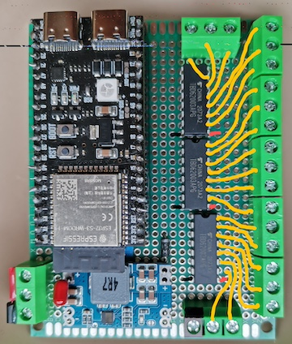

### Solder the wires

Check the wires again before soldering.

It's easiest if all soldering is done from the underside as noted above. Leave the wires short but sufficient to have good solder flow that covers underside pin and wire. 

My soldering skills and equipment are both clearly below average, but it works, The solder adheres well to both cable and pin, but there are small drops of excess solder. I am sure your work will be better.

Adjacent pins (such as the 12V connector pins and capacitor) can be connected with a bit of solder lead on the underside, no wire.

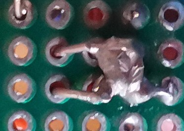

### Clean
Remove excess flux and bits of solder lead with an old toothbrush.

### Inspect
See if there are excess bits of solder. Check if there are unwanted bridges. Check all wires to see if some wire is still loose.

## Testing
Use multitester with continuity test to test all pins and contacts against all other. For example: Put one probe of the multitester on the 12V connector screw and check with all screw connectors and with visible all IC contacts (ULN2003A, ESP32-S3, capacitor, diode, 12V to solenoids) to see that only the wanted contacts are connected. Now proceed to the ground screw terminal and proceed the same way, etc.

## Connect the solenoids

Connect the solenoids. One pole of each solenoid go to the screw terminal (the colored wires on the photo below) the other pole of the solenoid goes to the 12V screw terminal (the red wire on the photo below). It does not matter which side goes to 12V.

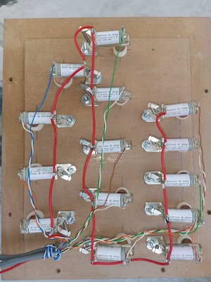

Plug the USB connector of the ESP32-S3 to a PC. The ESP32-S3 should have some leds that turn on or flash.

## Test with the provided software
At this point the standard software should be loaded. The pinout page has a test button that will test each solenoid based on the GPIO port input there. Check that the GPIO port numbers are correct. You should hear each solenoid move.

Once all solenoids move, the hardware should be considered ready. 

Probably some solenoids may be switched. If that is the case, it's perhaps easiest to correct the GPIO to MIDI assignment on the pinout page instead of switching the connections on the controller board.

## Microcontroller board inside the windchest

For short and tidy cabling, the microcontroller board can be inside the windchest.

It's rarely necessary to access the USB port. However, it may be better to connect a USB-C to USB-C female to male cable to the USB input of the ESP32-S3 and leave the female connector visible and sealed around with epoxy on the outside of the windchest. That allows to connect a PC anytime to the ESP32-S3.

For this configuration, it's advisable to have some sort of voltage indicator connected to the battery pack, to see load status. There are small and cheap three wire voltmeters available such as this one:

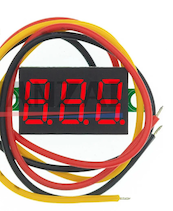

## Battery assembly

Always use batteries with an appropriate fuse, normally a 3 Ampere fuse. There is danger of burns or fire if you don't use a fuse.

There are many options for batteries. See [here](battery.md) for a writeup on battery options.

 I´ll describe here a battery pack based on 10 AA NiMH rechargeable batteries, because it is very simple. Materials needed are:

* Battery holder for 10 AA batteries
* 10 AA NiMH rechargable batteries
* Red and black cable (red for positive, black for negative)
* Some kind of on-off switch
* 3A fuse with inline fuse holder. The fuse has to go immediately next to the positive (red) wire of the battery holder, i.e. "first thing" connected
* Male/female 12V plug
* (and a AA Battery charger)

Please use a fuse.  Use an appropriate BMS with protections for rechargeable batteries. A short circuit or overcharging may cause injury or fire (I know, I am repeating myself).

It's safest to connect this way:

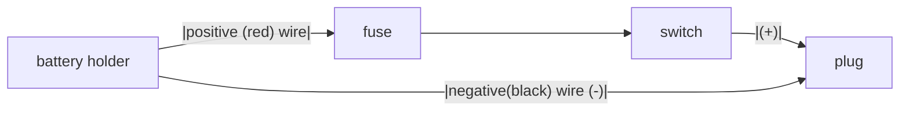

## A battery circuit for testing
For testing and development I am using this setup. You may choose a prettier switch,, but this works. The red wire has the inline fuse.

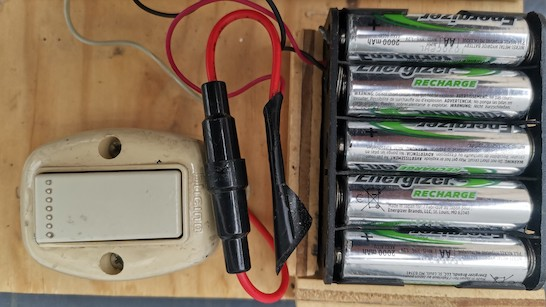

## Can the microcontroller be installed inside the windchest?

This is certainly an attractive option. Only 12V needs to be fed into the windchest (only two wires). The solenoid wires are hidden inside the windchest, it's rather neat.

In this case, it is advisable to connect a standard USB-C male to USB-C female cable to the USB port of the ESP32-S3 and expose that throgh a hole in the windchest to be able to service the ESP32-S3 without disassembling the windchest. Most software updates can be done via WiFi, so this will be used only once in a while.

The microcontroller board usually has some leds, it's calming to see the leds are blinking because then we know that the board is working. If inside a windchest, it's best to use a 5V DC-DC converter with a led or display to know that the batteries are working.

# Circuit for more than 20 valves
This circuit uses a ESP32-S3  board as central controller, I2C bus as communication and MCP23017 port expanders to provide 16 solenoid drivers each,

The schematic for a microcontroller and the MCP23017 controller is as follows.

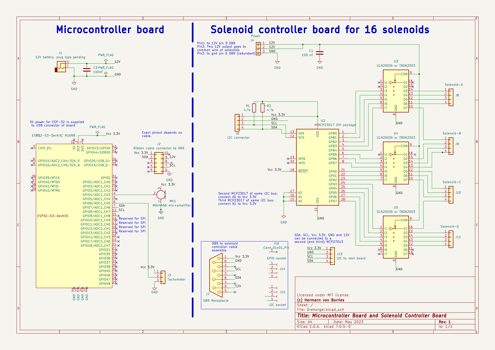

This is a photo of one controller boards I made. The 4 pin connector at the upper left is the I2C bus connector. The screw terminals at the bottom are for 12V and GND respectively. The 4 pin terminal at the upper left is for I2C, both with cables to the DB9 male on the windchest. The 4 pin terminals at the right are for the solenoid cable. (I also connected 2 GPIOs for a total of 18 solenoids.)

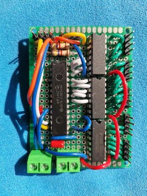

Outside view of windchest with the DB9 male:

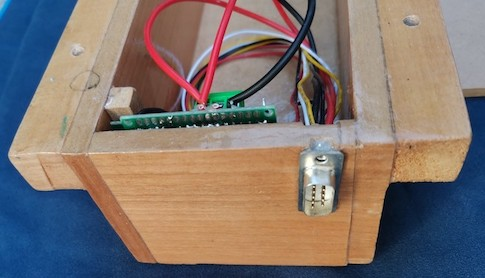

The MCP23017 controllers can be wired point to point (one controller per I2C bus) to the microcontroller. The only limit here is the number of pins, but any pair of available GPIO pins can control a board.

Another way to wire the MCP23017 controller boards is "daisy chain" (two or three controllers on the same bus). For example, a windchest with 32 pipes could have two controllers on the same bus. In this case, each MCP23017 has to have a different address, see note on A0-A2 pins in the drawing.

## Wiring from the microcontroller to the MCP23017 boards
This is the cable used to connect the main controller board to the MCP23017 controller:

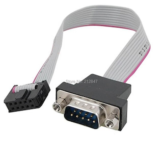

These can be had in various lengths, 30 cm to 100 cm. It is not advisable to use cables much longer than 1m, since I2C is not suitable for very long cables.

I put a DB9 male connector on the outside of the windchest, so once the chest is closed, it's easy to connect the microcontroller. DB9 connectors are very sturdy and have low contact resistance.

It is also possible to use standard DB9 cables used for RS232 transmission. However, the connection is a bit trickier since some of the cables are crossed. Flat cables are also easier to conceal. However if you are comfortable with the wiring diagram of a RS232 cable, this is certainly a good option from the electrical point of view. You can also solder the microcontroller side of the cable on the microcontroller board, instead of using a 10 pin head connector.

## Microcontroller for I2C control
The board again is very simple, only the ESP32-S3 and connectors. Here the first board I built, before putting in the cables. There are two 10 pin headers for the DB9 ribbon cables, one 4 pin header for the crank sensor or touchpad and another one for the microphone.

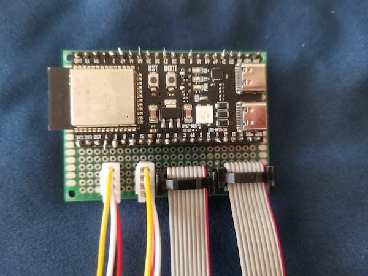

Once wired I found it too cramped but it works well:

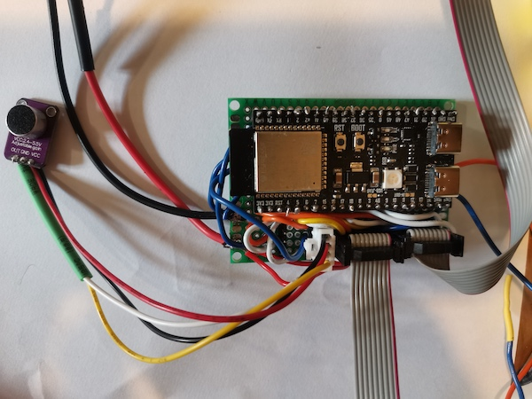

The 12V to 5V DC-DC converter is not on board, this is not very convenient.

## Second version
The second version has the the 12V to 5V DC-DC convertor on board, plus the connectors:
* 3 connectors for DB9 ribbon cables for 3 I2C buses, for a total of 48 solenoids. 
* Connector for microphone
* Connector for crank rotation sensor
* 2x screw terminal for 12V and ground.

# Microphone
The software allows to connect a microphonefor tuning. You have to turn the crank. The software opens the valve of each pipe, plays a note and measures amplitude and frequency. This is stored on flash for later reference and shown graphically on a browser page.

Any small microphone with amplifier will do. It has to operate with 3.3V and have 3 pins: ground, output and Vcc. Vcc goes to 3.3V, ground to ground, and microphone output to a GPIO pin on the ESP32-S3, for example pin 4.

This board is one example MAX4466 Electret Microphone Amplifier Module, adjustable gain:

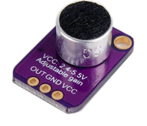

There are microphones with automatic volume control. These do not allow to measure volume.

It's probably easiest to solder the microphone pins on the board, since the microcontroller will be very near the organ anyhow

# Crank rotation sensor
The software (and the ESP32-S3) currently support connecting a crank rotation sensor, both to start the tune when the crank starts to turn, and (optionally) to change the playback speed based on crank rotation.

A simple sensor could be this optical sensor with a slotted disk cut of wood or 3mm MDF:

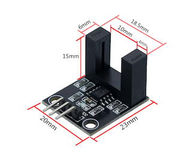

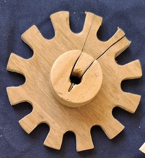

This is a simple solution, well suited to detect start/stop of the crank motion. This solution is not suitable if the tempo must follow the crank, because it is rather imprecise when used with the hardware PCNT pulse counter module of the ESP32-S3.

A good solution for the crank can be achieved with this type of sensor:

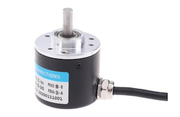

I used model E38S6G5-200B-G24N which is a optical incremental rotary encoder that generates 200 pulses per revolution. It must be powered with a voltage greater than 5V (for example 6 to 24V) and has two open collector outputs A and B that can go directly to GPIO pins of the ESP32-S3. "Open collector" means that the output acts as switch and do not output a voltage that could burn the GPIO pins. The software configures the pins with a internal pull-up resistor to source the open collector. For me, this setup worked well.

200 pulses per revolution is enough precision. The pulses are fed the PCNT (hardware pulse count unit) of the ESP32-S3. The CPU itself is not involved in counting pulses. This means, a 1000 or 5000 pulses/revolution counter will also work well, there is no significant advantage however. Since the pulse counter reads rising and falling edges, 200 pulses nominal will generate about 400 to 500 pulses/revolution. The software reads this 10 times a second, giving nominal values around 50 per reading, so the measurement error is at around 2%, which is by far precise enough for the purpose.

The PCNT unit of the ESP32-S3 will count positive in one direction and negative in the other direction. This gives the advantage that small pendulum movements or vibrations of the crank are netted out even before reading the value. After that netting, however, the software takes the absolute value so the crank can be turned either direction (which is a nice thing to avoid getting tired).

The PCNT unit also has a debouncing filter, which the software enables. All in all, I could not see artifacts or errors in the counting with this kind of sensor.

I used two printer GT2 timing pulleys and a printer timing belt   of the type use with 3D printers. I used a belt 6mm wide and 138mm long, GT2 meaning: 2mm pitch. The length is up to you depending on the space you have for the sensor. There are pulleys of different numbers of teeth, but a 1:1 transmission is ok, nothing more fancy needed here.

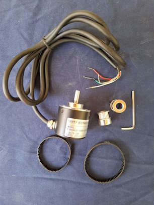

The sensor has 5 contacts:
* 0V (zero volts), goes to GND of the ESP32-S3
* A and B outputs go to GPIO pins of the ESP32-S3 (MCP23017 pins are not suitable, since the pulse counter of the ESP32-S3 needs GPIO pins)
* Vcc goes to 12V
* Shield: can go to GND also.

This is how the crank sensor looks when installed:

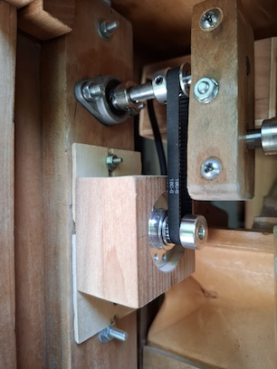

The position of the sensor can be adjusted with two bolts to a reasonable belt tension. The gears are fixed in position with hexagonal key nuts. 

I am sure there are other models of sensors out there that will also work well. The unit I show on the photo is probably one of the cheaper rotation sensors out there.

There is also the possiblity to connect a potentiometer type rotary encoder to change the playback speed:

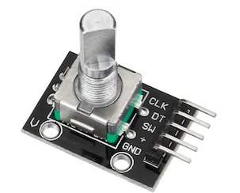

This little device is NOT meant to be connected to the crank shaft but it should be used as a manual tempo adjustment knob. I think that the crank sensor is a better option than this little device. However, the software supports it.

This is my history with crank sensors: [Crank sensor history](crank-sensor.md)

# Registers
You can connect any switch as a register, to enable/disable ranks of pipes just like a real organ.

I have used automotive headlight switches for this purpose:

The white light symbol is only printed on this switch, so it was easy to sand away with very fine paper.

One side of the switch must be connected to ground and the other side to a GPIO port. The software configures the internal pull-up resistor of the GPIO port and provides debouncing.

# Copyright and license

Hardware design files and descriptions: The files included in this repository are available under the Creative Commons License https://creativecommons.org/licenses/by-sa/4.0/deed.en

Use at your own risk. If you are not familiar with electronics and the equipment needed to do a project like the one described here, please get instruction and learn about proper use of tools, protection and safety measures.  Please use proper fuses for batteries. 

The information provided here is for general informational purposes only. All information on the Site is provided in good faith, however I make no representation or warranty of any kind, express or implied, regarding the accuracy, adequacy, validity, reliability, availability or completeness of any information on this repository. 

Software license:

(c) 2023 Hermann Paul von Borries. 

Permission is hereby granted, free of charge, to any person obtaining a copy
of this software and associated documentation files (the "Software"), to deal
in the Software without restriction, including without limitation the rights
to use, copy, modify, merge, publish, distribute, sublicense, and/or sell
copies of the Software, and to permit persons to whom the Software is
furnished to do so, subject to the following conditions:

The above copyright notice and this permission notice shall be included in all
copies or substantial portions of the Software.

THE SOFTWARE IS PROVIDED "AS IS", WITHOUT WARRANTY OF ANY KIND, EXPRESS OR
IMPLIED, INCLUDING BUT NOT LIMITED TO THE WARRANTIES OF MERCHANTABILITY,
FITNESS FOR A PARTICULAR PURPOSE AND NONINFRINGEMENT. IN NO EVENT SHALL THE
AUTHORS OR COPYRIGHT HOLDERS BE LIABLE FOR ANY CLAIM, DAMAGES OR OTHER
LIABILITY, WHETHER IN AN ACTION OF CONTRACT, TORT OR OTHERWISE, ARISING FROM,
OUT OF OR IN CONNECTION WITH THE SOFTWARE OR THE USE OR OTHER DEALINGS IN THE
SOFTWARE.