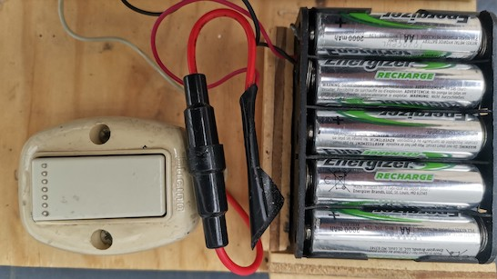
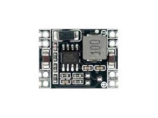
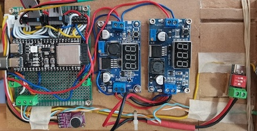

# Batteries

## Fuse and security
Always use a fuse for batteries, except when the manufacturer states clearly that the battery pack has a short circuit and overload protection.

Batteries can deliver a very high current when there is a direct connection between battery terminals. This high current can cause severe burns or fire. Fuses (or their equivalent electronic circuit) aim to prevent this.

The fuse goes between the positive (+) terminal of the battery and the switch. In this case it is a inline fuse of 5A:

Please read the battery manufacturer's safety instructions.

## Requirements
For a crank organ, looking at many MIDI files for crank organs, it seems that on the average three solenoid valves are closed. Yes, it seems a low figure, but then music consists of a lot of silence. This figure is necessary to estimate how long a battery can play.

Also, the maximum solenoid valves that are closed at any time are around 10 or 12. This figure is necessary to calculate the capacity of a fuse.

Peterson organ valves require 12V at the valve. Since the driver electronics take away a bit less than 1V (this is the collector-emmitter voltage drop of a transistor), the power source must deliver around 13V to 13.5V. More voltage can overheat the solenoid valves. See the document "Valve performance chart" here: 
http://www.petersonemp.com/manuals/manuals/Pipe%20Valves/Pipe%20Valve%20performance%20chart%20revised%2008-14-2014.pdf

Electronic circuits such as the one I propose in this repository, usually need 5V. If they tolerate 12 to 15V input, they can be connected directly to the battery. If not, a DC-DC buck converter to 5V is needed. See wiring diagram below.

With 13V at the source, a 90 Ohm solenoid valve will consume about 1,75W. This means that with an average of 3 valves on  the power consumption will be about 5,3W while playing music.

In practice, I have measured that with a 33Wh (Watt-hour) battery, about 100 to 120 tunes can be played. That means that one tune needs about 0,33 Wh. This enables to estimate the battery capacity needed. 

Commercial batteries are usually rated in mAh (milliampere-hours) or Ah (ampere hours). To convert mAh to Wh, you multiply by the voltage of the battery. For example a AA rechargable battery may be rated at 2000 mAh = 2Ah. The voltage of a battery is 1.2V, so this is equivalent to 2,4Wh for each AA battery.

For Lithium-Ion batteries, the Wh are usually calculated at 3.3V, which is what a single Li-ion battery delivers. So a 10000 mAh Li-ion battery pack will deliver 3.3*10000/1000 = 33 Watt-hours (33 Wh).

## Battery technologies

This is a rapidly evolving field. Here is a simple table. The weight is compared for 24Wh, which is enough to play about 70 or 80 tunes.

|                  | Lead acid| AA Ni-MH | LiFePo4 | Lithium-ion |
|------------------|----------|----------|----------|-------------|
| Weight for 24 Wh |  720g    | 276g     | 300g     |  290g       |
| Volts per cell   |    2V    |  1,2V   |    3,2V   |   3,3V      |
| Cells for 13V   | 7 cells=14V  |  12 cells=14,4V |    4 cells=12,8V   | 4 cells=13,2V  |

Lead-acid batteries are quite heavy. These are the batteries used in cars and motorcycles. 12V and 24V batteries are widely available. You will need a lead-acid battery charger. 

AA batteries are easily available. To recharge, you will have to take the batteries out of their battery holder and insert into a battery charger. This may be a bit of a chore. AA chargers are widely available.

LiFePo4 have a very stable voltage. Even when almost empty, the voltage does not decay much. So no voltage converter is needed for these batteries. You will need a special LiFePo4 battery charger.

Lithium-ion batteries are very lightweight, and work very well. Their voltage decays to about 3.1V per cell when almost empty. USB battery packs usually have lithium-ion batteries. A BMS is mandatory.

All rechargable batteries fail when discharged completely. The software that is available in this repository will calculate the battery level and show that on the cell phone.

## Voltage conversion
Rechargable batteries will deliver higher voltage when recently recharged, and 10 to 20% less voltage when almost empty. Search internet for "lithium-ion discharge curve".

To avoid that voltage drop, and to get always the correct voltage, you can use a circuit called "DC-DC voltage converter". There are many ready made circuits that do this. Since the output must be a odd voltage such as 13 or 13.5V, it's best to purchase a variable converter. These have a small screw or two buttons to you can adjust the output voltage. Some also have a display to show the output voltage (and even the input voltage and currents). That eases the adjustment of the voltage. Once set, you will not need to change the setting. Instead of a display, you can also use any multimeter set to DC volts.

If the battery supplies less than the 13V needed, you will need a "boost DC-DC converter" ("boost" means "raise the voltage"). If the battery supplies more than 13V, you will need a "buck DC-DC-converter".

The characteristics of the voltage converter needed to power the solenoid valves are:

| Description | DC-DC converter                                 |
|------|-------------------------------------------------|
| Type |  "buck" or "boost" depending on battery voltage |
| Input voltage range | Must include the battery voltage |
| Output voltage range | Must include the desired 13V    |
| Output current       | at least 3A, up to 5A           |
| Variable output voltage | Yes |
| Input voltage display | May be interesting to know battery state |
| Voltage display | Makes life easier |
| Efficiency | Not very relevant, most have better than 90% or 95% |
| Frequency | Not relevant, typically 100kHz to 2 MHz |
| Precision of output | Usually about 1%, not relevant |
| Overcurrent protection | Yes |
| Anti-reverse input protection | Very desirable |
| Used to charge batteries | No |

This is how a DC-DC converter looks like:

Search internet for DC-DC buck (or boost) converter with display.

The characteristics of the voltage converter needed to power the electronics with 5V are:

| Description | 5V DC-DC converter |
|------|-------------------------------------------------|
| Type |  buck converter |
| Input voltage range | Must include the battery voltage |
| Output voltage range | Fixed 5V |
| Output current | minimum 1A |
| Variable output voltage | Not necessary |
| Input voltage display | Not necessary |
| Voltage display | Not necessary |
| Efficiency | Not very relevant, most have better than 90% or 95% |
| Frequency | Not relevant, typically 100kHz to 2 MHz |
| Precision of output | Usually about 1%, not relevant |
| Overcurrent protection | Yes |
| Anti-reverse input protection | Very desirable |
| Used to charge batteries | No |

This is what a this DC-DC may look like:

LiFePO4 batteries have a very flat discharge curve. The battery voltage is fairly constant, so voltage conversion is not an issue.

## BMS: Battery Management System

Rechargable batteries must be treated well:

* Do not overcharge (i.e. turn off the charge when the battery is full)
* Do not discharge completely
* Never make a short circuit, this will likely cause fire or severe burns
* Protect the battery against high currents
* Do not charge too fast, the battery may overheat
* Some batteries need to be discharged completely before charging, if not the capacity is lowered
* All batteries have a limited life span, i.e. they resist a certain number of charge/discharge cycles
* Some batteries need a special charging curve, i.e. the charging current is different if the battery is full vs. empty

There are electronic circuits called Battery Management Systems (BMS) to protect batteries for all these cases and maximize battery lifetime. In order to avoid safety risks and to protect batteries, rechargeable batteries should be used with a BMS.

It's best to use a battery with integrated BMS, since then the manufacturer did the design to match the BMS with the battery.

## AA batteries

This is a very simple, cheap and lightweight solution.

Use two battery holders of 6 AA batteries each for a total of 12 batteries. Use Ni-MH AA batteries, they provide 1.2 volts nominal, for a total of 14.4 Volts.

Be sure to put a fuse next to the battery pack.
Put some kind of switch to turn on and off. 

See here: https://www.github.com/bixb922/crank-organ/doc-hardware section on AA batteries.

## USB battery packs

One nice option to power a crank organ is a USB battery pack, those that are used for quick charging a cell phone. The battery pack must have the QC or PD standard.

A typical power bank has 10000 mAh. That is equivalent to 33 Wh, good for playing more 100 tunes. They have a BMS built in, can be charged with a standard USB charger (the same you use for your cell phone), have short circuit, overload and battery empty protection. Most have a load indication, so you know if there is enough charge left. Some even show the percentage of charge. A 10000mAh unit weighs around 200 to 250 grams. The connectors are standard USB connectors, making cabling easy. No extra fuse is necessary.

The cons are:
* If the USB battery pack has a "off" switch, this switch may or may not work, because the battery may detect that the electronics are still consuming some current, so the battery electronics decide to continue working. To turn off the battery, you have to unplug it (I don't mind that, I even prefer that for safety).
* Some USB power packs may turn off automatically if the standby current is low. The software I describe here has a "heartbeat" function where a random valve is turned on very shortly every few seconds. The power consumption is neglible, but this keeps the battery on. The faint noise of the valves clicking also remind me that the organ is still powered on.

Many of these units are rated to deliver 22.5W or more, and that is enough to power a crank organ. To coax the USB battery pack to deliver that power, a special circuit must be used called commonly a "decoy trigger". These little circuits use the standard QC (Quick Charge) or PD (Power Delivery) standards, that can set the voltage to 12V or 18V. With these voltages, the current (amperes) is lower, so there are very little losses in the USB connectors and cables.

This is a typical decoy trigger:

The switches on this trigger allow to select the voltage. The recommended setting is 12V or 18V.

The circuit to use a USB power pack is as follows:

```mermaid
flowchart LR
UPP[USB battery pack]
DCT[decoy trigger]
DC13[13V DC-DC converter]
DC5[5V DC-DC converter]
V13[13V to circuit]
V5[5V to circuit]
GND[Ground to circuit]
UPP--USB cable-->DCT
DCT--positive/red-->DC13--positive/red-->V13
DCT--positive/red-->DC5--positive/red-->V5
DCT--negative/black-->GND
DCT--negative/black-->DC5
DCT--negative/black-->DC13
```

This is how this looks when connected:

From left to right you can see:
* Micerocontroller board. Below the board is the microphone
* 12V DC-DC boost converter
* 5V DC-DC buck converter
* At the far right: the decoy trigger, set to 12V

