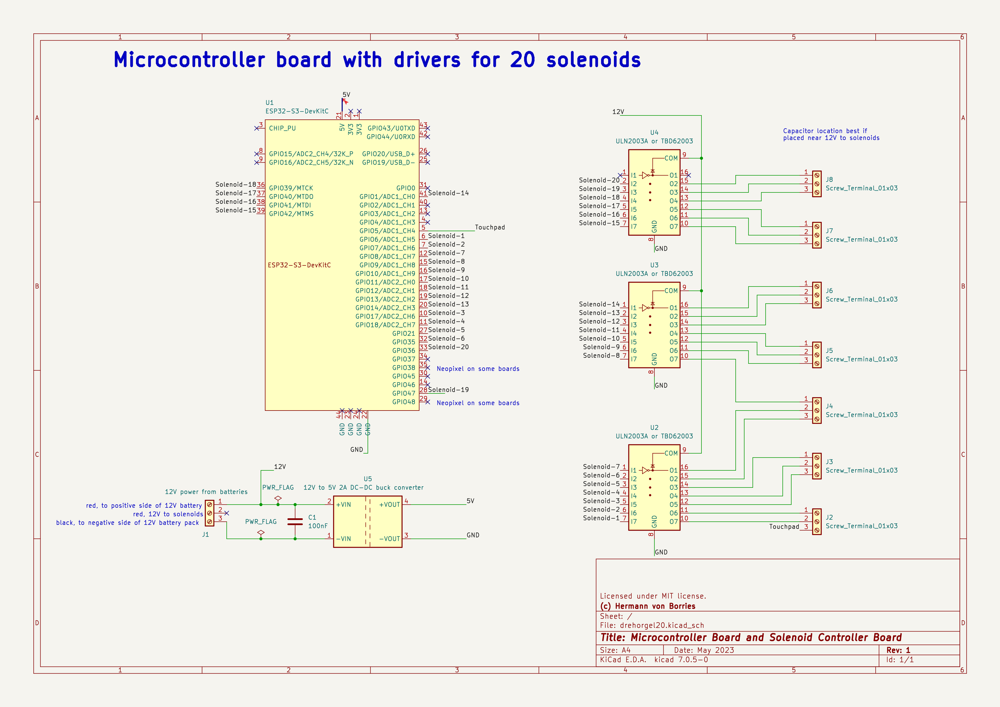

# Controller hardware for a crank organ
This document describes a controller architecture for crank organs.

# Controller for a  20 note crank organ. 
20 voice organs are very common, so here is a simple design for these:

The goals for the design are:
* Very simple electronics
* Readily available components
* Few but high level components for good reliability
* Able to control 20 notes without further hardware
* Able to play standard MIDI files
* Controllable from any smartphone, tablet or PC
* But: must be able to work without smartphone, tablet or PC
* Able to control solenoid based 90 Ohm valves

See also the software section for a MicroPython based solution.

# Description
The controller is based on a ESP32-S3 microcontroller. I am using readily available N8R8 (8 MB flash, 8MB RAM) or N16R8 (16 MB flash, 8 MB RAM) models. 8 MB RAM is much more than needed (the application uses about 150 to 200 kb).

8 MB flash means 6 Mb available for use. Assuming a MIDI file has about 20 kb average, this means 300 MIDI files. 16 MB means 14 Mb free, and 700 MIDI files. Although it is possible to add a SD card (and the software supports that well), this should be enough for most purposes. An SD card also means more complexity and more points of failure (the card may come loose), so the SD card reader is really optional.

The ESP32-S3 also has enough GPIO ports to drive 20 solenoids. It has WiFi to connect a smartphone, tablet or PC for control. The capacity is large enough to put a web server in the ESP32-S3, so control can be done with a standard browser. No special app is needed.

The 90 Ohm solenoid valves are driven by a ULN2803A or TBD62003A 7-circuit transistor array. Both ICs have 7 channels (i.e. can drive 7 solenoids). Both are plug compatible. The TBD62003A has a lower voltage drop when operating, so more voltage is available for the solenoids. 

The solenoids are driven by 12V, so this circuit needs a 12V power supply. Some options are:
* 10 AA rechargable NiMH batteries
* A USB power bank with PD or QC capabilities and a PD/QC decoy trigger set to coax 12V out of the batteries.

I'll show the circuit with 10 AA rechargeable batteries.

Some ESP32-S3 have a AMS1117 or SGM2212 regulator to get the voltage at the 5V pin down to the necessary 3.3V. These regulators accept 12V as input and regulate that down to 3.3V, so no additional voltage regulator would be needed. Some also have diodes to avoid the 5V power input to get back into the USB connections, which is useful to have both 12V and USB connected without 12V getting into the PC. Just to be on the safe side, I'll show the circuit with 12V to 5V DC-DC regulator and protection diode.

# The ESP32-S3
I have tested this with some ESP32-S3 boards similar a  ESP32-DEVKITC-1 V1.1 board, although schematics differ. Specifications: quad Flash (QD flash) and Octal SPIRAM (OT PSRAM). The boards have 44 pins.

On Octal Flash boards such as N16R8V, less than 20 pins are available. From the Espressif documents: "In module variants that have embedded OSPI PSRAM, i.e., that embed ESP32-S3R8, pins IO35, IO36, and IO37 connect to the OSPI PSRAM and are not available for other uses."

MicroPython images for N8R8 boards can be downloaded directly from the MicroPython site. At the time of this writing (2023), N16R8 still need custom generated images. This is an additional step to consider.

# Circuit diagram 

This is the circuit diagram:

# Board assembly
## Materials needed
For main bosrad
* ESP32-S3 N8R8 or N16R8 DEVKIT-C on 44 pin board
* Optional: two 22 pin contacts to be able to interchange ESP32-S3.
* 3x ULN2803A  or TBD62003APG solenoid drivers
* 1N4001 diode
* 100nF capacitor
* 12V to 5V 2A DC-DC buck converter (can be >2A)
* 7x9 cm solderable bread board
* 11 2x Screw terminals
* 22AWG color wire  (24AWG will also do)
* 4-40 hex separators and corresponding screws to fix circuit to board

Optional:
Heat shrinkable tubes, assortment 2mm to 10mm

For battery case
* Battery holder for 10 AA batteries
* 10 AA NiMH rechargable batteries
* Red and black cable
* On-off switch
* 3A fuse with inline fuse holder
* Battery charger

## Tools needed
* Small solder iron
* Wire cutter and insulation stripping tool
* Multitester with continuity sensor (beep sensor)
* Small crocodile clip

## Assembly
Search internet for video on soldering.

* Position all circuits and solder 1 pin only. Verify.
* Insert all wires, verify
* Use color wires, for example: red for 12V, orange for 5V, black or blue for ground, white for GPIO ports, yellow for solenoid ports. Cut, strip insulation, insert bend points.
* Verify
* Solder all wires
* Verify again (see testing)

## Testing
* Use multitester with continuity test to test all pins and contacts against all other. 
* Test solenoids with software provided

# Circuit for more than 20 pins
Update pending

# Copyright and license
(c) 2023 Hermann Paul von Borries. Available under MIT license.