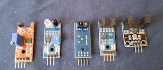
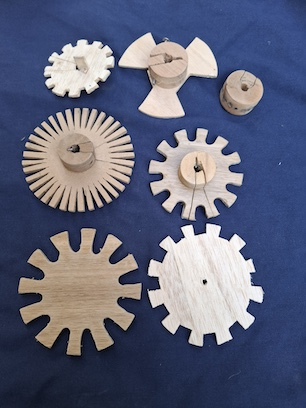
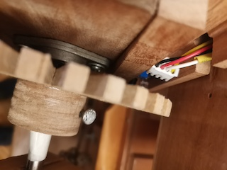
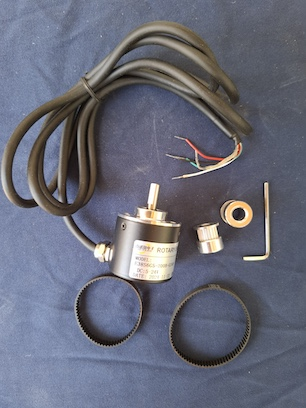
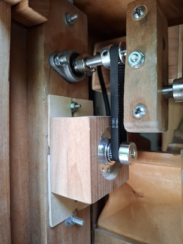
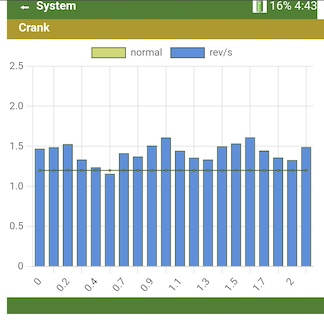
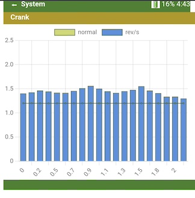
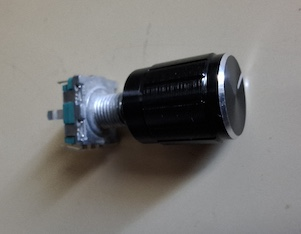
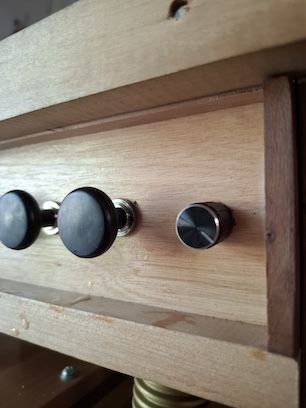

# A crank sensor journey

# Contents
1.  [Introduction](#1-introduction)
2.  [The sensors and the slotted wheels](#2-the-sensors-and-the-slotted-wheels)
3.  [Hall sensor](#3-hall-sensor)
4.  [Infrared distance sensors](#4-infrared-distance-sensors)
5.  [Optical sensors with a slot](#5-optical-sensors-with-a-slot)
6.  [Integration](#6-integration)
7.  [In search of another design](#7-in-search-of-another-design)
8.  [Incremental rotary encoder](#8-incremental-rotary-encoder)
9.  [Settings](#9-settings)
10.  [Smoothing out crank movement](#10-smoothing-out-crank-movement)
11.  [How is it to have a crank sensor in the organ?](#11-how-is-it-to-have-a-crank-sensor-in-the-organ)
12.  [A rotating encoder](#12-a-rotating-encoder)
13.  [Costs](#13-costs)
14.  [Conclusion](#14-conclusion)
15.  [Feedback](#15-feedback)
# 1. Introduction

TL;DR: read[this](README.md#9-crank-rotation-sensor).

My MIDI organ had to have a crank sensor. My main motivation was to mimic a mechanical organ very closely: start to turn the crank and the music starts. Turn slower, and the music is slower. Stop the crank, and the music stops at that point. No additional buttons, controls nor displays needed to play music.

Well, the journey was long. Over the course of the last few years I purchased some sensor boards.

# 2. The sensors and the slotted wheels

From left to right:
1. Hall effect sensor (magnetic field sensor)
2. Medium distance infrared sensor, range: 2 to 30cm
3. Short distance infrared sensor, range: 1 to 2cm
4. Small slot optical sensor, an object in the slot stops the infrared light, slot width: 0.5cm slot
5. Large slot optical sensor, same as small slot but with a 1cm slot5. 

All these sensors have a small potentiometer to adjust the level, and the boards have a comparator to produce a clean on-off signal for the microcontroller at the required 3.3V levels, but no kind of filter.

I made some slotted wheels to test the sensors. The hall effect wheel (wheel with 20 little magnets) is on the top left.

# 3. Hall sensor

First I tested the hall sensor with a small wheel of about 3 cm diameter with 20 3mm diameter magnets. To be effective, the sensor had to be very close (< 1mm) from the magnets, so there was a high probability of friction. I had had some faith in the hall sensor, since I thought sensing the movement at the distance was neat. Probably with larger magnets (5mm diameter?) and 2cm of separation  between magnets this could work, but then the wheel to support these magnets would be too large for the space I had.

# 4. Infrared distance sensors

(Sensors number 2 and 3 on the image above)

The “distance sensors” output high if there is something near the sensor and output low when there is a gap in the wheel. They have an infrared LED and an infrared sensor. These sensors only worked well at a very close distance (2 to 3 mm from infrared leds/ to the wheel), the short distance sensor, because the distance had to be short. And the long distance sensor had to be close, since if it was more than a 2 centimeters away, it did not sense the slots anymore because of low resolution.

The long distance infrared sensor also sensed the connecting rod behind the slotted wheel, so the count was off once for each revolution. The short distance sensor worked a better, but at a very close distance (millimeters).

# 5. Optical sensors with a slot

(Sensors 4 and 5 on the image above)

With the  “slot optical sensors”  the slotted wheel interrupts an infrared beam that crosses the slot. This is a very stable type of sensor, no need for adjustments, except that the wheel should better not touch the sensor at any point. That could be easily achieved with the sensor with the 1cm slot. 

I tested the slotted wheels by mounting them on my handheld electric drill/screwdriver, plotting response curves and counting pulses and revolutions once connected to the microcontroller on a breadboard.

At this point, I wrote software to get an interrupt for each falling and rising edge, so for example with 10 slots, I got 20 interrupts. The software stored the time of the last few interrupts (for example: last 10 or 20 interrupts). With that information it then could calculate the average time between pulse edges, filter out any noise, and then infer the revolutions per second of the wheel. Interrupt processing was  done with a few lines of MicroPython and was very fast.

When stopping the wheel, the revolutions/second had to be inferred by the absence of interrupts. So there was a delay to detect when the wheel stopped. For the extreme case of the wheel with 3 slots/spokes, this waiting time was too large to be practical. 10 or 12 slots sees to be a good value.

Finally, after some trying, I found that the combination of  the large slot optical sensor (1 cm slot) with a wheel with 12 slots worked best. A normal crank speed is around 1.2 revolutions/second, so 12 slots give about 10 to 15 pulses a second when using only one edge of the pulse and the double when using both edges. This means one interrupt every 50 milliseconds or so.  Interrupt processing took 20 microseconds, so everything seemed ok. 

# 6. Integration

But then I tried this on the real organ with a crank instead of on the breadboard with my electric screwdriver. And it did not work... I could make the microcontroller sense crank starting and stopping but could get no consistent revolutions/second readings. Interrupts got lost, and the crank speed reading was very irregular. What had happened?

Well, in ESP32 microcontrollers WiFi operations (and to a much lesser degree file operations) interfere with the interrupt processing and cause interrupts to be late or lost, sometimes 50 or 100 milliseconds late. When testing on a protoboard, I did not have WiFi enabled, but my software uses WiFi to report status to a browser on the cell phone. So it’s not feasible to use interrupts measure crank speed.

# 7. In search of another design

Back to the drawing board. I like the ESP32-S3 because it has lots of pins, RAM, flash, WiFi and even bluetooth! If interrupts are not reliable, what to use? Well, fortunately the ESP32 family has a built-in pulse count unit (PCNT). It can count pulses up to several Mhz without interfering with the CPU load.

But with 10 slots in the wheel, and reading the pulse count, say, 10 times a second, there is a large error in the reading. After 0.1 seconds, there could be either 0 or 1 pulse, that gives a 100% of error. Averaging several readings makes the  results a bit better.

So I tried with more slots (see the photo) but did not like the wheel I made (it’s ugly). You can buy slotted wheels with 100 slots or more, but then I found a different type of sensors.

# 8. Incremental rotary encoder

This is an incremental photoelectric rotary sensor, meaning that each time the shaft turns, pulses are generated proportionally to the angle of rotation. It has a quadrature encoder, meaning that it has 2 outputs that enable to distinguish rotation direction.

The model I am using is a E38S6G5-200B-G24N meaning it has 200 pulses/revolutions and two outputs (A and B output), but I am sure any similar encoder will work well. Search for a "rotary incremental encoder". I believe 200 pulses/revolution (200 P/R) is the minimum. A quadrature encoder (i.e with two outputs to distinguish directions) is not mandatory, it can be a simple encoder with one output only. The software supports both.

These are industrial sensors, meaning that they are more heavy duty than the sensor boards plus a hand sawn slotted wheel. The precision is better, there are models from 50 pulses per revolution to up to 5000 pulses per second. They can rotate at 30 revolutions per second and more, the sensor is photoelectric meaning that there is no wear on the sensor, etc. I don't think they are really heavy duty, but 1 to 2 revolutions per second in a crank organ does not need heavy duty.

This sensor is about 3 cm in diameter by 3.5 cm, with a 6mm diameter shaft. I selected a 200 pulse/revolution unit. The pinions and the belt are of the type used in 3D printers (“printer timing belts”). The belt is 2GT (2mm pitch) and 6mm wide, length as needed. Here is the sensor when mounted. The bolts and nuts allow to regulate the belt tension. 

This is how it looks when installed on the crank shaft:

But: Unfortunately at the time of this writing (January 2025), MicroPython has no official PCNT driver for ESP32-S3. There is one in the C language, but after working many years with C, I cordially dislike C, and some work is needed to integrate that driver with the latest MicroPython version. It was feasible to write a suitable driver directly in MicroPython, which is now part of the software until MicroPython releases their version. I set the driver to read the pulses every 100 milliseconds, that’s  below the time that can be perceived as “slowness”. The typical reading I get when the crank is turning is about 50 counts, because the ESP32-S3 can count both rising and falling edges. Calculating the time difference between counts together with the count gives a very precise revolutions/second reading, and no further processing is needed.

So now everything was ready to test the new sensor. I connected everything, and.... smoke came out of the microcontroller! Well, finally I found out that only the microcontroller failed. I had connected a GPIO port of the microcontroller to 12V by mistake.  Ok, now I had to order a new microcontroller, plus some spares. A good thing was that this happened just on a Cyberday, so I could order several brand ESP32-S3 boards for the price of a no-name brand board. And then I had to check all connections, cables and what not to make sure there was no further damage. 

So now this works well! The encoder has nice ball bearings, so it’s no effort at all to rotate it. It has to be powered by more than 5V (exactly 5V is not enough). The 13.5V I had available did the job. It has two outputs, since it is a quadrature encoder that can sense forward and backward rotation. The outputs are open collector, so they can be connected directly to the ESP32-S3 GPIO ports. The software enables the internal pullup resistors. No voltage level shifter needed.

# 9. Settings

When reaching 0.7 revolutions/sec, the crank is considered “started” and music sounds. When the revolutions/sec fall below 0.4, the crank is considered “stopped” and the music stops.  The “normal” crank speed is set to 1.2 revolutions/second.

# 10. Smoothing out crank movement

Looking at a graph of the crank movement, I found it difficult to keep each the movement perfectly steady:

So I added a software low pass filter to the crank rev/sec reading with a time constant around 0.8 to 1.2 seconds to smoothen the values in real time. The result is a softer motion:

 

The filter is turned off if the revolutions/sec are below 0.7 rev/sec. The effect of this is that starting and stopping the music is immediate, no delay. The filter smoothes out small fluctuations but does not protect if you don't pay attention to the crank.

# 11. How is it to have a crank sensor in the organ?

Having music tempo depend on crank motion gave me a mixed feeling. It is certainly interesting to dramatize the music a bit using the crank movement, but on the other hand, it is much easier to forget controlling the exact crank rotation speed and rely on the tempo set in the MIDI file. Also, if a passage needs more air, it needs turning the crank faster, but no tempo increase is desirable here. Unwanted tempo changes are very distracting. So I left an option on the user interface to turn “tempo follows crank” on and off when desired. The jury doesn’t have a final verdict on this point.

Starting and stopping the music, on the other hand, is very convenient. When the music has a stop, you can dramatize this stop even further stopping the crank at that point. You can pause the music pausing the crank. And, best of all, music starts when the crank starts turning.

In real crank organs, there may be notes that sound in the instant the crank is stopped. The software stops these notes, as it is not nice to hear the notes deflating.

If the crank sensor only needs to start/stop music, then I believe a slotted wheel of 3mm MDF with 12 slots and the 1cm wide optical sensor will do perfectly (sensor number 5 on the image of the sensors).

# 12. A rotating encoder

I tried yet another way to change tempo:

The knob is installed on the left side of the organ, so it can be adjusted while turning the crank:

This is a small rotating encoder of 20 pulses per revolution. If you turn the knob, the speed changes. I am still not convinced that this is useful. I think it's better to adjust the tempo of the MIDI file and have a good arrangement. But it can be done, and helps if I forgot to adjust the MIDI file...

The software supports this as the "tempo" encoder.

# 13. Costs

The slotted optical sensor board should cost around US$3 to 10.  Search for "infrared slotted optical sensor" or "optical rotation sensor". 

The incremental rotary encoder should cost around US$10 to 20, but there are much more expensive encoders out there. If you don't find one with a suitable cost, use the "slotted optical encoder" and build a your own slotted wheel with 12 slots, it will work fine.

# 14. Conclusion

Being able to start and stop the music with the crank is very nice. I can have a setlist stored (or have the microcontroller shuffle the tunes automatically) and then I can start turning the crank. The technology gets totally out of the way and becomes invisible.

YMMV.

# 15. Feedback

Feedback is welcome. Please post questions, corrections or comments here: https://github.com/bixb922/crank-organ/discussions

