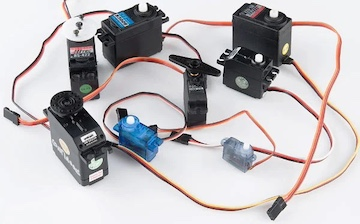
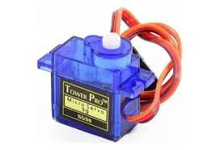
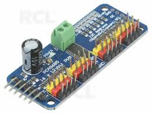
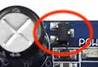

# RC servos for crank organ valves

## Feedback

Feedback is welcome. Please post questions, corrections or comments here: https://github.com/bixb922/crank-organ/discussions

# Contents
     * [Feedback](#feedback)
1.  [Introduction to RC Servos](#1-introduction-to-rc-servos)
     * [Control](#control)
     * [Speed](#speed)
     * [Force and torque](#force-and-torque)
     * [Horns](#horns)
     * [Digital and analog RC servos](#digital-and-analog-rc-servos)
2.  [Connections](#2-connections)
3.  [Selecting an appropriate servo to move a crank organ valve](#3-selecting-an-appropriate-servo-to-move-a-crank-organ-valve)
     * [Force, torque, length of horn and stall torque](#force-torque-length-of-horn-and-stall-torque)
4.  [Connecting the servos to the microcontroller](#4-connecting-the-servos-to-the-microcontroller)
     * [GPIO ports](#gpio-ports)
     * [PCA9685 ports](#pca9685-ports)
5.  [Power supply](#5-power-supply)
6.  [Software parameters for servo motors](#6-software-parameters-for-servo-motors)
7.  [A valve with servo motors](#7-a-valve-with-servo-motors)

# 1. Introduction to RC Servos

RC (Radio Control) servos are compact actuators commonly used in robotics, model aircraft, and other hobbyist applications. They are designed to precisely control angular position, making them ideal for tasks such as steering, controlling flaps, or moving robotic joints.

## Control

RC servos are typically controlled using Pulse Width Modulation (PWM). 
A control signal is sent to the servo, where the width of the pulse determines the target position of the servo arm (horn). The standard pulse width ranges from about 1 ms (minimum position) to 2 ms (maximum position), with a repetition rate of 50 Hz (20 ms period). 1.5 ms is considered the center position.

Pulse Width Modulation (PWM) signals are normally used to control a servo. The duty cycle is the ratio of the pulse width to the total period, so the duty cycle varies between 5% and 10% for a 20 ms signal.

See also here: https://en.wikipedia.org/wiki/Servo_(radio_control)

## Speed

The speed of a servo refers to how quickly it can move from one position to another. This is usually specified as the time required to rotate 60° at a given voltage (e.g., 0.12 seconds/60° at 6V). Faster servos are used for applications requiring quick response.

## Force and torque

Servos are rated by their torque, which is the rotational force they can apply, typically measured in kg·cm or oz·in. Higher torque servos can move heavier loads or resist greater external forces. The force is highest if the horn is held in place. The current here is also the highest (stall current).

See the specs for force or torque when stalling. 1 kg·cm or higher is a common figure.

A torque of 1 kg·cm means that at 1 cm apart from the axis, the horn lifts 1 kg, at 2 cm, the horn lifts 500 kg, at 3 cm the horn lifts 333g, etc.
 

## Horns

The servo horn is the output arm attached to the servo shaft. It transmits the servo's motion to the mechanical system being controlled. Horns come in various shapes and sizes to suit different applications.

## Digital and analog RC servos

Originally the RC servos had an analog circuit, many modern servos have a digital circuit (i.e. based on a very small microcomputer). The SG90 is a typical analog servo.

# 2. Connections

RC servos normally have a connector with 3 wires: black for ground, red for supply voltage and yellow for signal.

The supply voltage depends of the servo. Fast servos may need 7.4V or more. The servo has it's own circuit inside to amplify the GPIO or PCA9685 output to suitable currents to move the motor inside the servo.

Summary:

- RC servos are controlled by PWM signals (pulse width determines position).
- Speed and torque are key performance characteristics.
- Servo horns connect the servo to the mechanism being actuated.

# 3. Selecting an appropriate servo to move a crank organ valve

The force (torque) that a servo can supply is normally more than enough to move a crank organ valve. Bass valves at higher pressures may need a force of 1 Newton to open (1 Newton lifts about 100g). A small servo can lift 500g at least.

The main issue with servos is speed. One of the most common (and cheap) RC servos is the SG90:

The speed is  0.1 to 0.15 seconds to rotate 60° depending on what the vendor says on its site. It has plastic gears, so it the gears may get damaged if it stalls or exerts too much force. It is also rather slow compared to other servos.

However, an angle of much less than 60° is needed to open a valve. The aperture of a valve is normally about 3 or 4 mm maximum. With a horn of 2 cm, that means an angle of around 10°. If a fast servo moves at 0.06 seconds/60°, in theory 10° takes only 0.01 seconds. In practice, that relation does not hold so well, even small movements can take their time.

However, a fast digital servo of say 0.06 seconds/60° will open/close a valve allowing notes of 30 milliseconds followed by 30 milliseconds of pause.

That should be enough for crank organ music, and is similar or even faster than what a paper roll or book allows.

Solenoid valves are faster than that. See for example this article here: http://www.fonema.se/valvetime/valvetime.html

Solenoid valves open and close normally within 5 milliseconds. That is probably several times faster than a RC servo. But on the other hand, the opening/closing of valves on a paper roll organ isn't that fast either. 

The final word is not the physics and measurements, but what you hear and the musical effect. So if you try out a servo, buy one and test it.

## Force, torque, length of horn and stall torque

The force to lift a crank organ valve depends the diameter of the hole the pipe has to close (toe hole diameter) and the pressure.

Calculations are easiest if using cmH2O (centimeters of water column) measure for pressure and grams-force (the force to lift a gram in normal gravity). Internet has many ways to translate that to your preferred units.

Here are some figures for the force needed to open a valve.

Toe hole diameter in mm|Pressure in cmH2O|Force required in grams-force|
----------------------|-----------------|-----------------------------
0.8 cm | 10 cmH2O  | 5 g-force|
1.5cm | 15cmH2O  | 26 g-force |

Normally it must be necessary to add the force of the spring to hold the valve closed. Depending on that spring, 50 to 100 g-force could be necessary.

Exerting a force at a distance of 1 cm of the axis, a small servo like the SG90 stalls at 1.8kg (i.e. stops moving). The closer the servo gets to that force, the slower it will move. So if such a servo needs to lift 100 g-force at 3 cm (to get a fast action), this will need a torque of 300 g*cm, which should be in the range of force/speed of a capable servo.

Movement has to be as fast as possible. The longer the horn, the faster the movement will be. That favors using a long horn.

# 4. Connecting the servos to the microcontroller

Servos have a connecting cable with 3 wires:
* Yellow: signal
* Black: ground, this must go to the ground of the power supply
* Red: this is the supply voltage for the servos, this is connected to 5V, 6V, 7.4V or 8V or whatever the servo spec says.

## GPIO ports
Up to 8 GPIO ports of the ESP32-S3 can be used to drive the signal of a servo. See the "Pinout and MIDI configuration" page to see which are available.

The GPIO ports can be connected directly to the yellow signal input of the servo. If you want to be very careful, you can put a 220hm resistor in series with the GPIO output.

Then configure the GPIO ports in the "Pinout and MIDI configuration", using the 40_note_servo.json pinout file as template.

## PCA9685 ports

There is a nice board that has all the electronics to drive servos:

The connector on the left side has:
* GND: must go to GND of the ESP32-S3
* OE: output enable, leave open
* SDA, SCL: this is the I2C bus, must go each to a GPIO pin of the ESP32-S3
* Vcc: this is the power supply for the chip on the board, must go to 3.3V of the ESP32-S3
* V+: leave open

The power supply for the servos must go to the two screw terminals. Look well which is marked + and -. If not connected correctly, this may burn the board.

Look at the documentation provided by Adafruit here: https://www.adafruit.com/product/815 (Look for a Download button on the documentation page).

There is a PDF document with lots of details how to connect servos to one of these boards. There is a schematic of the Adafruit board. 

Most boards say "V+ 6V maximum" on their back side. This does not apply when using with servos. The maximum of 6V applies when driving LEDs with this board, since if a higher voltage is used, part of the current that drive the LEDs can leak back into the signal outputs of the board, damaging the chip. This effect does not occur for a servo, since all signal inputs of modern servos are compatible with digital outputs.

Some PCA9685 boards have an electrolytic capacitor (the large cylindrical black/gray component on the left of the board). This component is rather convenient. If not present, a 470uF 20V capacitor or even a 100uF 10V is recommended.

Some PCA9685 boards have a reverse voltage protection. This is a small black squarish component next to the electrolytic capacitor, with 3 contacts:

This is also convenient should you reverse the V+ connections, however this shaves about 0.5 off the supply voltage and makes the servos a bit slower.

PCA9685 can be connected in series (see the Adafruit writeup), but each board needs another address. The software can handle that. 64 boards can be connected to one I2C bus for a total of 1024 servos.

# 5. Power supply

The crank organ battery voltage must be converted by a "DC to DC buck converter" (also called "step down regulator") to the voltage needed by the servos. Some of these even have a display to indicate the input and output voltages:

The servos need current while moving (for note on and note off). While in a static position, little current is needed. See the specs of the servo.

300 to 500 mA seem to be normal for a servo to move a small load like a valve. 1A can be needed as stall current (when an obstacle is hit), so this situation should be avoided.

The software limits the number of notes simultaneously on (the "polyphony"). A practical limit is 10 notes, since there are few tunes for crank organ with so many notes.

This means that a voltage converter of 10A is more than enough.

Don't forget to use a fuse next to the battery.

# 6. Software parameters for servo motors

Instead of a 50 Hz (= 20 millisecond = 20000 microseconds) refresh rate, it is advisable to lower the rate to get faster response. The refresh period should never be below 3 or 4 milliseconds, so a proposed period is 5000 microseconds. This period should be set for all servos. There seems to be no need to vary it for an individual servo.

A pulse width of 1000 microseconds normally means 0° angle and 2000 microseconds means 180° angle. Some servos have other definitions, for example some operate between 500 microseconds and 2500 microseconds. See the servo's specifications.

The software accepts pulse widths from 1000 to 2000, since normally a small angle variation is needed. The "Pinout and MIDI configuration" will show the conversion of pulse widths to angles. The formula is angle = (pulse-1000)/1000*180.

The pulse widths can be defined for groups of MIDI outputs or even for each MIDI output individually. Altering this will need you to edit the pinout.json file directly, inserting "servopulse" directives where needed.

The software calculates the duty cycle for PWM.

# 7. A valve with servo motors

The challenges here are:
* Make the movement as fast as possible
* Avoid to force the servo. Forcing the servo (i.e making that it moves beyond a barrier or stop) may damage the gears inside the servo and consumes lots of current.

Crank organ valves need to open about 3 or 4 mm only, so a small angle is necessary. But the longer the horn, the smaller the angle needed for the movement, so select the longest horn that comes with the servo or purchase a larger one. 2 cm from center to farthest hole seems to be ok, meaning that a turn of 10° is needed. Pulse widths must be 1000 microseconds for "off" and 1056 microseconds for "on".

A proposed design here is a valve hold in place with piano wire and connected to the servo with a string. That allows to rotate the servo freely without never being forced, and the movement need not be extremely precise.

