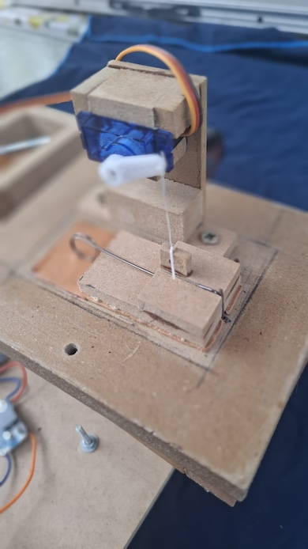

# RC servos for crank organ valves

## Feedback

This is the first version of this writeup. Feedback is welcome. Please post questions, corrections or comments here: https://github.com/bixb922/crank-organ/discussions

# Contents
     * [Feedback](#feedback)
1.  [RC Servos](#1-rc-servos)
2.  [Valve for servos](#2-valve-for-servos)
     * [Requirements for valve movement](#requirements-for-valve-movement)
     * [Selection of a servo](#selection-of-a-servo)
     * [Building the valve](#building-the-valve)
     * [Testing the servo in a voicing box](#testing-the-servo-in-a-voicing-box)
3.  [Connecting the servos to the microcontroller](#3-connecting-the-servos-to-the-microcontroller)
     * [GPIO ports](#gpio-ports)
     * [PCA9685 ports](#pca9685-ports)
4.  [Power supply](#4-power-supply)
5.  [Software parameters for servo motors](#5-software-parameters-for-servo-motors)

# 1. RC Servos

RC (Radio Control) servo motors are compact actuators commonly used in robotics, model aircraft, and other hobbyist applications. They are designed to precisely control angular position, making them ideal for tasks such as steering, controlling flaps, or moving robotic joints.

Servos are mass produced, so are (mostly) cheap and readily available.

See also here: https://en.wikipedia.org/wiki/Servo_(radio_control)

Servos are slower than pallet valves (like Peterson or Reisner), but there are some cheap servos out there. If you can tolerate a bit slower valves and prefer not to pay for pallet valves, here you go.

Also, with servos you will have to build the valve yourself.

# 2. Valve for servos
## Requirements for valve movement
Servos normally produce a torque of more than 1 kg-cm. That yields more than enough force to open/close a valve.

The aperture of a valve needed is equal to the 1/4 of the diameter of the toe hole of the pipe. For example, for a 8mm toe hole, a minimum of 2mm is needed, better: 3 or 4 mm. If the arm measures 15mm, the arm has to rotate by atan(3/15)=11°. This will take about 0.12sec*11°/60°=0.02 seconds = 20 milliseconds.

On organ paper rolls, the small holes measures:
* 1.85 mm for Wurlitzer organs, and paper advances at 8.4 feet/sec = 42mm/sec, for a note length of 44 msec
* 3mm for Carl Frei organs, and paper advances at about 6 or 7 cm/sec, for a note length of 42 msec

This is consistent with an analysis of about 1800 MIDI files scanned from large organ rolls, that show short notes take about 40 millisecond and short silences take about 50 milliseconds.

## Selection of a servo

A very cheap and Ubiquitous servo is the TowerPro SG90. Maximum (stall) torque is 1.2kg-cm and speed is 0.12 sec for 60°
It does the job, but is a bit slow. Nevertheless, I measured that 40 msec open and 50 msec closed is achievable, but the arm has to move at most about 10°.

166 beats/minute is a nice Allegro. A quarter note (negra, crotchet, Viertelnote) will take 360 milliseconds. Dividing that by 4 gives sixteenth notes (semicorchea, semiquaver, Sechzehtnelote) of 90 milliseconds each. That seems to be the limit for note repetition for a SG90.

Regular organ pallet valves are faster than that, I have measured them handle repeated sixteenth notes at 240 beats/minute.

Now, bear in mind that all this talk of sixteenth is in the case  the *same* note is repeated. If sixteenth notes are played in a scale, this restriction does apply and much faster tempos can be played with a simple servo. A very staccato semiquaver at a fast tempo will not be sufficient to open the servo. In that case you have to edit the MIDI file and lengthen the notes until you have a musically acceptable MIDI file.

If you feel like you can afford it, you can select a servo that:
* is digital as oppsed to the SG90 which is analog. Digital responds faster.
* has a faster speed. A very good speed is 60° in 0.06 seconds
* has metal gears. The SG90 has plastic gears that will break if too much force is exerted. I don't have information about durability, but I suspect metal gears last longer. 

But then, the price of such a servo may be already similar to the price of an organ pallet valve. Plus you don't have the hassle of building the valve. Pallet valves are very reliable.

Power consumption of a pallet valve is higher that a servo. But even with pallet valves, the crank organ can run at least 6 hours (or a little bit more than 100 tunes) with a 10000 mAh battery pack that weighs 200g. With a servo, the same battery should last 5 times longer than that.

## Building the valve

See also here: http://www.melright.com/busker/jsart115.htm

Here is the valve I made for testing:

I used 9mm MDF for the lid to cover the valve hole.  The underside of the valve is covered with leather. I used a strip of the bellows leather (sheep leather) with the rough side towards the hole. The laquered side of the leather is glued to the valve lid. The leather also serves as hinge. 

The valve is held in place with a  spring you can bend your self with piano wire. Piano wire of around 0.7mm to 1mm works well. Talk with a person who tunes or repairs pianos, she or he will for sure have lots of short cuts of piano wire.

Use gloves and safety goggles. Drill a 6mm drill into 15mm MDF or wood, and leave the bit there (without the drill!). Secure one extreme of the wire with a press to the wood, take the other side with pliers and wrap very firmly around the drill bit. At least one and a quarter of turn is necessary.

Glue two bits of MDF on the lid to hold the spring in place.

On the side opposite to the hinge cut a guide into the lid to ensure the lid is kept flat. Use a small nail or straight wire as guide. 

You should connect the servos to the microcontroller BEFORE tying the string between the horn and the valve. The neutral position should be pulse with 1500. The factory setting of the servos may be any.

After setting the servo to the neutral position, tie the servo arm at the most distant of the arm hole to a point of the lid that lies near the pipe hole. Nylon string (unelastic) or similar is nice.

When in neutral position, the string should have almost no slack, but still leave the valve closed. You can make a fine adjustment of the string tension when closed by software setting the servo neutral position (servo off) on the "Pinout and MIDI configuration" page.

Ensure the valve is well closed if the servo does not pull. Problems that can arise:
* The tension of the spring is not enough to hold it in place
* The hinge is not glued up to the edge of the lid
* The valve does not sit evently. Adjust the guide at the front to ensure the lid sits evenly on the surface.

I would still like to build and test a valve with two springs, one on each side, like on this photo:

This will have less possibility of a leak when the valve is closed.

## Testing the servo in a voicing box

Here is a small voicing box:

The voicing box is connected to the microcontroller on a breadboard plus power supply. The battery is a standard electric drill battery (18V) with a fuse (important) and a switch feeding a DC-DC buck converter to get 5 to 12V for the servos and a 5V fixed DC-DC converter to feed the microcontroller.

Here is the valve moving.

I use the repetition test in the software (on the Tuning page) to test repetition of the same note. Test starts with 850 msec note/150 msec silence, then goes gradually down until it gets to 40 msec note and 50 msec silence. Then a extreme test of 30 msec note/30 msec silence is added. Servos will not respond at this speed.

This is the waveform seen when recording the sound and activating the servo for 40 milliseconds then turning off for 50 milliseconds.

The slowness of the servo makes the note about 20 milliseconds longer.

The regular pallet valves (Peterson in my case) handle these tests very well.

# 3. Connecting the servos to the microcontroller

Servos have a connecting cable with 3 wires:
* Yellow: signal
* Black: ground, this must go to the ground of the power supply
* Red: this is the supply voltage for the servos, this is connected to 5V, 6V, 7.4V or 8V or whatever the servo spec says.

## GPIO ports
Up to 8 GPIO ports of the ESP32-S3 can be used to drive the signal of a servo. See the "Pinout and MIDI configuration" page to see which are available.

The GPIO ports can be connected directly to the yellow signal input of the servo. If you want to be very careful, you can put a 220hm resistor in series with the GPIO output.

Then configure the GPIO ports in the "Pinout and MIDI configuration", using the 40_note_servo.json pinout file as template.

## PCA9685 ports

There is a nice board that has all the electronics to drive servos:

For detailed information on how to connect this to a microcontroller and other details see here: https://www.adafruit.com/product/815. Look for a Download button on the documentation page, and download that PDF. 

The connector on the left side has:
* GND: must go to GND of the ESP32-S3
* OE: output enable, leave open
* SDA, SCL: this is the I2C bus, must go each to a GPIO pin of the ESP32-S3. No additional pull-up resistors are needed, the PCA9685 board provides these.
* Vcc: this is the power supply for the chip on the board, must go to 3.3V of the ESP32-S3
* V+: leave open

The power supply for the servos must go to the two screw terminals. Check which is marked + and -. If not connected correctly, this may burn the board. Don't use the internal power supply of the ESP32-S3 as supply for more than one servo.

There is a PDF document with lots of details how to connect servos to one of these boards. There is a schematic of the Adafruit board. 

Most PCA9685 boards say "V+ 6V maximum" on their back side. This maximum applies when driving LEDs, not when connecting servos. Signal inputs of modern servos are compatible with digital outputs.

Some day I'll post a circuit here. The Adafruit link above should explain most of what's needed. Use a dupont cable to connect boards:

For 20 note crank organs, 1 PCA9685 is needed. The ESP32-S3 can provide up to 8 additional ports. It may be easier to just use 2 PCA9685 boards and leave some outputs unused.

PCA9685 can be connected in series (see the Adafruit writeup), but each board needs another address. The software can handle that. Several boards can be connected to one I2C bus of the ESP32-S3. The restriction here is that each board provides pull up resistors and there is a limit for the I2C bus on how many pull up resistors there can be. There is no speed impact when connecting several boards to the same I2C bus.

# 4. Power supply

The SG90 needs a good 5V power supply. The USB output of a PC can drive only a few SG90. See [here](/doc-hardware/battery.md) for an article about power supplies. A power supply of 5V 2A should be enough. Don't forget to use fuse next to the battery.

In standby (not exerting any force) a SG90 draws less than 5mA. When moving, say 250g of force at 1.5cm of the axis, the current drawn is about 30 mA. So the servos will draw current when moving and while holding the valve open.

With normal music, it is very uncommon to move 10 servos at the same time. Even having 10 notes on at the same time is uncommon and will have other problems, such as a dwindling air supply. The peak consumption will be about 1A. Leaving some margin, a 5V 2A power supply should be enough.

# 5. Software parameters for servo motors

Use the "40 note RC servo: 8 GPIO PWM and  2x16 PCA9685" template. Select that template in the "Pinout and MIDI configuration" page. 

Leave unused entries blank. If only one PCA9685 is used, leave the I2C SDA and SCL and address of the second PCA blank.
 
Instead of a 50 Hz (= 20 millisecond = 20000 microseconds) refresh rate, it is advisable to lower the rate to get faster response. The refresh period should never be below 3 or 4 milliseconds, so a proposed period is 5000 microseconds. This period should be set for all servos. There seems to be no need to vary it for an individual servo. The template sets the period to that value.

A pulse width of 1000 microseconds normally means 0° angle and 2000 microseconds means 180° angle. Some servos have other definitions, for example some operate between 500 microseconds and 2500 microseconds. See the servo's specifications.

The software accepts pulse widths from 1000 to 2000, since normally a small rotation variation is needed. "Off" should be 1500 (center position) and "on" around 1700 (or 1300 if rotation is in the opposite direction).

Pulse width can be set for each output:

You should connect the servos to the microcontroller BEFORE tying the string between the horn and the valve. First make the software set the  neutral position at pulse width 1500. The factory setting of the servos may be any position.

Now you can use the pulse with to tense the string so there is almost no slack when the valve is closed. 200 microseconds difference between "on" and "off" probably gives a good angle to open/close the valve. 

Adjust the "Off" valve to have a minimum of slack in the string between servo arm and valve.

Adjust the "On" value to have the required height of the valve over where the pipe toe hole is. The required height is diameter of the toe hole divided by 4 plus 1mm.

