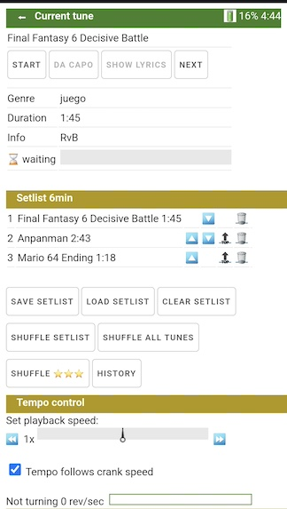
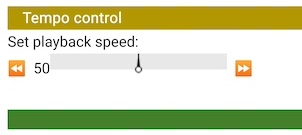

# Software for crank organs


# Purpose
The purpose of this software is to power a microcontroller (see schematic in this repository) enabling it to play music in MIDI format on a crank organ


# Features

* Browser as user interface. No internal display, no buttons. Control is done with WiFi with a browser on a cell phone, tablet or PC.
* Can define a setlist or select tune by tune.
* It's fast to establish a setlist. The setlist can be ordered, shuffled and stored. Playback order can be changed while playing, new tunes can be added or tunes can be dropped while performing.
* Music is uploaded into the microcontroller via WiFi with drag and drop or via USB connnection. You can add description, author, title, year to each tune.
* To aid tuning, playing scales and individual notes is supported.
* Shows remaining battery capacity on browser
* Preconfigured for common scales: 20 note Carl Frei, 26 note Alderman/Wright, 31 note Raffin. Allows to define custom scales and different instruments.
* This system is highly scalable, capable of managing a vast number of pipes. Depending on the model, the microcontroller can store either 300 or 700 MIDI files. With the addition of an SD card, there is virtually no limit.
* Standard type 0 and 1 MIDI files are supported. Solenoids can be mapped to MIDI note number only (only one instrument), or MIDI note number and program number (several instruments). Percussion channel mapping is also supported (drums and percussion).

The organ has to be equipped with electric solenoid valves for the pipes, see hardware description.

# Main menu and navigation
The home page has the main menu and shows detailed battery use information.


This diagram shows page navigation.
The page top has a left arrow to navigate up one level.

```mmd
flowchart LR
    H[main menu]
    H -->|Crank organ mode button| T[tune list page]
    T --> |Performance button| P[Performance control page]
    H --> |Tuner mode button| NL[Note list page]
    NL --> |Click on MIDI number| NN[Note page]
    H --> |Configuration mode button| C[Configuration page]
    C --> |Go to pinout page| PI[Pinout and MIDI configuration]
    
    H --> |System info button| W[System information page]
    W --> |Show log button| E[Event log]
    
```
These pages can be used even during playback. 
    
The software operates either in crank organ mode (to play music), as tuner (no tune playback, only notes) or in configuration mode (after entering the configuration password, no tune playback).

When entering a mode (crank organ, tuner, configuration) it is possible that you'll have to press the button twice, first to enter mode and then, once the mode has changed, to go to the selected page.

It's best to navigate the applicatino using the buttons and the back button on the top of the page.

The home page is by default the menu page, but the configuration allows to define the tune list or the performance page as "home" page.

## The page header


The ⬅ symbol will go up one level in the previous diagram.

When the battery symbol 🔋 turns to 🪫, then the computed battery level is low. 100% means battery full, 0% means battery empty. The level is reset to 100% when pressing the "Battery counters set to zero" on the home page. The time is the estimated operating time remaining in hours:minutes, based on the use history.

Battery use is calculated based on the "battery watts-hour" value and the solenoid resistance set in the configuration. The average power consumption of the microcontroller is about 0.3W) and the power consumed by each note played in when in crank organ mode is calculated using 90 Ohms as resistance of the solenoids and adding the time each note is on.

Battery information is refreshed about every minute.

Keep in mind that battery capacity is usually lower than what the battery manufacturer informs. For example a 5V battery pack impelemented internally with 3.3V lithium batteries shown as 10000 mAh might have 3.3*10 Wh and not 5*10 Wh. To have meaningful output with the battery indicator, you will have to calibrate the battery capacity configuration.

If the browser looses the connection to the server, the broken heart symbol 💔 will come up. This usually happens if the microcontroller is turned off or out of range of the cell phone.


## Battery section of main menu page


The "Battery" section shows more information about the computed state of the battery than the page header. 

The correct calculation of power remaining depends on the "battery_watts_hour" parameter in the config.json file. Be sure to press "Battery counters set to zero" after recharging the battery.


# Tune control: tune list and performance page

## The tune list page


Contract the page a bit to see all columns. Scroll up and down to see the complete page.


Entering text into the search box filters all tunes with that text. For example, entring polka will show all tunes with polka in the genre, title or author. The search is case insensitive and uses all information fields shown.


Tapping on a tune adds that tune to the bottom of the current setlist, i.e. queues the tune for playing. Tapping again, removes the tune from the setlist. The queued tunes are marked with a golden star 🌟 and the position in the setlist:


If a tune is playing, progress is shown with a progress bar next to the tune name. "Waiting" means that the tune is waiting for the crank to turn in order to start.


Once some tunes that you want to perform are selected, you turn the start turning the crank. If there is a crank sensor, the first tune starts playing. If not, touch the touchpad and the first starts playing. Once played, it pops off the pending list, and the next tune waits for start.

Or else, you can control performance pressing the "Performance" button. The queued tunes can be treated as a setlist.  Or if there is a request for a certain tune, you go back to the tune list page, tap the tune to add to setlist, go to the performance control page, move it to top with the little top button and play it.

You always can navigate back from the performance page to the tune page without disrupting the play list.

## The performance control page
With this page you can:

* Start the top tune with the start button. However, it's easier to use the touchpad button for this, or just turn the crank if the crank sensor is installed.
* Stop the currently played tune.
* Go back to the beginning of the current tune (restart it).
* See information about current tune 
* Control the sequence of tunes in the setlist
* Control reproduction speed


### Current tune

This section shows current tune, title, author, year, genre, duration and a bar with % played.


"Waiting" means that the tune is waiting for the crank to turn or for the TouchPad or for the start button. 

* Start: starts playing the tune. If touchpad installed, this is equivalent to pressing the touch pad. If crank sensor installed, this is equivalent to start turning the crank. 
* To begining: rewinds the tune to the beginning
* Next: Skips the rest of the tune

Once started, the top tune is removed from the setlist. s

The setlist stored on flash gets changed only with the “save serlist“ button. 

### How to start a queued tune that is waiting

Option 1: If a crank rotation sensor is installed, start turning the crank. This will start the tune.

Option 2: If the touchpad is installed, start cranking, then touch and release the touchpad. This is very simple from the hardware point of view, since a touchpad is just any metallic knob or disc (see hardware), and easy to do: one hand turns the crank while holding the touchpad. When ready, release the touchpad.

Option 3: Press the start button on the performance page.


### Setlist control



This section show the current setlist. The buttons next to each title allow to:
 * 🔼 move up or 🔽 move down one position
 * 🔝 move to top of the setlist
 * 🗑 delete from setlist (the tune itself is never deleted)

The actual colors of the icons depend on the device.

The large buttons are:

* Save setlist: save the current setlist to flash. The current setlist will be lost with power off, the setlist on flash will remain. This is the only action that affects the saved setlist, all other actions are on the current (transient) setlist.
* Load setlist: load the setlist from flash, replacing the current setlist
* Clear setlist: clear the current setlist. Then you can get back to the tune list page and select new tunes. The setlist in flash is not affected.
* Shuffle setlist: shuffle tunes in the current setlist randomly. 
* Shuffle all: Get all tunes in the tune library and shuffle all randomly.

### Crank and speed control


If a crank sensor installed, the crank turning speed will influence playback speed. The buttons here allow to regulate the relationship, this is, set what crank speed is the normal speed. 


# Operation on power on
It's best to have the main menu page, tunelist page or performance page open in the browser of the cell phone when starting. The main menu page, tune list page and performance page poll the microcontroller every few seconds, and will update the information as soon as the microcontroller is up. Put a favorite marker on the page to have it at hand. However, having the page open is not mandatory, you can operate without cell phone or turn in on later if needed. Also: there is an configuration option to select the tune list or performance page as alternate home page.)

If a RGB (neopixel) LED is on the board and configured, it will show blue on start and flashes green when ready. If it turns red, an error has occurred, see event log in system configuration. If you suspect a problem with the software, please report errors as an issue, pasting log and description of situation.

Startup takes about 15 seconds until the system is ready. Some valves will move as a signal when ready. 

The software will automatically load the saved setlist. If you turn the crank (with crank sensor installed) or release the touchpad, the playback will start. 

If there is no setlist stored (empty setlist). turning the crank or releasing the touchpad will shuffle all tunes randomly and start playing the first tune.

So for all cases: turn on, and turn the crank or touch the touchpad and music starts.

If you have the tune list or performance page open in your cell phone, the page will poll the microcontroller until it is powered on and running, and then it will refresh the information. No need to reload the page. The "broken heart" emoticon on the header bar will disappear automatically once the microcontroller is running.


# Tuner mode
Tuning mode aids tuning and intonation of pipes.

When entering tuning mode,  MIDI playback is disabled.

The microphone/tuning capacity is still in testing phase. However, there is a scale and repetition test to aid intonation and tuning.

Without a microphone, the tuning and amplitude graphs just show random values with no meaning. 

## All notes page


This page shows all defined MIDI notes. Frequency and amplitude bar graph only have a meaning if there is a working microphone connected.

"any-C3(60)" means MIDI program = any, note=MIDI 60=C4. If a specific program had been configured, this would show as "Piano(1)-C3(60)". 

The "Play scale" button will play a scale up and down activating all solenoids in order.

"Tune all" will make each pipe sound in order. If a microphone is installed, tuning and amplitude is updated and stored. Tuning is shown in cents. Zero cents is a perfect tuning. 100 cents means one semitone away. 5 cents or less is probably a reasonably well tuned note.

Amplitude is shown in relative scale in dB (decibel). 0 dB is the loudest possible measurement, -10 dB is less loud, etc. dB scales are logarithmic, just as the human perception is. The purpose of this measurement is to aid comparison of loudness of the pipes. The final judgement should be your ear.

Tapping the underscored MIDI note name/number will take you to the note page.

## The note page
This page aids intonating and tuning one note.

The "Tune" button will sound that note. You can use your own tuner, or if a microphone is installed, the tuning and amplitude is stored and shown. While the note sounds, several samples are taken and shown separately. If there is much difference for each frequency or amplitude measurements, adjustments can be made to that pipe.

The "Note test" button will sound that note.

The "Repetition test" button will make a repetition test increasing speed until reaching a 30ms on/30ms off cycle.


# System information
The home page, the WiFi page and the Show log page show diagnostic and technical information about what's going on in the microcontroller.

These pages are mostly to aid diagnosis of possible problems.

## Event log

The "Show log" button will show the latest event log. Look at the log if the neopixel led flashes red, or if you see some malfunction. Several past log files are stored in the data folder, to be rescued with ```mpremote :cp data/errornnn.log errornnn.log```. The time in the log file starts with 00:00:00, but if connected to a router or cell phone hot spot, the microcontroller acquires current time information, and the log time is shown in UTC. The "time zone" parameter on the configuration page can assign another (fixed) time zone, if you really want to look at the log in local time.

If the description is not clear, please post the relevant part of the log, with previous history, and the description of the situation as an issue, I'll try to help.

The event log records events of class INFO, ERROR and EXCEPTION. The MicroPython Console, accessible through the USB connector with mpremote, putty, Thonny, or other tools will additionally show records of class DEBUG. Due to the overhead, these are not recorded to flash. For some cases, it may be necessary to rescue these events.


# The tune library
All MIDI files to be played reside in the tunelib folder in the microcontroller.

This folder also contains tunelib.json, a text file with additional information about the tune such as title, genre, year, author and playback time. There is a program available for the PC to edit this file,. 

## MIDI files
Both MIDI file type 0 (single track) and MIDI file type 1 (multitrack) files are supported. 

Only note on, note off and set tempo events are needed for MIDI file playing. The default configuration ignores MIDI program numbers, although the pinout configuration allows to specify program numbers and a MIDI notes for percussion channels 10 and 11. If specified, program change events are also interpreted. All other messages such as after touch, Meta messages such as lyrics or text and sysex messages are may be present but are ignored.

Be sure to play the MIDI file at least once on your PC to see if it has a correct format.

There is no functionality to transpose a MIDI file. Use any MIDI file editor to do that, if you need.

## Preparing the tunelib on your PC

* Copy the music folder of the GITHUB repository to your PC.
* Copy your crank organ MIDI files to the tunelib folder. 
* Run ```tunelib_gui.py``` on your PC to edit the tunelib information: title, author, genre and year.
* Connect the microcontroller to the USB port of the PC. See if it is available with mpremote.

This is the screenshot of the tunelib editor:


To add files, copy them to the tunelib folder, then update the info with the tunelib editor.

To remove files, rmove them from the tunelib folder, then update the info with the tunelib editor.

## Update tune library through USB
* Run ```update_tunelib_mc.py```to copy all changes of the tunelib to the microcontroller. Only changed files are copied.

## Update tune library with WiFi
* On a Mac, install Filezilla. Enter the host name, for example ```organillo.local``` in FileZilla.  You now can drag and drop files to the tunelib folder.
* On Windows, search internet for "How to connect to FTP servers in Windows".


# Installation and configuration
## Prerequisite hardware and software
This software is designed for a ESP32-S3 N8R8 or N16R8 microcontroller. N8R8 means 8 Mb flash, 8 Mb RAM. N16R8 means 16 Mb flash, 8 Mb RAM. The ESP32-S3 is most easily available on boards (modules) like the ESP32-S3-Devkit-C or equivalents. There are many vendors offering these boards.

For a 20 pipe organ, see the hardware section for a schematic. It's best to connect a touchpad, which really is any metal knob such as a drawer knob connected with a single wire to the input port of the ESP32-S3. The touchpad senses the touch of the hand with a capacitive sensing technology.

Optionally a crank sensor and microphone can be installed (still being tested).

If more than 20 pipes/solenoids are needed, see hardware section of this repository.

Use Chrome or Firefox on a cell phone, PC, MAC or tablet to control the microcontroller. Safari is not supported.

## Prerequisite skills for installing and configuring the software

Basic command line commands, i.e. cmd on windows, terminal on Mac. Commands such as dir or ls and cd. 

Install standard free software, namely Python and Filezilla. 

No programming required. Configuration is done via web pages and forms. 

If you need a MIDI configuration that is not available, post an issue. 

Post an issue if you have questions about this software. 

# Installation
Install MicroPython on the ESP32-S3, please see micropython.org.


Install the mpremote utility (part of MicroPython) with ```pip install mpremote```

You can use the mpremote utility to verify that MicroPython is working.

Install the git utility, to access github.com

Get the complete repository with ```git clone https://github.com/bixb922/crank-organ``` to your hard drive of the PC.

Go to the install folder and run ```mpremote run install.py````

Now enter ```mpremote ls``` and the output should be similar to:
```
ls :
          19 .frozen_date
         539 config.json
           0 data/
         520 main.py
           0 software/
           0 tunelib/
```
The application is now installed.

To start the application with console :
```
mpremote soft-reset
>>>(now press control-D)
```
You should see a startup log similar to this, with no error or exception messages:
```
MPY: soft reboot
Go!
frozen_root.extract / is up to date.
frozen_software.extract /software is up to date.
frozen_tunelib.extract /tunelib not empty, no action.
2023/08/21 11:44:35 - minilog - INFO - === RESTART ===
2023/08/21 11:44:36 - config - INFO - No SD card detected at /sd
2023/08/21 11:44:36 - config - INFO - Config YD-ESP32-S3 N8R8 architecture=ESP32S3 wifi_mac=7cdfa1e8c240 hostname=AP-ssid=BLE=esp32s3
2023/08/21 11:44:36 - wifimanager - DEBUG - _init start
2023/08/21 11:44:36 - wifimanager - DEBUG - WiFi hostname esp32s3
2023/08/21 11:44:37 - wifimanager - DEBUG - AP mode started ssid esp32s3 config ('192.168.144.1', '255.255.255.0', '192.168.144.1', '192.168.144.1')
2023/08/21 11:44:37 - wifimanager - DEBUG - _start_station_interface for _sta_if_ap=my_home_router
2023/08/21 11:44:37 - wifimanager - DEBUG - init ok
2023/08/21 11:44:38 - solenoid - DEBUG - setup softi2c mcp_def.rank=mcp_melody
2023/08/21 11:44:38 - solenoid - DEBUG - init ok _device_info={'mcp_melody.pins': 16, 'mcp_melody.mcp23017': 'test', 'gpio_melody.pins': 2}
2023/08/21 11:44:38 - modes - DEBUG - init start
2023/08/21 11:44:39 - battery - DEBUG - init ok
2023/08/21 11:44:40 - tunelist - DEBUG - init ok 52 tunes
2023/08/21 11:44:40 - tachometer - DEBUG - init ok
2023/08/21 11:44:41 - player - DEBUG - init ok
2023/08/21 11:44:41 - setlist - DEBUG - init ok
2023/08/21 11:44:41 - modes - DEBUG - Mode changed to play
2023/08/21 11:44:41 - modes - DEBUG - init ok
2023/08/21 11:44:41 - setlist - DEBUG - Setlist loaded _current_setlist=[]
2023/08/21 11:44:41 - startup - DEBUG - Starting asyncio loop
2023/08/21 11:44:41 - webserver - INFO - USE_CACHE=True MAX_AGE=86,400 sec, send_file FILE_BUF_SIZE=4096 bytes
2023/08/21 11:44:43 - startup - INFO - uftp started
2023/08/21 11:44:52 - wifimanager - INFO - Status'(my_home_router 1001)', could not connect to my_home_router
2023/08/21 11:44:53 - wifimanager - DEBUG - _start_station_interface for _sta_if_ap=my_cell_phone
2023/08/21 11:44:53 - setlist - INFO - Automatic play, shuffle all tunes 51
2023/08/21 11:44:56 - setlist - INFO - play tune will start tune=jf8E0LIr
2023/08/21 11:44:56 - player - INFO - Starting tune jf8E0LIr tunelib/boccher_gw.mid
2023/08/21 11:44:57 - wifimanager - INFO - Connected to my_cell_phone network config ('192.168.43.73', '255.255.255.0', '192.168.43.1', '192.168.43.1') hostname esp32s3
2023/08/21 11:44:57 - tinyweb - DEBUG - /battery 201 msec
2023/08/21 11:44:59 - tinyweb - DEBUG - /battery 182 msec
etc etc etc
```

If there is an entry marked ERROR or EXCEPTION, there is some problem to be solved. Please report as issue.

Now connect with WiFi and use a browser to use the software. See below, there are several options to connect with WiFi. The first connection must be done to the Access Point provided by the microcontroller. Search the WiFi access points (WiFi networks) available on your PC or cell phone and connect to esp32s3. Enter http://esp32s3.local in your browser and wait for the main menu page to show.

# WiFi capabilities
You connect to the controller with a browser (Chrome or Firefox) via WiFi. 

The microcontroller can connect to a WiFi Access Point, for example your home WiFi Router. It can simultaneously be be an Access Point so that a cell phone or PC can connect to it as if it were a home router.

These 3 options are available simultaneously for WiFi connection:

* Option 1: Have the microcontroller connect to a Access Point (also called Hotspot or WiFi zone) on you cell phone or tablet. This way of connecting is useful if you are performing. You setup the Access Point on your cell phone and the microcontroller will connect to it.
```mmd
flowchart LR
   S[cell phone]-->|WiFi| AP[AP on cell phone] --> I[Internet]
   
```

* Option 2: Have the microcontroller connect to your home router. The microcontroller will try option 1 and option 2 one after the other until connected. This way of connecting is useful at home. You can connect to the microcontroller with any device connected to the home router, such as tablets or PCs.
```mmd
flowchart LR
   S[cell phone]-->|WiFi| AP[home router]
   MC[microcontroller]-->|WiFi| AP --> I[Internet]
   
```
* Option 3: This is the fallback option and the option used the first time to configure the microcontroller. The microcontroller publishes a Access Point where you can connect. You connect to that Access Point just like you connect to your home router, but there is no internet available through the microcontroller. For power saving reasons, this option is made available during 2 minutes after power on, or until one of the first two options have made a successful connection. This option is useful if you want to connect from a cell phone where you haven't set up an access point (such as a borrowed cell phone one). Be aware that while connected, you won't have internet access available on the phone, unlike options 1 and 2.

```mmd
flowchart LR
   S[cell phone]-->|WiFi| AP[Microcontroller as access point]
```
When configuring the microcontroller (see below) you assign a host name, say "organillo".
Once connected, you start the Chrome or Firefox and enter ```organillo.local```. This will navigate to the microcontroller. In other words, the microcontroller is always at http://organillo.local (or whatever name you assign).

Sometimes, the browser changes the http:// prefix to https://, verify that the prefix is http since https does not work currrently.

The index page with the main menu should come up.


# Configuration

Click the configuration button on the home page. The initial password is _drehorgel_.


The configuration parameters explained on the configuration page.

## Configurations you should change
A initial configuration file is supplied. This is what you should modify:

* The configuration password (as noted above). The configuration password is also the password for connecting to the microcontroller in AP mode.
* The network name and description. This name is important, it will be both the WiFi name in AP mode and also to navigate in the browser to the microcontroller, you enter this host name: either http://hostname or http://hostname.local i
* The name and password of your cell phone's hot spot and/or the name and password of your home router, to be able to connect to the microcontroller from your cell phone.

## Pinout
### Select scale
Use the "Go to pinout page" to select the scale of the organ:

* 20 note Carl Frei scale (the default)
* 26 note Alderman/Melvin Wright scale
* 31 note Raffin scale
* If you need another scale, post a issue.

The pinout assignment consists of defining wich MIDI note should activate a certain output port and thus a solenoid.

### Transpose scale if necessary
If you have a organ with, say, a 20 note Carl Frei scale, that scale may start on F, G or other notes. Use the transpose buttons to adjust the scale until the loweest note fits. The transpose buttons shift the complete scale up and down one semitone.

### Redefine MIDI notes (only if necessary)
This is advanced configuration, should be necessary only for custom scales, or crank organs with drums and glockenspiel.

There are three ways to define a MIDI note here:
* Only the MIDI note number, leaving program number blank or zero. This will match any MIDI program number in the MIDI file. This is the most common way to define notes, since for simple organs there is only one voice or instrument, and the program number in the MIDI file does not matter. 

* Program number and MIDI note number. The output port will activate only if the specified program nubmer and MIDI number is encountered. This is necesary to implement, for example, a glockenspiel.

* Program number 129 and MIDI note number. The output port will activate if the MIDI note number is encountered on the percussion channels 10 and 11. The program number 129 is not part of the MIDI standard and is only used here to define drum or percussion sounds. However, if you like it better, you can assign drum notes to regular MMIDI notes, if your MIDI files are setup that way.

### Microphone, crank sensor, touchpad and neopixel sensor (important)

This configuration is necessary to review, depending on what sensors you install in your microcontroller hardware.

On this page you also select if you will have a microphone, crank sensor, neopixel led or touchpad button installed, and which GPIO ports will be assigned to them. 

If present, it's best to have microphone on pin 4, either touchpad or crank sensor on pin 5. 

Many boards have a neopixel RGB led either on pin 38 or 48. See the vendor's description or schematic, or try with both values.

*After saving configuration, please reboot.*

## Power management settings

Configure the battery capacity, in watts-hour. You get the watts-hour by multiplying the battery voltage by the milliampere-hours figure (mAh) figure of the battery. Some manufacturers will publish the watts-hour figure.

Example: a AA battery is rated at 2000mAh, that is 2 Ah (ampere-hours. The battery pack has 10 batteries delivering 1.2V each, for a total of 12V. The capacity is 12V*2Ah = 24 watt-hours.

Another example: a USB battery pack is rated at 10000mAh = 10 Ah. Although the battery pack delivers 5V, lithium batteries are 3.3V, so the capacity is 3.3V*10Ah = 33 watt-hours.

Configure the solenoid resistance (default: 90 Ohms).

## Other parameters (less likely to need change)

Go through the rest and change what you may need, use save button to save to the microcontroller. The sections are:
* Crank settings. Necessary to change when a crank speed sensor is installed (still under development).

The rest of the sections is even less likely to require change:
* Debug/test settings
* Other parameters, such as the time zone offset. The time zone is only relevant for the time displayed in the event log.

The configuration gets stored to /config.json in the microcontroller. Passwords are cyphered. However the ESP32-S3 does not provide the hardware to really protect the passwords in a way that can be considered highly secure.  The microcontroller should not be exposed to access from the internet, only to access in home or cell phone "hot spot" networks.

*After saving configuration, please reboot.*

## FTP: drag and drop to update files with WiFi
Press the "FTP access" button on the configuration page.,

This will allow to access the microcontroller's files via FTP with Windows Explorer or with the (free) Filezilla program.

Google "FTP acess Windows Explorer" to see how to register a FTP server.

Download Filezilla from it's official site and follow instructions.

In both cases you get a graphical user interface to access and update files with WiFi.

## SD card 

If the microcontroller has a SD or TF card controller please modify boot.py to mount at /sd, including the following lines: 
```
import os
import machine
os.mount(machine.SDCard(), "/sd")
```
If the SD card is connected to a non-standard SPI port, other parameters will be necessary, search for  "micropython.org class sdcard" plus the documentation for ESP32-S3. 

The tunelib folder will then be at /sd/tunelib

With the SD card, only about 500kb of free flash memory is necessary. The /tunelib folder on flash will serve as fallback should the SD card fail or come loose.


## Customization crank organ photo
You can replace the crank organ ohite of the home screen by replacing the file /static/crank.jpg. A size of 100x75 pixels may be a good size to start with. 


# Programming language
The application is programmed in MicroPython using the asyncio model to coordinate multiple concurrent tasks. Web pages are written in HTML5 with CSS, programming in JavaScript with web requests done with fetch/async.

Frequency detection is done with the zero crossing algorithm (See zcr.py). This is quite appropriate for organs, since the fundamental is strong. The algorithm also is fast.

MicroPython version 1.21 (or 1.20 later than sept 2023) is required. Since MicroPython is continually enhanced, best use the latest version.

Credits to mcauser (MCP23017 library, no modifications), belialov (Tinyweb web server, modified to enhance asyncio response). Both library modules are available on github under MIT license.

# Under development/testing
Most code, especially the MIDI file parser, have been tested extensively, although I keep making small changes. I have tested all options under many circumstances. Also, I have tested the system with large tunelibs and large setlists without problemas.

The following features need more testing or development:
* Microphone for tuning. Measures frequency of notes and shows if in tune. Pending to do more tests.
* Sensor for crank speed to influence playback speed. Pending to test and for several adjustments.
* Keyboard mode: you can connect a Bluetooth (BLE) keyboard to the microcontroller. I haven't been able to test this thoroughly.

# Restrictions
Safari as a browser is not supported.

The security  and protection of this software is designed for a WiFi network such as a home network or a hotspot on a cell phone. The webserver on the microcontroller should not be made available on the public internet, since it does not have the required security mechanisms necessary to be a public web server. When accessing the microcontroller via USB, all elements including passwords can be retrieved, although it's not trivial to do that.

Although it is possible to connect several clientes simultaneously, it is recommended to connect only one client at a time.

Detection of devices on an I2C bus is tricky or lenghty. At startup, the test if a MCP23017 is present is done in a simple way, so sometimes that detection may report device absent when the MCP23017 is present. However, if it is reported as absent, there is certainly a problem.

If a new scale has to be implemented (say: 50 note scale), a new .json template for that scale has to be designed.

Time zone offset is fixed and can be set via configuration. There is no provision for DST (daylight savings time) transitions. The time zone only is relevant for the date/time displayed in the event log. If in doubt, set the offset to 0, and all times will be shown in UTC.

In some countries, WiFi devices need certification. Be sure to purchase hardware that conforms to the legal requirements in your country or area.

# Licensing
Copyright (c) 2023 Hermann Pau von Borries

This software and design is licensed under the MIT License:

Permission is hereby granted, free of charge, to any person obtaining a copy
of this software and associated documentation files (the "Software"), to deal
in the Software without restriction, including without limitation the rights
to use, copy, modify, merge, publish, distribute, sublicense, and/or sell
copies of the Software, and to permit persons to whom the Software is
furnished to do so, subject to the following conditions:

The above copyright notice and this permission notice shall be included in all
copies or substantial portions of the Software.

THE SOFTWARE IS PROVIDED "AS IS", WITHOUT WARRANTY OF ANY KIND, EXPRESS OR
IMPLIED, INCLUDING BUT NOT LIMITED TO THE WARRANTIES OF MERCHANTABILITY,
FITNESS FOR A PARTICULAR PURPOSE AND NONINFRINGEMENT. IN NO EVENT SHALL THE
AUTHORS OR COPYRIGHT HOLDERS BE LIABLE FOR ANY CLAIM, DAMAGES OR OTHER
LIABILITY, WHETHER IN AN ACTION OF CONTRACT, TORT OR OTHERWISE, ARISING FROM,
OUT OF OR IN CONNECTION WITH THE SOFTWARE OR THE USE OR OTHER DEALINGS IN THE
SOFTWARE.


# Affiliation
I have no affiliation nor relationship with any vender of hardware or software nor other products mentioned in this page. I do not endorse specific products, nor do I get benefits by promoting them.

In any case, I believe that software products mentioned on this page are either available under very permissive licenses such as MIT license or GPL, or are hardware products which are fairly generic and available from many vendors and sources.
