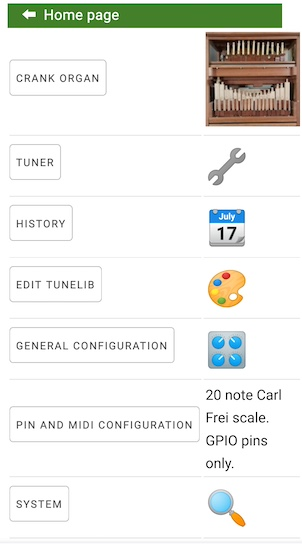
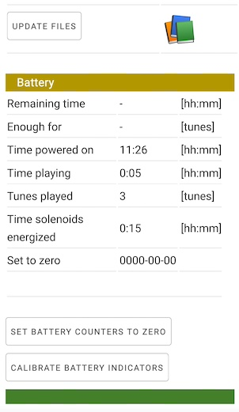
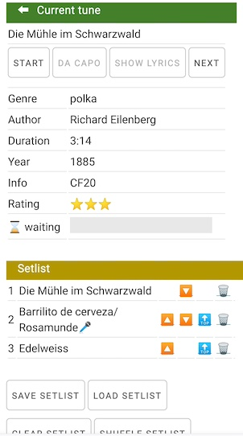

# Software for crank organs

# Purpose
The purpose of this software is to power a microcontroller (see schematic in this repository) enabling it to play music in MIDI format on a crank organ


# Features

* Browser as user interface. Control is done with WiFi with a browser on a cell phone, tablet or PC.
* Can define a setlist or select tune by tune.
* It's fast to establish a setlist. The setlist can be ordered, shuffled and stored. Playback order can be changed while playing, new tunes can be added or tunes can be dropped while performing.
* Music is uploaded into the microcontroller via WiFi with drag and drop or via USB connnection. You can add description, author, title, year to each tune.
* To aid tuning, playing scales and individual notes is supported. A tuner (test version) is included.
* Shows remaining battery capacity on browser
* Preconfigured for common crank organ scales scales: 20 note Carl Frei, 26 note Alderman/Wright, 31 note Raffin. Allows to define custom scales and different MIDI instruments.
* This system is highly scalable, capable of managing a vast number of pipes. Depending on the model, the microcontroller can store either 300 or 700 MIDI files. With the addition of an SD card, there is virtually no limit.
* Standard type 0 and 1 MIDI files are supported. Optionally, program numbers to identify different instruments and the percussion channel can be defined for use, 


The organ has to be equipped with electric solenoid valves for the pipes, see hardware description.

# If you want to try out the software
To see this software in operation, you need a ESP32-S3 development board (such as a DEVKIT-C board) with at least 1 MB of RAM. You can install the software as documented here, and then connect with a browser and navigate and use all functions. 

The only thing you won't be able is to hear music...


# Main menu and navigation
The home page has the main menu and shows detailed battery use information.

 


This diagram shows page navigation.
The page top has a left arrow to navigate up one level.


It's best to navigate the application using the buttons and the back button on the top of the page. Since pages are cached for fast response, sometimes reloading pages will update/clear information.

The home page is by default the menu page, but the configuration allows to define the tune list or the performance page as "home" page.

While music is playing, try to stay on the tune list and the performance page. The software is optimized so that these pages and their refresh does not interfere with the MIDI notes being played. All functions for playing music are included in these two pages.


## The page header


The ⬅ symbol will go up one level in the previous diagram.

Next to the battery is the % remaining (100%=battery full, 0%=battery empty) and the remaining estimated operating time in hours:minutes (21 hours 29 minutes on the example).

When the battery symbol 🔋 turns to 🪫, then the computed battery level is low. The counters are reset  when pressing the "Battery counters set to zero" on the home page. The time is the estimated operating time remaining in hours:minutes, based on the use history.

Battery use is calculated based on the power consumption parameters of the General Configuration: battery capacity, solenoid consumption, microcontroller consumption, all in Watts or Watt-hours. The solenoid consumption is then computed during the time each solenoid is on during playback.

Battery information is refreshed about every minute.

Keep in mind that battery capacity is usually lower than what the battery manufacturer informs. For example a 5V battery pack impelemented internally with 3.3V lithium batteries shown as 10000 mAh might have 3.3*10 Wh and not 5*10 Wh. To have meaningful output with the battery indicator, you will have to calibrate the battery capacity configuration.

If the browser looses the connection to the server, the broken heart symbol 💔 will come up. This usually happens if the microcontroller is turned off or out of range of the cell phone.


## Battery section of main menu page


The "Battery" section shows more information about the computed state of the battery than the page header. 

The correct calculation of power remaining depends on the "battery_watts_hour" parameter in the config.json file. Be sure to press "Battery counters set to zero" after recharging the battery.


# Tune control: tune list and performance page

## The tune list page


Contract the page a bit to see all columns. Scroll up and down to see the complete page.

You change these texts with the Tunelib Editor.

Entering text into the search box filters all tunes with that text. For example, entring polka will show all tunes with polka in the genre, title, author or any other field. The search is case and diacritic mark insensitive (for example a will match a, A, á, â or ä) and uses all information fields shown.


Tapping on the header of a column will sort up (and then down) by the contents of the column.

Tapping on a tune adds that tune to the bottom of the current setlist, i.e. queues the tune for playing. Tapping again, removes the tune from the setlist. The queued tunes are marked with a golden star 🌟 and the position in the setlist:


If a tune is playing, progress is shown with a progress bar next to the tune name. "Waiting" means that the tune is waiting for the crank to turn in order to start.


Once some tunes that you want to perform are selected, you turn the start turning the crank. If there is a crank sensor, the first tune starts playing. If not, touch the touchpad and the first tune starts playing. Or as a last resort, use the "Start" button on the performance page to start the tune. Once played, it pops off the pending list, and the next tune waits for start.

Or else, you can control performance pressing the "Performance" button. The queued tunes can be treated as a setlist.  Or if there is a request for a certain tune, you go back to the tune list page, tap the tune to add to setlist, go to the performance control page, move it to top with the little top button and play it.

You always can navigate back from the performance page to the tune page without disrupting the play list.

## The performance control page
With this page you can:

* Start the top tune with the start button. However, it's easier to use the touchpad button for this, or just turn the crank if the crank sensor is installed.
* Stop the currently played tune.
* Go back to the beginning of the current tune (restart it).
* See information about current tune 
* Control the sequence of tunes in the setlist
* Control the tempo of the tune (make the tunes play faster or slower)


### Current tune

This section shows current tune, title, author, year, genre, duration and other information, and a bar with % played.



"Waiting" means that the tune is waiting for the crank to turn or for the TouchPad or for the start button. 

* Start: starts playing the tune. If touchpad installed, this is equivalent to pressing the touch pad. If crank sensor installed, this is equivalent to start turning the crank. 
* To begining: rewinds the tune to the beginning
* Next: Skips the rest of the tune

Once started, the top tune is removed from the setlist. s

The setlist stored on flash gets changed only with the “save serlist“ button. 

### How to start a queued tune that is waiting

Option 1: If a crank rotation sensor is installed, start turning the crank. This will start the tune.

Option 2: If the touchpad is installed, start cranking, then touch and release the touchpad. This is very simple from the hardware point of view, since a touchpad is just any metallic knob or disc (see hardware), and easy to do: one hand turns the crank while holding the touchpad. When ready, release the touchpad.

Option 3: Press the start button on the performance page.


### Setlist control


This section show the current setlist. The buttons next to each title allow to:
 * 🔼 move up or 🔽 move down one position
 * 🔝 move to top of the setlist
 * 🗑 delete from setlist (the tune itself is never deleted)

The actual colors of the icons depend on the device.

The large buttons are:

* Save setlist: save the current setlist to flash. The current setlist will be lost with power off, the setlist on flash will remain. This is the only action that affects the saved setlist, all other actions are on the current (transient) setlist.
* Load setlist: load the setlist from flash, replacing the current setlist
* Clear setlist: clear the current setlist. Then you can get back to the tune list page and select new tunes. The setlist in flash is not affected.
* Shuffle setlist: shuffle tunes in the current setlist randomly. 
* Shuffle all: Get all tunes in the tune library and shuffle all randomly.

### Crank and speed control


These controls regulate playback speed. This is mainly for future use with the crank rotation speed sensor. 


# Operation on power on and onboard RGB led

It takes about 10 or 12 seconds from power on until the system is ready. Some valves will move when ready, normally that sound can be heard.

If a RGB (neopixel) LED is on the board and configured, it will show shades of blue and green on start. It will flash white several times when WiFi has connected. If it turns red, an error has occurred, see event log in system configuration. If you suspect a problem with the software, please report errors as an issue, pasting log and description of situation.  The led will flash white when touching and releasing the touchpad. 

The software will automatically load the saved setlist. If you turn the crank (with crank sensor installed) or release the touchpad, the playback will start. 

If there is no setlist stored (empty setlist), turning the crank or releasing the touchpad *twice in a row* will shuffle all tunes randomly. Entering the tuning page or MIDI configuration will disable this function.

So for all cases: turn on, and turn the crank or touch the touchpad and music starts.

If you have the tune list or performance page open in your cell phone, the page will poll the microcontroller until it is powered on and running, and then it will refresh the information. There should be no need to reload the page. The "broken heart" emoticon on the header bar will disappear automatically once the microcontroller is running.

You don't need your cell phone turned on to play music, only to alter the setlist.


# Tuner mode
Tuning mode aids tuning and intonation of pipes.

When entering tuning mode,  MIDI playback is disabled.

Even without a microphone installed, these pages are useful to make individual notes sound, to play scales and do repetition tests.

Actions such as "sound a note" or "repetition tests" are queued if you press the button several times. This is useful to free your hands during tests. The "stop" button on the "all notes page" will empty the queue.

## All notes page


This page shows all defined MIDI notes. Frequency and amplitude bar graph only have a meaning if there is a working microphone connected.

"C3(60)" means the central C on the piano, MIDI number 60, note name C, 4th octave. If a specific program had been configured, this would show as "Piano(1)-C3(60)". 

The "Play scale" button will play a scale up and down activating all solenoids in order.

"Tune all" will make each pipe sound in order. If a microphone is installed, tuning and amplitude is updated and stored. Tuning is shown in cents (1 cent = 1/100 of a semitone). Zero cents is a perfect tuning. 100 cents means one semitone away. 5 cents or less is probably good enough.

Amplitude is shown in relative scale in dB (decibel). 0 dB is the loudest possible measurement, -10 dB is less loud, etc. dB scales are logarithmic, just as the human perception is. The purpose of this measurement is to aid comparison of loudness of the pipes. The final judgement should be your ear.

Tapping the underscored MIDI note name/number will take you to the note page.

## The note page
This page aids intonating and tuning one note.

The "Tune" button will sound that note. You can use your own tuner, or if a microphone is installed, the tuning and amplitude is stored and shown. While the note sounds, several samples are taken and shown separately. If there is much difference for each frequency or amplitude measurements, adjustments can be made to that pipe.

The "Note test" button will sound that note.

The "Repetition test" button will make a repetition test increasing speed until reaching a 30ms on/30ms off cycle.

# History page
The history page will show all dates a tune has been played, and a list of all tunes played that date.

# Edit Tunelib
The tunelib editor allows to edit information about the tunes.

Activating this page will take some time, since the software checks for added and deleted files, and gathers information about the files.

Editing then tunelib is best done on PC, since the page is rather wide.


Press the "save" button at the bottom of the page to save all changes.

Columns:
* Title
* Genre
* Author
* Year
* Autoplay: if marked, this tune is included in the "shuffle all" function.
* Rating
* Info
* Duration in minutes:seconds, calculated automatically
* Date added, registered automatically
* File name
* Size: file size in bytes
+ Clean row: mark here to clear all fields of this row on save. This is used to get rid of the information about a deleted file.


# System information
The home page, the System Information and the Show log page show diagnostic and technical information about what's going on in the microcontroller.

These pages are mostly to aid diagnosis of possible problems, to see WiFi status and operating status. Free and used flash memory space is reported.

## Event log

The "Show log" button will show the latest event log. Look at the log if the neopixel led flashes red, or if you see some malfunction. Several past log files are stored in the data folder, to be rescued with, for example, ```mpremote :cp data/error12.log error12.log```. The time in the log file starts with 00:00:00, but if connected to a router or cell phone hot spot with internet access, the microcontroller acquires current time information, and the log time is shown in UTC. The "time zone" parameter on the configuration page can assign another (fixed) time zone, if you really want to look at the log in local time.

If there is some problem, please post the relevant part of the log, with previous history, and the description of the situation as an issue, I'll try to help.

The event log records events of class INFO, ERROR and EXCEPTION. The MicroPython Console, accessible through the USB connector with mpremote, putty, Thonny, or other tools will additionally show records of class DEBUG. Due to the overhead, these are not recorded to flash. It may be of interest to look at these detailed event logs too.


# The tune library
All MIDI files to be played reside in the tunelib folder in the microcontroller.

The Edit Tunelib option allows to add information about each MIDI file, such as title, author, year, rating,

## MIDI files
Both MIDI file type 0 (single track) and MIDI file type 1 (multitrack) files are supported. 

Note on, note off and set tempo events are interpreted for MIDI file playing. The default configuration ignores MIDI program numbers, although the pinout configuration allows to specify program numbers for certain or all MIDI notes or to specify MIDI notes for percussion channel 10. All other messages such as after touch, Meta messages such as lyrics or text and sysex messages are may be present but are ignored.

Be sure to play any MIDI file at least once on your PC to see if it has a correct format.

There is no functionality to transpose a MIDI file. Use any MIDI file editor to do that, if you need.

## Adding and deleting MIDI tunes

To add files, copy them from the PC to the tunelib folder on the microcontroller, then update the info with the Tunelib Editor option.

To remove files, rmove them from the tunelib folder on the microcontroller, then update the info with the tunelib editor.

Before copying tunes to the microcontroller, it is best to have the time set by ```mpremote rtc --set```. Another option is to let the microcontroller acquire date and time from the internet. Wait about 20 seconds after reboot and check date/time on the microcontroller with the System Information button.

## Update MIDI files with WiFi
* On a Mac, install Filezilla. Enter the host name, for example ```organillo.local``` in FileZilla.  You now can drag and drop files to the tunelib folder.
* On Windows, search internet for "How to connect to FTP servers in Windows" with Windows Explorer.

## Update MIDI files with USB and mpremote

mpremote is the standard tool to update files on the microcontroller, see https://docs.micropython.org/en/latest/reference/mpremote.html

Connect the microcontroller to the USB of the PC. Use ```mpremote cp my_midi_file.mid :/tunelib/my_midi_file.mid```to copy files from the PC to the microcontroller.

## Process MIDI file updates
New files will be visible only once you enter the Tunelib Editor option. This will take some time, since the microcontroller scans each MIDI file entirely.

Then you can edit the additional information, using this screen. Since the form is rather wide, this is best done on a tablet or PC:

!(tunelib editor screenshot)[tunelib_editor.jpg]

What you put into the fields is up to you. The tunelist page allows to search and order for these field contents.


# Installation and configuration
## Prerequisite hardware and software

This software is designed for a ESP32-S3 N8R8 or N16R8 microcontroller. N8R8 means 8 Mb flash, 8 Mb RAM. N16R8 means 16 Mb flash, 8 Mb RAM. The ESP32-S3 is most easily available on boards (modules) like the ESP32-S3-Devkit-C or similar boards. There are many vendors offering these boards. 

For a 20 pipe organ, see the hardware section (doc-hardware folder) for a schematic. It's best to connect a touchpad, which really is any metal knob or disc such as a drawer knob connected with a single wire to the input port of the ESP32-S3. The touchpad senses the touch of the hand with a capacitive sensing technology.

Optionally a crank sensor and microphone can be installed. Crank sensor is still being developed. Post an issue for an update about the crank sensor.

If more than 20 pipes/solenoids are needed, see hardware section of this repository. This will need a MCP23017 port expander.

Use Chrome or Firefox on a cell phone, PC, MAC or tablet to control the microcontroller. Safari is not supported.

## Prerequisites installing and configuring the software

Installation is easiest done with command line commands, i.e. using cmd on windows or Terminal on Mac. You should be familiar with commands such as dir or ls and cd. 

No programming required. Configuration is done via web pages and forms with a browser.

Install Python from python.org. You don't need to program with python, but the programs to manage the microcontroller need the Python runtime.

Python includes the pip "pip installs Python libraries" utility. Install esptool and mpremote using: ```pip install esptool```and ```pip install mpremote```

Install the git utility, to access github.com easily, to clone this repository to your PC.


# Installation
Install MicroPython on the ESP32-S3, please see micropython.org. You will have to download the "ESP32-S3 generic" .bin file and install that as per instructions on the download page with the esptool utility.

You can use the mpremote utility to verify over a USB cable that MicroPython is working, see https://docs.micropython.org/en/latest/reference/mpremote.html

Copy the software repository with ```git clone https://github.com/bixb922/crank-organ``` to the hard drive of your PC. 

Go to the install folder and execute the commands: ```

```
mpremote run install_software.py
mpremote run install_data.py
```

During the installation, a list of all files installed on the microcontroller will be displayed.

Enter ```mpremote ls``` and the output should be similar to:
```
ls :
           0 data/
         516 main.py
           0 software/
           0 tunelib/
```
The application is now installed.

To start the application with the MicroPython console use:
```
mpremote exec "import main"
```
You should see a startup log similar to this, with no error or exception messages:
```
Go!
2023-11-07 17:10:19-03 - minilog - INFO - === RESTART ===
2023-11-07 17:10:20-03 - config - INFO - Config ESP32-S3 N16R8/grande wifi_mac=f412fae72980 hostname and AP SSID=s3n16
2023-11-07 17:10:22-03 - wifimanager - DEBUG - _init start
2023-11-07 17:10:22-03 - wifimanager - DEBUG - AP mode started ssid s3n16 config ('192.168.144.1', '255.255.255.0', '192.168.144.1', '192.168.144.1')
2023-11-07 17:10:22-03 - wifimanager - DEBUG - _start_station_interface for ssid=self.sta_if_ssid=magus-2.4G
2023-11-07 17:10:22-03 - wifimanager - DEBUG - init ok
2023-11-07 17:10:23-03 - tachometer - DEBUG - init ok
2023-11-07 17:10:23-03 - solenoid - DEBUG - start _init solenoid
2023-11-07 17:10:23-03 - solenoid - ERROR - No I2C connected sda=11 scl=12
2023-11-07 17:10:23-03 - solenoid - ERROR - No I2C connected sda=15 scl=16
2023-11-07 17:10:23-03 - solenoid - DEBUG - init complete self.solenoid_def.device_info={'i2c1': 'not connected', 'i2c0': 'not connected', 'i2c1.mcp.0': 'test', 'i2c0.mcp.0': 'test'}
2023-11-07 17:10:24-03 - tunemanager - DEBUG - init ok 160 tunes
2023-11-07 17:10:24-03 - battery - DEBUG - init ok
2023-11-07 17:10:25-03 - organtuner - INFO - Microphone ADC configured
2023-11-07 17:10:26-03 - organtuner - INFO - Calibration done duration=0.056616 _TUNING_ITERATIONS=5 samples_per_sec=35325.7
2023-11-07 17:10:26-03 - organtuner - INFO - Frequency from 88.31425 to 8831.426
2023-11-07 17:10:26-03 - organtuner - DEBUG - init ok
2023-11-07 17:10:26-03 - player - DEBUG - init ok
2023-11-07 17:10:26-03 - setlist - DEBUG - init ok
2023-11-07 17:10:27-03 - poweroff - DEBUG - init ok
2023-11-07 17:10:27-03 - startup - DEBUG - imports done
2023-11-07 17:10:27-03 - tunemanager - DEBUG - Tunelist history updated
2023-11-07 17:10:27-03 - setlist - DEBUG - Setlist loaded self.current_setlist=[]
2023-11-07 17:10:27-03 - poweroff - DEBUG - Power off monitor started
2023-11-07 17:10:27-03 - startup - DEBUG - Starting asyncio loop
2023-11-07 17:10:27-03 - webserver - INFO - USE_CACHE=True MAX_AGE=300 sec
2023-11-07 17:10:28-03 - solenoid - DEBUG - clap 8
```

If there is an entry marked ERROR or EXCEPTION, there is some problem to be solved. Please report as issue if it's not clear what the problem is.

Now connect with WiFi and use a browser to use the software. See below, there are several options to connect with WiFi. The first connection must be done to the Access Point provided by the microcontroller. Search the WiFi access points (WiFi networks) available on your PC or cell phone and connect to the ```esp32s3``` access point. Enter ```http://esp32s3.local``` in your browser and wait for the main menu page to show.

Then configure the WiFi parameters using the General Configuration button on the index page. This is the start of the configuration page:


# WiFi capabilities

You connect to the controller with a browser (Chrome or Firefox) via WiFi. 

The microcontroller can connect to a WiFi Access Point, for example your home WiFi Router. It can simultaneously be be an Access Point so that a cell phone or PC can connect to it as if it were a home router.

These 3 options are available simultaneously for WiFi connection:

* Option 1: Have the microcontroller connect to a Access Point (also called Hotspot or WiFi zone) on you cell phone or tablet. This way of connecting is useful if you are performing. You setup the Access Point on your cell phone and the microcontroller will connect to it. The microcontroller is in "station mode".


* Option 2: Have the microcontroller connect to your home router. The microcontroller will try option 1 and option 2 one after the other until connected. This way of connecting is useful at home. You can connect to the microcontroller with any device connected to the home router, such as tablets or PCs. The microcontroller is in "station mode".


* Option 3: This is the fallback option and the option used the first time to configure the microcontroller. The microcontroller publishes a Access Point where you can connect. You connect to that Access Point just like you connect to your home router, but there is no internet available through the microcontroller. For power saving reasons, this option is made available during 2 minutes after power on, or until one of the first two options have made a successful connection. This option is useful if you want to connect from a cell phone where you haven't set up an access point (such as a borrowed cell phone one). Be aware that while connected, you won't have internet access available on the phone, unlike options 1 and 2.


When configuring the microcontroller (see below) you assign a host name, say "organillo".
Once connected, you start the Chrome or Firefox and enter ```organillo.local```. This will navigate to the microcontroller. In other words, the microcontroller is always at ```http://organillo.local``` (or whatever name you assign).

Sometimes, the browser changes the http:// prefix to https://, verify that the prefix is http since https does not work currrently. (I plan to upgrade to https support once the Microdot web server supports https. https support in Micropython is fairly recent, 2023).


# Configuration

The configuration parameters explained in detail on the configuration page.

## Configurations you should change
A initial configuration file is supplied. This is what you should modify:

* The configuration password (as noted above). The configuration password is also the password for connecting to the microcontroller in AP mode.
* The network name and description. This name is important, it will be both the WiFi name in AP mode and also to navigate in the browser to the microcontroller, you enter this host name: either http://hostname or http://hostname.local 
* The name and password of your cell phone's hot spot and/or the name and password of your home router, to be able to connect to the microcontroller from your cell phone.

You should check the checkbox "Password is required to make configuration changes". This will ask for the configuration password each time you save a change of configuration, i.e. not very often. Normal music playback does not need password. I make no claim about the security of this software, but the password will aid to prevent unauthorized or accidental changes. Also, if checked, enabling FTP access will require password.

If this option is checked, the a dialog like the following one will appear when you save General Configuration, MIDI configuration and Tunelib Editor (in your cell phone's language):


Leave the username blank. Enter the configuration password and press accept.


## MIDI configuration

The MIDI configuration consists of defining wich MIDI note should activate a certain output port and thus a solenoid.

There are templates for the pin definition for several usual crank organ scales.

### Select scale

Go to "MIDI configuration" to select the scale of the organ:

* 20 note Carl Frei scale (the default)
* 26 note Alderman/Melvin Wright scale
* 31 note Raffin scale
* 35 note custom (a custom scale)

If you need another scale, post an issue or look at the configuration files to figure out how they work. The configuration files are JSON text files. Follow the same order as a existing file. The 35 note custom scale uses almost all configuration options, except putting more than one MCP23017 on the same I2C bus, so that may be a starting point. Any file in the /data folder called nn_note_xxxx.json (with nn a number and xxx a description) is considered a MIDI pinout description file.


### Transpose scale if necessary
If you have a organ with, say, a 20 note Carl Frei scale, that scale may start on F, G or other notes as lowest note. Use the transpose buttons to adjust the scale until the lowe

st note fits. The transpose buttons shift the complete scale up or down one semitone.

### Test solenoids
Next to each solenoid pin definition there is a test button. If the hardware and solenoids are connected, this is a way to test if the wiring is correct.

If a solenoid is connected to the wrong port, instead of swapping wires, you can change the MIDI to port association here.

### Redefine MIDI notes (only if necessary)

This is advanced configuration, should be necessary only for custom scales, or crank organs with drums or glockenspiel, where the glockenpiel have their own program number and the drums are on the percussion channel number 10.

There are three ways to define a MIDI note here:
* Only the MIDI note number, leaving program number blank or zero. This will match any MIDI program number in the MIDI file. This is the most common way to define notes, since for simple organs there is only one voice or instrument, and the program number in the MIDI file does not matter.

* Program number and MIDI note number. The output port will activate only if the specified program nubmer and MIDI number is encountered. This is necesary to implement, for example, a glockenspiel.

* Program number 129 and MIDI note number. The output port will activate if the MIDI note number is encountered on the percussion channel 10  The program number 129 is not part of the MIDI standard and is only used here to define drum or percussion sounds.

### Microphone, crank sensor, touchpad and neopixel sensor (important)

This configuration is necessary to review, depending on what sensors you install in your microcontroller hardware.

You select if you will have a microphone, crank sensor, neopixel led or touchpad button installed, and which GPIO ports will be assigned to them. 

If present, it's best to have microphone on pin 4, either touchpad or crank sensor on pin 5. Only some pins of the ESP32 support touchpad and analog-digital conversion. 

Many ESP32-S3 boards have a "neopixel" RGB WS2812 led either on pin 38 or 48. See the vendor's description or schematic, or try with both values. 

If you don't have, say, a microphone, leave the pin definition blank to tell the software to ignore the microphone.

It's best if you have at least the touchpad button, which essentially is a single wire from the microcontroller to a metallic knob or disc.

*After saving configuration, please reboot.*

## Power management settings

Configure the battery capacity, in watts-hour. You get the watts-hour by multiplying the battery voltage by the milliampere-hours figure (mAh) figure of the battery. Some manufacturers will publish the watts-hour figure.

Example: a AA battery is rated at 2000mAh, that is 2 Ah (ampere-hours. The battery pack has 10 batteries delivering 1.2V each, for a total of 12V. The capacity is 12V*2Ah = 24 watt-hours.

Another example: a USB battery pack is rated at 10000mAh = 10 Ah. Although the battery pack delivers 5V, lithium batteries are 3.3V, so the capacity is 3.3V*10Ah = 33 watt-hours.

Configure the solenoid resistance (default: 90 Ohms).

## Time zone
When connected to a router or cell phone hot spot, the software uses ntptime (network time protocol) to acquire the UTC time, and then it queries worldtimeapi.org once a day for the time zone offset and DST offset. Once that is done, the time zone offset is stored in flash for the next refresh, that takes place at most once a day.

Enter your local time zone in the "other parameters" section. See https://en.wikipedia.org/wiki/List_of_tz_database_time_zones for a list of official names of time zones. The time zone name has to match one recognized by worldtimeapi.org. 

If no internet access is available, time starts on Jan 1st, 2000. This does not impair operation. The history page will show the tunes as played on 2000-01-01, and the error log will show time only.

Before copying tunes to the microcontroller, it is best to have the time set by ```mpremote rtc --set'''.

## Other parameters (less likely to need change)

Go through the rest and change what you may need, use save button to save to the microcontroller. Most parameters are there just to explain how the software works.

The sections are:
* Crank settings. Necessary to change when a crank speed sensor is installed (still under development).

The rest of the sections is even less likely to require change:
* Debug/test settings
* Other parameters, such as the time zone offset. The time zone is only relevant for the time displayed in the event log.

The configuration gets stored to /data/config.json in the microcontroller. Passwords are cyphered. However the ESP32-S3 does not provide the hardware to really protect the passwords in a way that can be considered highly secure.  The microcontroller should not be exposed to access from the internet, only to access in home or cell phone "hot spot" networks.


*After saving configuration, please reboot.*

## FTP: drag and drop to update files with WiFi
Press the "FTP access" button on the configuration page.,

This will allow to access the microcontroller's files via FTP with Windows Explorer or with the (free) Filezilla program.

Google "FTP acess Windows Explorer" to see how to register a FTP server.

Download Filezilla from it's official site and follow instructions.

In both cases you get a graphical user interface to access and update files with WiFi.

## SD card 

If the microcontroller has a SD or TF card controller please modify boot.py to mount at /sd, including the following lines: 
```
import os
import machine
os.mount(machine.SDCard(), "/sd")
```
If the SD card is connected to a non-standard SPI port, other parameters will be necessary, search for  "micropython.org class sdcard" plus the documentation for ESP32-S3. 

The tunelib folder will then be at /sd/tunelib

With the SD card, only about 500kb of free flash memory is necessary. The /tunelib folder on flash will serve as fallback should the SD card fail or come loose.


## Customization crank organ photo
You can replace the crank organ ohite of the home screen by replacing the file /static/crank.jpg. A size of 100x75 pixels may be a good size to start with. 

## Backup
Microcontroller flash storage is fairly robust. However, 
once you configure your microcontroller, you should backup relevant files:
* /data/tunelib.json (the additional information about each tune)
* /data/config.json (cyphered password, WiFi and general configuration). 
* /data/20_note_Carl_Frei.json or the pinout .json you are using (with the information about MIDI to pin information). This is necessary only if you change the standard configuration.
* /data/pinout.txt (although this file is very easy to restore using the MIDI configuration page)
* /data/history.db (if you are interested in conserving the history of when tunes have played)

Copy with FileZilla or mpremote to your PC. You also can print the configuration forms with the browser, to have backup on paper, but that will need to reenter the data if the files get lost.

Also: Keep a copy of the MIDI files on your PC, or backup the tunelib folder after changes.

# Recent changes

* Record history of tunes played. Show times a tune has played. New history page to show past performances with dates and times.
* More fields for tunelib: date added, rating, info, number of times played, and more.
* Integrated tunelib editor
* Sticky table headers
* Allow ordering of tune list
* Time zone support. Time zone and current DST is read from worldtimeapi.org once a day.
* Standard Web authentication if password is required to change configuration
* Microcontroller enters deepsleep after a time to conserve energy
* Keep backup of json files when changed
* Make tune play speed changable even without crank sensor
* RGB Led colors on startup
* Migrated web server from tinyweb to Microdot, preparing for https support.
* Improved blocking of MIDI playback when using tuner or pin test functions
* Tested and measured for interference of web server functions with MIDI music playback. Enhanced a guard to minimize delays of MIDI events due to essential functions during playback.
* Improved and changed touchpad sensitivity. Touchpad now works on release. Two touches in a row with a empty setlist will shuffle all tunes. RGB LED gives visual      feedback when using touchpad.
* Changed fields on forms change background color until saved.
* Tuner now locks in on signals where harmonics are much stronger than the fundamental.
* Refactored many modules to be based on classes instead of plain modules.
* Updated documentation, made diagrams work on github
* Restructured language support. Complete software is available in english language. Web pages related to music performance are available in spanish translation.
* Standarized parameters for battery usage to watts and watt-hours. Record when battery is set to zero, and record playing time. USB battery pack keepalive function.
* Initial page can now be set by configuration
* Corrected errors in detailed hardware and software documentation, schematics and images 
* Added button on the MIDI configuration page to test the solenoid when installing the wiring.
* Detection of polyphony to limit battery consumption 
* Cream background color for changed fields in forms


# Programming language
The application is programmed in MicroPython using the asyncio model to coordinate multiple concurrent tasks. Web pages are written in HTML5 with CSS, programming in JavaScript with web requests done with fetch/async. No C/C++ code was necessary.

The MIDI file parser is written in highly optimized MicroPython, with very little overhead. The timing is done in a way to minimize interference of other functions, and the tunelist and performance pages are also well optimized not to interfere with playback of the music. Lengthy tasks are fitted by a scheduler in avalable time slots between notes.

Frequency detection is done with the zero crossing algorithm (See zcr.py). The algorithm is fast and quite precise. To guard against noise, autocorrelation of the signal is done and the strongest part of the autocorrelation is used. With closed (bourdon) pipes, the harmonics can be quite strong and that is accounted for also.

MicroPython version 1.21 (or 1.20 later than sept 2023) is required. Since MicroPython is continually enhanced, best use the latest version.

# Credits

Credits to mcauser (MCP23017 library, no modifications), Miguel Grinberg (microdot server, temporarily added some logging to debug my software), and Robert-hh and several others for uftpd. All these library modules are available on github:
* https://github.com/mcauser/micropython-mcp23017
* https://github.com/miguelgrinberg/microdot
* https://github.com/robert-hh/FTP-Server-for-ESP8266-ESP32-and-PYBD

These components are (c) Copyright by their respective authors and are available under the same MIT license as this software.

To ease the installation process, I have included the libraries in the repository and installation files. There is no need for a separate installation of these libraries.

# Under development/testing

Most code, especially the MIDI file parser, has been tested extensively, although I keep making changes. I have tried tested all options under many circumstances. Please report problems as github issue.

The following features need more testing or development:

* Microphone for tuning. It works well, but I have not included a way to aid setting the sensitivity of the microphone. Microphones have a volume setting. If set for high, signal is distorted but that does not impair frequency detection, but intensity cannot be measured. Microphones with automatic volume control are ok to measure tuning, but will not measure volume.

* Sensor for crank speed to influence playback speed. Pending to test and for fine adjustments.


# Restrictions
Safari as a browser is not supported.

The security  and protection of this software is designed for a WiFi network such as a home network or a hotspot on a cell phone. I make no claim about the security against willful hacking. I have put several safeguards in the software, such as cyphering (encrypting) passwords with a hidden key, controlling access via WiFi to files, etc. However, the webserver on the microcontroller should not be made available on the public internet, since it does not have the required security mechanisms necessary to be a public web server. When accessing the microcontroller via USB or FTP, all elements including passwords can be ultimately retrieved and new code can be installed. 

Although it is possible to connect several clientes simultaneously, it is recommended to connect only one client at a time, since more than one client may delay notes when playing back music.

If a new scale has to be implemented (say: a 50 note scale), a new .json template for that scale has to be designed.

Current time zone offset is updated only once a day. When playing deep in the night during a DST transition, local time will be off one hour until the next power on. 

If no internet is accessible, current time will be of January 2000 until internet gets accessible at next reboot. This will not affect playing music, but history and error log timestamps will be of the year 2000 indicating that no time was available. For example: when connecting in AP mode to the microcontroller, no internet is available.

In some countries, WiFi devices need certification. Be sure to purchase hardware that conforms to the legal requirements in your country or area.

The touchpad sensor will probably not work with gloves, I never tested that.

# Licensing
Copyright (c) 2023 Hermann Paul von Borries

This software and design is licensed under the MIT License:

Permission is hereby granted, free of charge, to any person obtaining a copy
of this software and associated documentation files (the "Software"), to deal
in the Software without restriction, including without limitation the rights
to use, copy, modify, merge, publish, distribute, sublicense, and/or sell
copies of the Software, and to permit persons to whom the Software is
furnished to do so, subject to the following conditions:

The above copyright notice and this permission notice shall be included in all
copies or substantial portions of the Software.

THE SOFTWARE IS PROVIDED "AS IS", WITHOUT WARRANTY OF ANY KIND, EXPRESS OR
IMPLIED, INCLUDING BUT NOT LIMITED TO THE WARRANTIES OF MERCHANTABILITY,
FITNESS FOR A PARTICULAR PURPOSE AND NONINFRINGEMENT. IN NO EVENT SHALL THE
AUTHORS OR COPYRIGHT HOLDERS BE LIABLE FOR ANY CLAIM, DAMAGES OR OTHER
LIABILITY, WHETHER IN AN ACTION OF CONTRACT, TORT OR OTHERWISE, ARISING FROM,
OUT OF OR IN CONNECTION WITH THE SOFTWARE OR THE USE OR OTHER DEALINGS IN THE
SOFTWARE.


# Affiliation
I have no affiliation nor relationship with any vender of hardware or software nor other products mentioned in this page. I do not endorse specific products, nor do I get benefits by promoting them.

In any case, I believe that software products mentioned on this page are either available under very permissive licenses such as MIT license or GPL, or are hardware products which are fairly generic and available from many vendors and sources.
