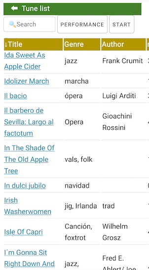
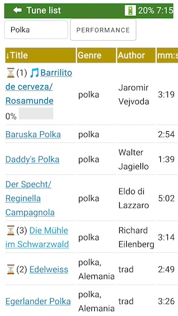
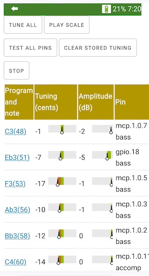
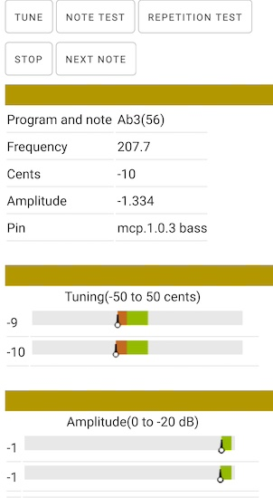
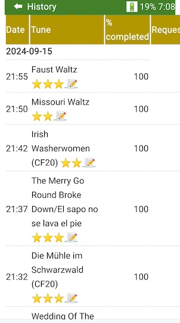
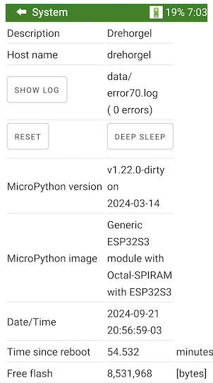

# Software for crank organs

# Contents
1.  [Purpose](#1-purpose)
2.  [Features](#2-features)
3.  [If you want to try out the software](#3-if-you-want-to-try-out-the-software)
4.  [Main menu and navigation](#4-main-menu-and-navigation)
     * [The page header](#the-page-header)
5.  [Crank organ: tune list and performance page](#5-crank-organ-tune-list-and-performance-page)
     * [The tune list page](#the-tune-list-page)
     * [The performance control page](#the-performance-control-page)
         * [Current tune](#current-tune)
         * [How to start a queued tune that is waiting](#how-to-start-a-queued-tune-that-is-waiting)
         * [Setlist control](#setlist-control)
         * [Crank and speed control](#crank-and-speed-control)
6.  [Tuner](#6-tuner)
     * [The note list page](#the-note-list-page)
     * [The note page](#the-note-page)
7.  [History](#7-history)
8.  [Edit Tunelib](#8-edit-tunelib)
     * [The tune library](#the-tune-library)
     * [MIDI files](#midi-files)
     * [Adding and deleting MIDI tunes](#adding-and-deleting-midi-tunes)
     * [The Tunelib Editor (Tunelib Editor button on index page)](#the-tunelib-editor-tunelib-editor-button-on-index-page)
9.  [General configuration](#9-general-configuration)
     * [Configuring a network name and host name](#configuring-a-network-name-and-host-name)
     * [Configurations you should change: WiFi connections](#configurations-you-should-change-wifi-connections)
     * [Power management settings](#power-management-settings)
     * [Other parameters (less likely to need change)](#other-parameters-less-likely-to-need-change)
     * [Crank configuration](#crank-configuration)
     * [Automatic playback](#automatic-playback)
     * [Battery calibration](#battery-calibration)
10.  [Pin and MIDI configuration](#10-pin-and-midi-configuration)
     * [Select scale](#select-scale)
     * [Transpose scale (only if necessary)](#transpose-scale-only-if-necessary)
     * [Test solenoids](#test-solenoids)
     * [Redefine MIDI notes (only if necessary)](#redefine-midi-notes-only-if-necessary)
     * [Microphone, crank sensor, touchpad and neopixel sensor (important)](#microphone-crank-sensor-touchpad-and-neopixel-sensor-important)
     * [Standard pin definitions for 20 note organ](#standard-pin-definitions-for-20-note-organ)
     * [MIDI over serial (5 PIN DIN connector)](#midi-over-serial-5-pin-din-connector)
     * [Available GPIO pins](#available-gpio-pins)
11.  [System](#11-system)
     * [Error log](#error-log)
12.  [File manager](#12-file-manager)
     * [Update MIDI files](#update-midi-files)
     * [Update software](#update-software)
     * [View files](#view-files)
13.  [Turning the system on](#13-turning-the-system-on)
14.  [Installation](#14-installation)
     * [Prerequisite hardware and software](#prerequisite-hardware-and-software)
     * [Prerequisites installing and configuring the software](#prerequisites-installing-and-configuring-the-software)
     * [Installation instructions](#installation-instructions)
     * [WiFi capabilities](#wifi-capabilities)
15.  [Other stuff](#15-other-stuff)
     * [Increase MIDI file capacity](#increase-midi-file-capacity)
     * [SD card](#sd-card)
     * [Time zone](#time-zone)
     * [MIDI over serial](#midi-over-serial)
     * [Languages: English, Spanish and German](#languages-english-spanish-and-german)
     * [Customization crank organ photo](#customization-crank-organ-photo)
     * [Registers](#registers)
     * [Percussion sounds made with pipes a.k.a. "fake drums"](#percussion-sounds-made-with-pipes-aka-fake-drums)
     * [Crank rotation sensor and tempo](#crank-rotation-sensor-and-tempo)
     * [Compressed HTML and JS files, compile .py files](#compressed-html-and-js-files-compile-py-files)
     * [Automatic shutdown when idle](#automatic-shutdown-when-idle)
     * [The onboard RGB LED](#the-onboard-rgb-led)
     * [Another way to do initial configuration](#another-way-to-do-initial-configuration)
16.  [Backup](#16-backup)
17.  [Recent changes](#17-recent-changes)
     * [Changes from Nov 2023 to March 2024:](#changes-from-nov-2023-to-march-2024)
     * [Changes from March 2024 to June 2024.](#changes-from-march-2024-to-june-2024)
     * [Changes from June 2024 to October 2024](#changes-from-june-2024-to-october-2024)
     * [Changes on Oct 30, 2024](#changes-on-oct-30-2024)
     * [Changes from Oct 30, 2024 to January 2024](#changes-from-oct-30-2024-to-january-2024)
     * [Changes Feb 2025](#changes-feb-2025)
     * [Changes Feb 2025 to March 28, 2025](#changes-feb-2025-to-march-28-2025)
     * [Changes March 29, 2025 to April 8, 2025](#changes-march-29-2025-to-april-8-2025)
18.  [Changes April 9, 2025 to May 10, 2025](#18-changes-april-9-2025-to-may-10-2025)
19.  [Changes May 10 to May 30, 2025](#19-changes-may-10-to-may-30-2025)
     * [Changes May 31 to June 14, 2025](#changes-may-31-to-june-14-2025)
20.  [Changes June 15 to June 23, 2025](#20-changes-june-15-to-june-23-2025)
21.  [Programming language](#21-programming-language)
22.  [Credits](#22-credits)
23.  [Testing](#23-testing)
24.  [Troubleshooting](#24-troubleshooting)
25.  [Restrictions](#25-restrictions)
26.  [Licensing](#26-licensing)
27.  [Affiliation](#27-affiliation)
# 1. Purpose
The purpose of this software is to power a microcontroller (see schematic in this repository) enabling it to play music in MIDI format on a crank organ by operating solenoid valves.

No software programming knowledge is needed to use this software. However, full source code is provided for perusal and it comes with the permission to change it and use it according to the MIT license, which not very restrictive.

Please post a Github issue in this repository for any question you might have. Please star the github repository if this is of interest for you.

# 2. Features

* Browser as user interface (Chrome or Firefox). Management is done with WiFi with a browser on a cell phone, tablet or PC. No need to install anything on the cell phone or tablet.
* However: the solution can play music perfectly without a cell phone present
* Can define a setlist or select tune by tune.
* It's very fast to establish a setlist. The setlist can be ordered, shuffled and stored on flash. Playback order can be changed while playing, new tunes can be added or tunes can be dropped while performing.
* MIDI files can be updated via WiFi or via USB connection. You can add description, author, title, year and a rating to each tune.
* To aid tuning, playing scales and individual notes is supported. A tuner is included.
* Preconfigured for common crank organ scales scales: 20 note Carl Frei, 26 note Alderman/Wright, 31 note Raffin. Allows to define custom scales and different MIDI instruments, like a glockenspiel MIDI instrument.
* This system is highly scalable, capable of managing a virtually unlimited number of pipes. The microcontroller can store about 1600 MIDI files in it's flash memory. With the addition of an SD card, there is virtually no limit.
* Standard type 0 and 1 MIDI files are supported. Optionally, program numbers to identify different instruments and the percussion channel can be defined for use, 
* Allows to store lyrics
* Unattended operation is possible too
* Software or hardware registers (as in "register stop of a organ")
* Crank turning speed sets MIDI playback speed (optional)
* Simulated percussion: drums are simulated playing several pipes together during a very short time
* Shows remaining battery capacity on browser
* Many options to move valves, percussion and other devices:
   - solenoids or solenoid valves via GPIO pins
   - solenoids or solenoid valves via via "MCP23017 16 port expander". Either several MCP23017 on one I2C bus or one bus per port expander.
   - third party driver boards via MIDI over serial output. There are several manufacturers of boards for 32 or 64 or more outputs that can be connected to a "5 pin DIN MIDI over serial" connector.
   - RC servos (radio control servos) via GPIO ports (up to 8 supported on ESP32-S3) 
   - RC servos (radio control servos) via  "PCA9685 16 port RC control board". Either several PCA9685 on one I2C or one I2C for each PCA9685


# 3. If you want to try out the software
To see this software in operation, there is a demo here: https://drehorgel.pythonanywhere.com/demo/.

The demo allows to see the Tune list and the Performance page in operation (although there is certainly no crank organ behind that will make music, there are no cranks organ on the cloud). You also can see all configuration pages (although no configuration can be changed on the demo).

If you can get a ESP32-S3 development board (such as a ESP32-S3-DEVKITC-1 board) with at least 1 MB of RAM, for example a N8R8 or N16R8 board, then you can install the software as documented here over USB, and then connect with a browser and navigate and use all functions. 

As a next step, you will only need a crank organ to make the pipes sound...

I believe the software is relatively intuitive to use. Don't feel overwhelmed with the configuration information presented here. The only configuration you really need to do is to configure the WiFi router where the microcontroller needs to connect. All the rest is optional and the software will work out of the box.


# 4. Main menu and navigation
The home page has the main menu and shows detailed battery use information.

 


This diagram shows page navigation.
The page headers have a left arrow to navigate up one level (go back).


The home page is the menu page.

While music is playing, try to stay on the tune list and the performance pages. The software is optimized so that these pages and their refresh does not interfere with the MIDI notes being played. All functions for playing music are included in these two pages. The purpose of other pages is the configuration and update of the microcontroller and these pages may interfere with playing music.

While using the tuning pages (note list and note page) and the test button on the pinout definition page, playing back music is disabled (if not, music could start to play while tuning or testing). You will need to reboot the microcontroller to enable playing music again.


## The page header


The &#11013; symbol will go up one level in the previous diagram. 

If the battery has been calibrated, the usage also will be shown here. See [here](#power-management-settings-and-battery-calibration) for details. Battery calibration is optional.

If the browser looses the connection to the server, the broken heart symbol &#x1f494; will come up. This usually happens if the microcontroller is turned off or out of range of the cell phone or out of range of the WiFi router:


# 5. Crank organ: tune list and performance page

## The tune list page


The purpose of the tune list page is to select tunes to be played by tapping on the tune. You change these texts with the Tunelib Editor.

Entering text into the search box filters all tunes with that text. 


Tapping on the header of a column will sort up (and then down) by the contents of the column.

Tapping on a tune title adds that tune to the bottom of the current setlist, in other words: queues the tune for playing. Tapping again removes the tune from the setlist. The queued tunes are marked with a golden star &#127775; and the position in the setlist:


Once some tunes that you want to perform are selected, you have several ways to start the tune,see section [How to start a queued tune that is waiting](#how-to-start-a-queued-tune-that-is-waiting), one of the methods is to press the _Start_ button.

Use the _Start_ button to start the tune in position 1 This same button is also on the Performance page. If a tune is playing, progress is shown with a progress bar and percentage next to the tune name. 




Once played, the tune pops off the pending list, and the next tune waits for start.

The queued tunes are in fact a setlist.  The Performance page allows to manage this setlist. If there is a request for a certain tune, you go back to the Tune list page, tap the tune to add to setlist, go to the performance control page, and move it to the required position.

You always can navigate back from the performance page to the tune page without disrupting the play list and without disrupting playing the music. 

## The performance control page
With this page you can see information about the current tune, start/stop the current tune, see lyrics and manage the setlist. 

### Current tune

This section shows current tune, title, author, year, genre, duration and other information, and a bar with % played.


"Waiting" means that the tune is waiting for the crank to turn or for the TouchPad or for the start button. 

* Start: starts playing the tune. If touchpad installed, this is equivalent to pressing the touch pad or (if a crank sensor is installed) starting to turn the crank.
* Da capo: returns the tune to the beginning, waiting for a start.
* Show lyrics/Show setlist: toggles between lyrics and setlist.
* Next: Skips the rest of the tune

Played tunes are removed from the setlist. 
 

### How to start a queued tune that is waiting

Option 1: Press the start button on the performance page (on this page).

Option 2: If the touchpad is installed, start cranking, then touch and release the touchpad. The tune starts when the touchpad is released. See hardware section for touchpad. The touchpad is really any metallic button such as a drawer button, connected with a single wire to the microcontroller.

Option 3: If a crank rotation sensor is installed, start turning the crank. This will start the tune.


### Setlist control


This section show the current setlist. The buttons next to each title allow to:
 * 🔼 move up or 🔽 move down one position
 * 🔝 move to top of the setlist
 * 🗑 delete from setlist (the tune itself is never deleted)

The actual colors of the icons depend on the device.

The large buttons are:

* Save setlist: store the current setlist to flash memory so that it can be loaded (restored) later.  
* Load setlist: load the stored setlist from flash, replacing the current setlist
* Clear setlist: clear the current setlist.  
* Shuffle setlist: shuffle tunes in the current setlist randomly.
* Shuffle all: Shuffle all tunes marked with "autoplay" randomly. Autoplay can be set/reset with the [Tunelib Editor](#edit-tunelib) for each tune.
* Shuffle ⭐⭐⭐: Shuffle all tunes with a rating of three stars randomly.
* History: Navigates to the History page. The purpose of this button is to be able to put a comment or rating on recently played tunes.

The current setlist is kept even if the microcontroller is rebooted or turned off.

### Crank and speed control


These controls regulate playback speed. Even if there is no crank sensor, you can vary the tempo with the two buttons left and right to the indicator bar. If there is a crank sensor, and "Tempo follows crank", then the crank determines playback speed.

# 6. Tuner
Tuning mode aids tuning and intonation of pipes.

Even without a microphone installed, these pages are useful to make individual notes sound and look at a tuner, to play scales and do repetition tests.

When entering tuning mode,  MIDI playback is disabled. Reboot to get back to normal.

Actions such as "sound a note" or "repetition tests" are queued if you press the button several times. This is useful to free your hands during tests. The "stop" button will empty the queue.

## The note list page



This page shows all defined MIDI notes. Frequency and amplitude bar graph only have a meaning if there is a working microphone connected.

"C3(60)" means the central C on the piano, MIDI number 60, note name C, 4th octave. If a specific program had been configured, this would show as "Piano(1)-C3(60)". 

* "Tune all" will make each pipe sound in order. If a microphone is installed, tuning and amplitude is updated and stored. Tuning is shown in cents (1 cent = 1/100 of a semitone). Zero cents is a perfect tuning. 100 cents means one semitone away. 5 cents or less is probably good enough. The tuning is stored in flash, so after a reboot you will still see the tuning.
* The "Play scale" button will play a scale up and down activating all solenoids in order.
* "Test all pins" will play all defined pins wired to a solenoid valve, in order.
* "Clear stored tuning" will clear the stored tuning.
* "Stop" will stop whatever tuning is in progress.

Tuning is shown in cents, one cent is 1/100 of a semitone. The green range is -10 to +10 cents. 

Amplitude is shown in relative scale in dB (decibels). 0 dB is the loudest possible measurement, -10 dB is less loud, etc. dB scales are logarithmic, just as the human perception is. The purpose of this measurement is to aid comparison of loudness of the pipes. The final judgement should be your ear.

Tapping the underscored MIDI note name/number will take you to the note page.

## The note page
This page aids intonating and tuning one note.



The "Tune" button will sound that note. You can use your own tuner, or if a microphone is installed, the tuning and amplitude is stored and shown. While the note sounds, several samples are taken and stored separately. 

The "Note test" button will sound that note.

The "Repetition test" button will make a repetition test increasing speed until reaching a 30ms on/30ms off cycle.

"Stop" will stop whatever is in progress.

"Next note" will go to the next note in the tuner list.

# 7. History
The history page will show all dates a tune has been played, and a list of all tunes played that date. There is a button to purge older history, if you should wish that.

The column "% completed" show how much of the tune has been played. 100% means the complete tune. I like to know whether I stopped a tune (with the "Next" button on the performance page) before completing in order to review that tune.



The 📝 button next to the title allows to enter a rating (*, ** or ***) or a comment about a recently played tune. I use that to keep notes on how a recently played tune went with the audience and with me. The rating is stored in the _rating_ column of the tunelib. The comment is appended to the _info_ column of the tunelib. These fields can also be edited with the Tunelib Editor, but reviewing the history also allows to add info and rating for recently played tunes while the memory is fresh.

# 8. Edit Tunelib
The Tunelib Editor allows to edit information about the tunes.

## The tune library
All MIDI files to be played reside in the /tunelib folder in the microcontroller. The filenames must end with .mid or .MID

.kar, .smf and .rtx files that contain MIDI files must be renamed to .mid. If you do that, please check the files by playing them first on the PC.

The Edit Tunelib option allows to add information about each MIDI file, such as title, author, year, rating. This information is stored separately in /data/tunelib.json

## MIDI files
Both MIDI file type 0 (single track) and MIDI file type 1 (multitrack) files are supported. 

Note on and note off will act on solenoids.  Set tempo events are interpreted for MIDI file playing. The default configuration ignores MIDI program numbers, although the pinout configuration allows to specify program numbers for certain or all MIDI notes or to specify MIDI notes for percussion channel 10. All other messages such as aftertouch, Meta messages such as lyrics or text and sysex messages may be present but are ignored on playback.

Be sure to play any MIDI file at least once on your PC to see if it works.

MIDI files without long Meta messages are best. Use the ```compress_midi.py``` utility program to make the MIDI files lean and to compress them to almost one third of the original size. See [here](#increase-midi-file-capacity).


## Adding and deleting MIDI tunes

Use the [File Manager](#file-manager) to upload files to the /tunelib folder of the microcontroller. Both the File Manager and the Tunelib Editor can be used to delete files from the MIDI folder.

MIDI files become visible after a few seconds (10 or 20 seconds). You may need to refresh the tunelist or play page to make changes visible. You also can enter the "Edit Tunelib" button to force a check for all changed files.

You also can add MIDI files with ```mpremote cp``` to the /tunelib folder over USB. 

## The Tunelib Editor (Tunelib Editor button on index page)

Activating this page will take a few seconds, since the software checks for added, deleted and modified files, and gathers information about the MIDI files such as size and duration.

Editing then tunelib is best done on PC, since the page is rather wide.


Press the "save" button at the bottom of the page to save all changes.

Columns:
* Title, Genre, Author, Year: free text
* Autoplay: if marked, this tune is included in the "shuffle all" function.
* Rating: this should be *, ** or *** or be left blank. I use it to indicate how much I like this tune. The * character is shown on output as star ⭐, ⭐⭐, ⭐⭐⭐. If marked  with three stars, this tune is included in the "Shuffle ⭐⭐⭐" function. 
* Info: free text. This information can also be added using the history page. I use it to keep notes on music recently played.
* Lyrics: press the Add or Edit button to add or edit lyrics for this tune. The lyrics can be recalled with the Lyrics button on the Performance page.

The following columns are computed and cannot be changed:
* Duration in minutes:seconds
* Date added
* File name
* File size in bytes

And at the end of the row there is this button:
* Delete: press the wastebasket button to delete the MIDI file from the microcontroller. You will be asked for confirmation.

# 9. General configuration

The configuration parameters explained in detail on the configuration page. After changing and saving a new configuration, please reboot the microcontroller.


THis page is long and wide and is best used on a PC or MAC.

Any configuration change needs a reboot of the microcontroller after saving changes to become effective.

## Configuring a network name and host name
This is the first configuration parameter to change.

When configuring the microcontroller (see below) you assign a host name, say "organillo".
Once connected, you start the Chrome or Firefox and enter ```organillo.local``` as the web site address. This will navigate to the microcontroller. In other words, the microcontroller is always at ```http://organillo.local``` (or whatever name you assign).

Sometimes, the browser changes the ```http://``` prefix ```to https://```, verify that the prefix is ```http``` since ```https``` does not work.

## Configurations you should change: WiFi connections
A initial configuration file is supplied. This is what you should modify:

* The network name and host name as noted above.
* The configuration password. The configuration password is also the password for connecting to the microcontroller in AP mode. 
* The name and password of your cell phone's hot spot and/or the name and password of your home router, to be able to connect to the microcontroller from your cell phone.
* The description, which is not very important...

You should mark the checkbox "Password is required to make configuration changes". This will ask for the configuration password each time you save a change of configuration, i.e. not very often. Normal music playback does not need password. The password will aid to prevent unauthorized or accidental changes. Also, if checked, enabling the File Manager access will require password.

If this option is checked, a dialog like the following one will appear when you save General Configuration, MIDI configuration and Tunelib Editor (in your cell phone's language):


Leave the username blank. Enter the configuration password and press accept.

See [WiFi Capabilities](#wifi-capabilities)

You also can change the passwords editing config.json on your PC and then uploading the file with mpremote.

## Power management settings

Maximum polyphony allowed: Since the battery fuse or current protection may shut down the battery if the consumption is too high, this limits the maximum solenoids that can be on at a certain time. The oldest note gets turned off (shortened a bit) if the maximum is exceeded. Calculate this number by dividing the maximum current less 10% by the current consumption of each solenoid, and truncate to the previous integer.

USB power pack heartbeat: Some USB power packs need some current every now and then to remain turned on. This option will activate a random solenoid to achieve a minimal consumption.

## Other parameters (less likely to need change)

Go through the rest and change what you may need, use save button to save to the microcontroller. Most parameters are there just to explain how the software works.

The sections are:
* Automatic playback. This option makes sense if a crank motor is installed. The setlist will be played with the indicated time between tunes.

* Crank settings. Necessary to change when a crank speed sensor is installed.

The rest of the sections is even less likely to require change:
* Debug/test settings
* Other parameters

The configuration gets stored to /data/config.json in the microcontroller. Passwords are encrypted. However the ESP32-S3 on a DEVKIT-C board does not provide the hardware to really protect the passwords in a way that can be considered very highly secure, since everything can be ultimately accessed and changed via USB.  The microcontroller should not be exposed to access from the internet, only to access in home or cell phone "hot spot" networks. (As a side note: the ESP32-S3 can be made very secure, but that needs a more expensive board).

## Crank configuration

The crank can be equipped optionally with a sensor to measure rotation. The software has a very efficient rotation counter, and can calculate rotation speed.

When starting to turn the crank, the current MIDI file will start playing.

When starting to turn the crank and no setlist has been defined, all tunes with 3 stars (or if not starred, all tunes) will be shuffled and the first tune will start to play.

On the performance page and on the General Configuration page, there is an option to make the tempo of the music depend on the crank revolution speed. 

To enable a crank sensor:
* Define the GPIO pin where the crank sensor is connected in the "Pin/MIDI configuration" page
1. If it is a simple slotted wheel, enter only one pin
2. If it is a incremental rotation encoder with two outputs, enter the two pins that go to the encoder
* Go to the "Crank and tune play parameters" in the configuration page and set the parameters there. The number of pulses per revolution (PPR) is given by the sensor. If you are builiding the encoder yourself, this is the number of positive signal edges per revolution.

See also [Crank rotation sensor and tempo](#crank-rotation-sensor-and-tempo) 

[Here](/doc-hardware/crank-sensor.md) is a detailed description of crank sensor options.

## Automatic playback
There are crank organs being used for unattended operation. In the "Crank and tune play parameters" of the configuration page, set the number of seconds between tunes, and tunes will play automatically one after the other with the indicated pause between tunes. As with manual operation, first the current setlist will be played, and when empty, the microcontroller will shuffle tunes.

## Battery calibration
Battery calibration enables to show computed battery usage on the top of each page and on the home page. If you have other means to show battery level, this is of little interest.

Battery calibration is done on the home page (index page). It will give information to the microcontroller to estimate the level of charge of the batteries based on the time the processor is on and on the time solenoid valves are on.

The battery capacity is configured with the following steps:
* Charge battery fully and insert
* Press "Reset battery counters to zero" on the home page 
* Play the organ until the battery reaches zero, this is: until the battery fully discharges. 
* Recharge battery fully, insert and _before_ setting counters to zero, press "Battery calibration" on the home page. Enter 0 (i.e. battery empty) and press ok.
* Repeat these steps a second time to ensure best results.

Battery capacity will be automatically calculated from now on. The calibration is necessary only once.

If the battery has a % charge indicator, the % can be entered a few times. This adds more information to the battery calibration process.

If the battery has been calibrated: Next to the battery  symbol at the top of each page is the % remaining (100%=battery full, 0%=battery empty) and the remaining estimated operating time in hours:minutes (21 hours 29 minutes on the example).

When the battery symbol &#x1f50b; turns to &#x1faab;, then the computed battery level is low.

The counters are reset  when pressing the "Battery counters set to zero" on the home page. The time is the estimated operating time remaining in hours:minutes, based on the use history.

Even without calibration, some useful information will show on the home page (index page). Times are since the last reset to zero of counters:
* Time powered on 
* Time playing
* Tunes played
* Time solenoids energized
* Set to zero (date/time)


# 10. Pin and MIDI configuration

The MIDI configuration consists of defining wich MIDI note should activate a certain output port and thus a solenoid.

The pin configuration assigns GPIO pins for functions like touch pad, crank sensor, microphone, etc.

There are templates for the pin definition for several usual crank organ scales. For a 20 note Carl Frei scale, the preconfigured settings should normally do.

Any Pin and MIDI configuration change needs a reboot of the microcontroller after saving changes to become effective.

## Select scale

Go to "MIDI configuration" to select the scale of the organ:

* 20 note Carl Frei scale (the default, very common)
* 26 note Alderman/Melvin Wright scale
* 31 note Raffin scale (a very common scale for larger crank organs)
* 35 note custom (a custom scale)
* 40 note RC servo (radio control servo)
* 64 note scale for MIDI over serial

What you select is a template that allows to see and change pin assignment for different hardware configurations:
* Use GPIO pins only (useful for 20 note organs), only ULN2803 drivers necessary for the solenoids
* Use MCP23017 16 port expander for larger configurations
* Use a MIDI over serial driver to send the data to a DIN type MIDI connector
* Use RC servos to move valves or percussion

If you need another scale or hardware configuration, post an issue in this Github repository or look at the configuration files to figure out how they work. The configuration files are JSON text files. Follow the same order as a existing file. The 35 and 48 note custom scale uses almost all configuration options, except putting more than one MCP23017 on the same I2C bus, so that may be a starting point. Any file in the /data folder called nn_note_xxxx.json (with nn a number and xxx a description) is considered a MIDI pinout description file, so you can add your own file here.

You can mix and match, i.e. you can specify a template that sends some MIDI messages to a MIDI DIN serial plug, others that hits a drum with a solenoid on a GPIO port, and others that turn on solenoid valves via a MCP23017 port expander, and yet others that turn on RC servos.

You also specify additional hardware you connect to the microcontroller:
* A touchpad button (which is really any metallic drawer knob connected with a single wire to the microcontroller)
* Electronic register switches
* A rotary sensor for the crank (to detect movement, and/or to sense velocity)
* A rotary knob (rotary encoder) to set velocity
* A microphone for tuning

## Transpose scale (only if necessary)
If you have a organ with, say, a 20 note Carl Frei scale, that scale may start on F, G or other notes as lowest note. Use the transpose buttons to adjust the scale until the lowest note fits. The transpose buttons shift the complete scale up or down one semitone.

## Test solenoids
Next to each solenoid pin definition there is a test button. If the hardware and solenoids are connected, this is a way to test if the wiring is correct.

If a solenoid is connected to the wrong port, instead of swapping wires, you can change the MIDI to port association here. 

Pin and scale definitions must be saved before testing, but MIDI note number can be changed on the fly without saving. A "Pin not found" message can mean that the scale definition was not saved, or a MCP23017/PCA9685 is not detected on the I2C bus.


## Redefine MIDI notes (only if necessary)

This is advanced configuration, should be necessary only for custom scales, or crank organs with drums/percussion or glockenspiel, where the glockenpiel have their own program number and the drums are on the percussion channel number 10.

There are three ways to define a MIDI note here:
* Only the MIDI note number, leaving program number blank or zero. This will match any MIDI program number in the MIDI file. This is the most common way to define notes, since for simple organs there is only one voice or instrument, and the program number in the MIDI file does not matter.

* Program number and MIDI note number. The output port will activate only if the specified program nubmer and MIDI number is encountered. This is necesary to implement, for example, a glockenspiel.

* Program number 129 and MIDI note number. The output port will activate if the MIDI note number is encountered on the percussion channel 10  The program number 129 is not part of the MIDI standard and is only used here to define drum or percussion sounds.

## Microphone, crank sensor, touchpad and neopixel sensor (important)

These configurations are necessary to review depending on what sensors you install in your microcontroller hardware.

You select if you will have a microphone, crank sensor, neopixel led or touchpad button installed, and which GPIO ports will be assigned to them. 

If present, it's best to have microphone on pin 4, either touchpad or crank sensor on pin 5. Only certain pins of the ESP32-S3 support touchpad and analog-digital conversion. 

Most ESP32-S3 boards have a "neopixel" RGB WS2812 led either on pin 38 or 48. See the vendor's description or schematic, or try with both values. You can use the Pin and MIDI Configuration page to redefine the pin number. The default pin number is 48.

If you don't have, say, a microphone, leave the pin definition blank to tell the software to ignore the microphone.

It's best if you have at least the touchpad button, which essentially is a single wire from the microcontroller to a metallic knob or disc. This knob is used to signal the start of tune, when released.

The available pins are shown on the pinout configuration page.

*After saving configuration, please reboot.*

## Standard pin definitions for 20 note organ

| pin | MIDI note number | Note |
 -------- | ----|--- |
| 6  |  53 |F3 |
| 7  | 58 | Bb3 |
| 15 | 60 | C4|
| 16 | 62 | D4|
| 17 | 63 | Eb4 |
| 18 | 64 | E4 |
| 8  | 65 | F4 |
| 9  | 67 | G4 |
| 10 | 69 | A4 |
| 11 | 70 | Bb4 |
| 12 | 72 | C5 |
| 13 | 74 | D5 |
| 14 | 75 | Eb5 |
| 1  | 76 | E5 |
| 42 | 77 | F5 |
| 41 | 79 | G5 |
| 40 | 81 | A5 |
| 39 | 82 | Bb5 |
| 47 | 84 | C6 |
| 21 | 86 | D6 |

The definition for the 20 note scale is in /data/20_note_Carl_Frei.json. You can transpose this scale to start with another note using the Pin and MIDI configuration.

Please see other scale definitions in their respective json files. Several scales are provided as example. 

The Pin and MIDI configuration allows to alter that the default. For example, I don't care very much which valve is connected to what pin, I just connect and then use the Test button on the Pin and Midi Configuration to find out what wiring I did, and then adjust configuration correspondingly. I usually don't even label the wires.

The MIDI pin definition is ordered by the hardware layout. For each hardware pin, it specifies one or more notes that will activate each pin, possibly with the control of a register.

The pin definition columns are:
* Pin number: this cannot be altered and is the hardware pin. To change this, you will have to change the JSON template.
* Program number/midi note indicates a MIDI note which will activate this pin. If program number is left blank, any program number in the MIDI file will do. If you specify a program number (1 to 128, 1=piano), that specific program number must be present in the MIDI file to make the note sound. If you specify 129, that MIDI note number on the percussion/drum channel (channel 10) will activate the note.
* Rank: Any comment or description, for example a description of the location of the pipe (e.g. "accomp windchest pipe 3")
* Register: a register (either hardware or software register) that must be active for the note to sound.
* Test: Will test this pin. No MIDI note needs to be defined nor saved to test the pin. It will activate/deactivate the pin several times in succession.

## MIDI over serial (5 PIN DIN connector)

For a MIDI over serial, the pin number has no meaning, but it must be present. See this file: /data/64_note_midi_over_serial.json for an example.

For MIDI over serial, it will be best that you only include the MIDI note numbers that your configuration really has, and leave the unused MIDI positions of the board with a blank MIDI note number. This will speed up the tuning.

## Available GPIO pins
This page provides summary of available GPIO pins. The summary is updated when loading the page or after saving changes. This is an example:

Category|List of pin numbers | Count
Used GPIO pins	|4,5,48|	(3 )|
-----------------|-------|-----|
Available GPIO pins	|1-3,6-18,21,38-42,47|	(23 )|
Reserved GPIO pins|	0,19,20,22-37,43-46	|(23 )|
Available GPIO ADC1 pins	|1-3,6-10	(8 )|
Available GPIO Touchpad pins|	1-3,6-14	(12 )|


* Used GPIO pins: ESP32-S3 pins used as input or output pins on the "Pinout and MIDI configuration page" such as microphone, touchpad, I2C bus and GPIO output
* Available GPIO pins: ESP32-S3 pins that can be assigned. They can be used as input or output pins. Not all can used for microphone and touchpad, see below. But all can be used as output pins for MIDI.
* Reserved GPIO pins: some pins of the ESP32-S3 cannot be used or interfere with the inner working of the chip. For example, some of these are used for WiFi or for the flash. THese cannot be used for crank organ functions.
* Available GPIO ADC1 pins: ESP32-S3 Analog-Digital-Converter bank 1. Select the microphone pin from this list. (Bank 2 cannot be used, this bank is reserved for WiFi)
* Available GPIO Touchpad pins: Select a pin for the touchpad function from this list.

The output pins of the ESP32-S3 cannot drive solenoids (electromagnets) directly. The current they supply is not enough, and solenoids produce high currents when turned off that must be absorbed with a "kick back diode". Always connect the GPIO output to a driver such as the ULN2803 IC, which will amplify the current and provide kick back diodes.

# 11. System
The home page, the System shows diagnostic and technical information about what's going on in the microcontroller.


On the System page, the following buttons will appear:
* Reset: resets (reboots) the microcontroller
* Deep sleep: puts the microcontroller in deep sleep mode. In this mode, the microcontroller will draw very little energy. To power on again, you will have to power off and on the battery.
* Show log: shows the last error log.
* Scan WiFi: repeats a scan for WiFi access points, ordered by signal intensity.


## Error log

The "Show log" button will show the latest error log. Look at the log if the neopixel led flashes red, or if you see some malfunction. Several past log files are stored in the data folder. They can also be accessed wit the [File Manager](#file-manager).

If there is some problem, please post the relevant part of the error log in a Github issue, with previous history, and the description of the situation here on Github (section: Issues). I'd like to fix issues that crop up.

The error log records events of class INFO, ERROR and EXCEPTION. The MicroPython Console, accessible through the USB connector with mpremote (or also putty, Thonny, or other tools) will additionally show records of class DEBUG. Due to the overhead, DEBUG records are not recorded to flash. It may be of interest to look at these detailed error logs too.

# 12. File manager

Press the "Update files" button on the index page, and the File Manager will show up.

You can navigate to all folders, and view text, MIDI and image files, but the main purpose is to update MIDI files (i.e. tunelib) and software.


The buttons at the top of the page are:
* Upload to current folder. This will open a dialog box to select files on your PC to be uploaded to the current folder.
* Upload to auto folder. This will open a dialog box to select files on your PC. The files will be automatically copied to their correct folder: .py and .mpy files go to the /software/mpy folder, html and web pages go to the /software/static folder, MIDI files go to the /tunelib folder and json files go to the /data folder. There is no need to specify (nor remember) the correct folder.
* Dowload: select one or more files with the checkbox before the file name, and press download to copy the files to your PC's or Mac's download folder.
* Delete: select one or more files with the check box before the file name, and press delete. You will be asked for confirmation.
* Clear selection: clear all selection check boxes.

When uploading files to the microcontroller, you can select a folder with subfolders, all files will be uploaded (either to the current folder, or sorted according to file type). This is useful if you want to upload many files.

When navigating to the tunelib folder, some useful information about the MIDI files will also appear.

## Update MIDI files
Use the "Update to auto folder" button to upload MIDI files. After some seconds, the tunelib will also update automatically. Use the "Edit Tunelib" option to add title, genre, author, rating, etc.

## Update software
Use the "Update to auto folder" button to upload a new software version (.py or .mpy files. .html and .js files), then reboot to make the new version take effect. You can reboot with the "Reset" button on the "System" page, or by pressing the reset button on the microcontroller.

## View files
Files that are "underlined" in the File Manager can be clicked to view their content. Click on MIDI files is supported, try that!

# 13. Turning the system on

TLDR: turn on, and turn the crank or touch the touchpad and music starts.

It takes about 5 to 8 seconds from power on until the system is ready. Some valves will move when ready as a signal that the microcontroller has completed the boot.

If a RGB (neopixel) LED is on the board and configured, it will show changing blue and green during startup. It will flash white several times when WiFi has connected. If it flashes red or magenta, or if it turns a solid red, an error has occurred, see the error log under the System button. If you suspect a problem with the software, please report errors as an issue, pasting the part of the error log and description of situation.  The led will flash white when touching and releasing the touchpad. If there is a RGB led and it does not turn on, then change neopixel LED pin according to [Configure neopixel LED](#microphone-crank-sensor-touchpad-and-neopixel-sensor-important)

The software will automatically load the current setlist, or if empty, the saved setlist. If you turn the crank (with crank sensor installed) or release the touchpad, the playback will start. 

If there is no setlist stored (empty setlist), turning the crank or releasing the touchpad  will shuffle all tunes randomly (first all tunes with 3 stars rating, if none, all tunes). 


If you have the tune list or performance page open in your cell phone previously to reboot, the page will poll the microcontroller until it is powered on and running, and then it will refresh the information. There should be no need to reload the page. The "broken heart" emoticon on the header bar will disappear automatically once the microcontroller is running.

You don't need your cell phone turned on to play music, only to alter the setlist. In fact, you don't need a cell phone at all to play music with this system.


# 14. Installation
## Prerequisite hardware and software

This software is designed for a ESP32-S3 N8R8 or N16R8 microcontroller. N8R8 means 8 Megabytes of flash, 8 Megabytes of RAM. N16R8 means 16 Megabytes of flash, 8 Megabytes RAM(Megabytes, not Gigabytes...). The ESP32-S3 is most easily available on boards (modules) like the ESP32-S3-Devkit-C or similar boards. There are many vendors offering these boards, I use a "ESP32-S3-Devkit-C N16R8" clone (see also the hardware description in this repository).

For a 20 pipe organ, see the hardware section (doc-hardware folder) for a schematic. It's best to connect a touchpad, which really is any metal knob or disc such as a drawer knob connected with a single wire to the input port of the ESP32-S3. The touchpad senses the touch of the hand with a capacitive sensing technology. The touchpad is used to start tunes.

If more than 20 pipes/solenoids are needed, see hardware section of this repository. This will need a MCP23017 port expander.

Use Chrome or Firefox on a cell phone, PC, MAC or tablet to control the microcontroller. Safari is not supported.

## Prerequisites installing and configuring the software

Installation is easiest done on the command line, i.e. using cmd on windows or Terminal on Mac. You should be familiar with commands such as dir or ls and cd. 

No programming required. Configuration is done later via web pages and forms with a browser over WiFi.

Install Python from python.org. Please follow instructions on that page to install Python. You will not need to program with Python, but the programs to manage the microcontroller need the Python installed.

Python includes the pip "pip Installs Python Libraries" utility. Install the esptool.py and mpremote utility programs using: ```pip install esptool```and ```pip install mpremote```

Install the git utility, to access github.com easily, namely to clone this repository to your PC with ```git clone https://www.github.com/bixb922/crank-organ```


## Installation instructions

To install MicroPython on the ESP32-S3 N8R8 or N16R8 please see https://micropython.org/download/ESP32_GENERIC_S3/ section "Firmware (Support for Octal-SPIRAM)". Download the latest .bin file and use the esptool.py command line provided on the page. Version 1.24 is fine.

To change the flash size from the standard 8Mb to 16Mb use this tool: https://github.com/glenn20/mp-image-tool-esp32. If you use this tool, you don't need ```esptool.py```, and the tool alters the .bin image to recognize the 16Mb and can even load the altered image to the microcontroller. See here: https://github.com/bixb922/crank-organ/discussions/3 or read the documentation at the respository for mp-image-tool-esp32. 


You can use the mpremote utility to verify over a USB cable that MicroPython is working, see https://docs.micropython.org/en/latest/reference/mpremote.html.  Run mpremote on the command line and you should get the >>> prompt (also called "REPL prompt").

Copy the software repository with ```git clone https://github.com/bixb922/crank-organ``` to the hard drive of your PC. 

No other prerrequisite libraries need to be installed on the microcontroller (former versions required ```aiohttp```, but this is not needed anymore).

Go to the install folder and execute the commands: 
```
mpremote run install_software.py
mpremote run install_data.py
```
Please be patient, these ```run``` commands take a few seconds before a response appears, since ```mpremote``` needs to transfer the data over USB first and does not show progress.

During the installation, a list of all files installed on the microcontroller will be displayed.

Enter ```mpremote ls``` and the output should be similar to:
```
ls :
           0 data/
         516 main.py
           0 software/
           0 tunelib/
```
The application is now installed. You can copy MIDI files (with .mid type) to the tunelib folder with mpremote:
```
mpremote cp my_nice_melody :/tunelib/
```
Or you can configure WiFi and copy MIDI files to the /tunelib folder with the [File Manager](#file-manager). Please enter the [Tunelib editor](#the-tunelib-editor-tunelib-editor-button-on-index-page) to make the MIDI files visible after copying ()


To test the application use this command in cmd (Windows) or Terminal (Mac) enter the mpremote command. When the >>> prompt appears, press control-D.

You should see a startup log similar to this:
```
VfsLfs2 mounted with readsize=1024, progsize=128, lookahead=512
timezone - Could not read timezone.json: [Errno 2] ENOENT
2024-06-25 15:26:10UTC - minilog - INFO - === RESTART ===
2024-06-25 15:26:11UTC - config - INFO - Generating new key
2024-06-25 15:26:11UTC - config - INFO - Passwords encrypted
2024-06-25 15:26:11UTC - config - DEBUG - Config Your ESP32-S3 device wifi_mac=7cdfa1e8c240 hostname and AP SSID=esp32s3
2024-06-25 15:26:11UTC - led - DEBUG - init done
2024-06-25 15:26:12UTC - wifimanager - DEBUG - AP mode started ssid esp32s3 config ('192.168.144.1', '255.255.255.0', '192.168.144.1', '192.168.144.1')
2024-06-25 15:26:12UTC - wifimanager - DEBUG - _start_station_interface for ssid=self.sta_if_ssid=wifi_SSID_1
2024-06-25 15:26:12UTC - wifimanager - DEBUG - init ok
2024-06-25 15:26:12UTC - solenoid - DEBUG - init complete self.solenoid_def.device_info={}
2024-06-25 15:26:12UTC - tunemanager - DEBUG - init ok, 0 tunes in data/tunelib.json
2024-06-25 15:26:12UTC - tachometer - DEBUG - Crank sensor not enabled
2024-06-25 15:26:12UTC - tachometer - DEBUG - crank init ok
2024-06-25 15:26:12UTC - battery - INFO - init error loading json, rebuilding. OSError(2,)
2024-06-25 15:26:12UTC - battery - DEBUG - init ok
2024-06-25 15:26:12UTC - history - DEBUG - init done
2024-06-25 15:26:13UTC - player - DEBUG - init ok
2024-06-25 15:26:13UTC - setlist - DEBUG - init ok
2024-06-25 15:26:13UTC - organtuner - INFO - new data/organtuner.json written
2024-06-25 15:26:13UTC - organtuner - DEBUG - init ok
2024-06-25 15:26:13UTC - poweroff - DEBUG - init ok
2024-06-25 15:26:14UTC - setlist - DEBUG - Setlist loaded 0 elements
2024-06-25 15:26:14UTC - poweroff - DEBUG - Power off monitor started
2024-06-25 15:26:14UTC - startup - DEBUG - Starting asyncio loop
2024-06-25 15:26:14UTC - webserver - DEBUG - USE_CACHE=True MAX_AGE=300 sec
2024-06-25 15:26:14UTC - solenoid - DEBUG - clap 8
Total startup time (without main, until asyncio ready) 4357 msec
2024-06-25 15:26:15UTC - battery - DEBUG - Can't calibrate: no calibration data
2024-06-25 15:26:27UTC - wifimanager - INFO - Status'(wifi_SSID_1 201)', could not connect to wifi_SSID_1
2024-06-25 15:26:28UTC - wifimanager - DEBUG - _start_station_interface for ssid=self.sta_if_ssid=wifi_SSID_2
```

If there is an entry marked ERROR or EXCEPTION, there is some problem to be solved. Please report as issue if it's not clear what the problem is, I'll try to help.

Now connect with WiFi. WiFi is active about 5 seconds after power on. Look at the the WiFi access points (WiFi networks) available on your PC or cell phone and connect to the ```esp32s3``` access point. This AP will be visible around 10 seconds after power on, and will stay on until you configure WiFi and reboot. If prompted for a password, enter the word _password_. Enter ```http://esp32s3.local``` in your browser (Chrome or Firefox) and wait for the main menu page to appear. Typing ```http://192.168.144.1``` in the address bar instead of ```http://esp32s3.local``` should also work. You may need to use  ```http://192.168.144.1```on Android phones older than 2021. 

Then configure the WiFi parameters using the General Configuration button on the index page. This is the start of the configuration page:


Configuration is best done on a PC. That also allows to use the browser to translate the configuration instructions.

Once WiFi is configured, further updates can be made with the [File Manager](#file-manager), for example, upload MIDI files.

If you can't configure WiFi, see (here)(##another-way-to-configure)

## WiFi capabilities

The microcontroller can connect to a WiFi Access Point, for example your home WiFi Router. It can simultaneously be an Access Point so that a cell phone or PC can connect to it as if it were a home router.

These options are available for WiFi connection:

* Option 1: Have the microcontroller connect to a Access Point (also called Hotspot or WiFi zone) on you cell phone or tablet. This way of connecting is useful if you are performing away from home. You setup the Access Point on your cell phone and the microcontroller will connect to it. The microcontroller is in "station mode".


* Option 2: Have the microcontroller connect to your home router. This way of connecting is useful at home, to configure the software, upload files or to perform. You can connect to the microcontroller with any device connected to the home router, such as tablets or PCs. The microcontroller is in "station mode".


The microcontroller will try option 1 and option 2 one after the other until connected. It will try during 15 seconds with option 1, then 15 seconds with option 2 and so on, until one of the two options is available.

* Option 3: This is the fallback option and the option used the first time to configure the microcontroller and can be used in case of problems. The microcontroller publishes a Access Point where you can connect, initially with the name esp32s3, and if configured, with the name you provide. You connect to that Access Point just like you connect to your home router, but there will be no internet available through the microcontroller. For power saving reasons, this option is made available during 2 minutes after power on (except when the microcontroller is not configured for WiFi, in that case option 3 is active until configured), or until one of the first two options have made a successful connection. This option is useful if you want to connect from a cell phone where you haven't set up an access point (such as a borrowed cell phone). Be aware that while connected, you won't have internet access available on the phone, unlike options 1 and 2. If you connect, option 3 access stays active until you stop using it.


See [General Configuration](#general-configuration) to configure WiFi.

# 15. Other stuff

## Increase MIDI file capacity

The software accepts compressed MIDI files. With average size crank organ music MIDI files (what I'm trying to say: withthe tunes I have) the capacity without compression is about 700 files for the 16MB flash version of the ESP32-S3. With compression the capacity is about 1800 MIDI files for the 16MB version and 700 files for the 8MB version of the ESP32-S3 board.

The ```compress_midi.py``` utility included here runs on your PC. It compresses all MIDI files in an input folder to an ouput folder. The input files are not changed. The output folder should start empty. If ```compress_midi.py``` is run again, only changed files are processed.

The ```compress_midi.py``` is in the ```tools``` folder of the repository and runs on your PC or Mac or Linux (not on the microcontroller). You need to do: ```pip install mido``` as a prerrequisite (pip is a Python utility on the PC to install software packages. mido is package to read and write MIDI files).

The compression is done in several steps by ```compress_midi.py```:
* Only note on, note off and program change MIDI events are kept, the rest of the MIDI events are discarded. Set tempo meta events are processed and incorporated into the MIDI times. All meta messages are discarded. Pulses per beat is set to a lower (standard) value of 96, which should be precise enough for mechanical music. All this makes the MIDI file much faster to process and considerably smaller.
* All note on and note off events are converted to note on events with running status. This can give in a significant file size reduction.
* Then the files are compressed by ```compress_midi.py``` using the gzip algorthm and written to the output folder with .gz suffix. In other words, ```foo.mid``` becomes ```foo.mid.gz```.


Finally, you should copy these files to the microcontroller using the "Update to auto folder" button of the File Manager. This will replace all *.mid files with their *.mid.gz compressed counterpart.

The music player will automatically recognize either the .mid file or the .mid.gz file and decompress on the fly if necessary.

Use ```compress_midi.py --help``` for help with the utility program. Input and output folder name need to be specified only once because they are kept in ```compress_midi.json``` in your current folder on the PC.

Average compression for my 300+ MIDI files is to 40% of the original size, considering that the allocation unit of the flash is blocks of 4096 bytes.

There is an additional feature of compress_midi.py: it leaves a file named ```setlist_stored.json```in the compressed file folder. This can be uploaded together with the MIDI files (with the same upload in file manager). Then recall the stored playlist in the Play page and you will have a setlist of the last 2 weeks of modifications. This allows to check and play recent tunes.

## SD card

If the microcontroller has a SD or TF card controller please modify boot.py to mount at /sd, including the following lines: 
```
import os
import machine
os.mount(machine.SDCard(), "/sd")
```

It is quite easy to connect a SD card if desirable. There are schematics of boards with SD card included here, and for the MicroPython support see here: https://docs.micropython.org/en/latest/library/machine.SDCard.html. You should add the commands to mount the SD card to ```boot.py```.

If the SD card is connected to a non-standard SPI port, other parameters will be necessary, search for  "micropython.org class sdcard" plus the documentation for ESP32-S3. 

The tunelib folder will then be at /sd/tunelib

With the SD card, only about 500kb of free flash memory is necessary. The /tunelib folder on flash will serve as fallback should the SD card fail or come loose.

## Time zone
When connected to a router or cell phone hot spot, the software uses NTP (Network Time Protocol) to acquire the UTC time. If internet is not reachable, current time is set when a page is loaded on the browser.

The time zone (for example America/Lima or India/Kolkata) is obtained from the browser automatically. There is no need for configuration.

If no internet access is available nor a browser loads a page on the microcontroller, time starts on Jan 1st, 2000. This does not impair operation at all, allowing to crank the organ without internet access. The history page will show the tunes as if played on 2000-01-01, and the error log will show time only.

## MIDI over serial

MIDI over serial (MIDI over a DIN connector) is supported. On the pinout page (Pin and MIDI configuration) select the "64 notes MIDI over serial data/64_note_midi_over_serial.json". 

The provided configuration has defined 64 notes from MIDI 48 to MIDI 111. You can select the MIDI channel here, and all notes are sent to that channel.

No program change messages are sent. In fact, only note on and note off messages are sent, and with fixed velocity, as it is normal for pipes. If you have another requirement, please post an issue in this repository.

MIDI output over serial can be combined with valves or actuators connected via GPIO outputs, MCP23017 outputs or RC servo outputs.

This option has little testing. Please report any problem.


## Languages: English, Spanish and German
Pages for daily operation such as home page, tunelist, performance and history are available in english, spanish and german.

Pages for configuration are only available in english. Since these pages are not used very frequently, please use the translation provided by the browser if necessary. Anyhow, it's best to use a PC for configuration since these pages have a lot of text or are wider than a cell phone screen. On a PC, Chrome and Firefox have translation capabilites, so you can configure the system with translated pages.

The language is selected according to the language preference of the browser.

I will be delighted if someone is willing to add another language. The translations are in the file /static/translations.js. Please post an issue in this repository if you would like to colaborate.


## Customization crank organ photo
You can replace the crank organ ohite of the home screen by replacing the file /static/crank.jpg. A size of 100x75 pixels may be a good size to start with. Upload a new photo using the [File Manager](#file-manager)

## Registers
You can switch groups of pipes on and off with a register, either using the web interface or with hardware switches. See an example in /data/48_notes_custom.json. I use this to activate Piccolo flutes and for a Octave register. If you are interested, please post an issue in this Github repository and I'll explain.

## Percussion sounds made with pipes a.k.a. "fake drums"

Sounding several pipes together very shortly makes a percussive sound, much like a tom. The software supports this. It will detect suitable MIDI messages on channel 10 and transform these into commands to turn on the necessary pipes for a very short time. Please see /data/drumdef.json for the MIDI notes that are defined on channel 10. The page at ```/static/drumdef.html``` allows to test the drum definitions. Make a MIDI file with the drum notes repeated over and over and play that MIDI file while changing the definitions on the drumdef.html page. This page is a bit experimental and not linked to the main menu.


## Crank rotation sensor and tempo
The crank rotation sensor can start tunes, and can influence tempo of the music. See hardware section for discussion of sensors.

The crank rotation sensor can be a simple rotation sensor or a quadrature rotation sensor, this second type of sensor can distinguish forward and backward motion. More advanced sensors are usually quadrature encoding rotation sensors.

The crank sensor must be configured first in the pinout page. There is a line called "Tachometer" (meaning: rotation speed sensor) and either one or two GPIO pins can be configured for the sensor:
* One pin means this is a simple encoder
* Two pins means this is a quadrature encoder. Quadrature encoder typically have outputs marked A and B. The order is not relevant.

Once configured there, go to the General Configuration page, "Crank and tune play parameters" section:
* "Tempo follows crank": if checked, the music tempo (music playback speed) follows the crank speed. If you turn faster, music plays faster. If you turn slower, music plays slower. This setting can be temporarily changed on the "Performance" page, since there is also a "Tempo follows crank" checkbox. 
* Pulses per revolution: If the sensor has a toothed disk, the number of tooths. If the sensor is a industrial sensor: the number of pulses per revolution specified on the sensor. In both cases, the ESP32-S3 will count both rising and falling edges and then divide by 2.

If the crank starts to turn, music will start to play. The "tempo follows crank" setting does not influence this.

To detect that the crank starts turning, the crank speed must exceed the "high threshold". Only when the crank speed drops below the "low threshold" the music stops. Crank start and stop detection is very fast.

"Normal value of crank speed": I have found 1.2 revolutions/second a good value, but this depends on your bellows capacity and turning habit.

There is a crank speed graph on the "System" page. It is difficult to maintain a steady turning, but the "Crank variations faster than this rev/sec value are smoothed out" parameter may help to maintain a constant tempo of the music. Don't set too low, a value below 0.6 will cause a sluggish crank behaviour. Here are graphs showing a little smoothing out of the crank movement:

 

When you turn the crank for some seconds and there is no setlist, the microcontroller will shuffle all tunes with 3 stars and start playing.

## Compressed HTML and JS files, compile .py files
You can compress the text files in the /software/static folder using gzip on the PC or Mac. That saves about 130 kilobytes of flash space. 

Python files (.py files) can also be compiled with mpy-cross to save space and make startup slightly faster. This will save about 280 kilbytes of flash space.

In both cases, there is a slight performance advantage.

If you are interested, plase post an issue in this Github repository and I'll explain

## Automatic shutdown when idle
After 15 minutes without activity, the microprocessor will shut itself down to save energy. You will need to turn it off and then on again.

This time can be changed using the General Configuration, section "Power Management".

## The onboard RGB LED
ESP32-S3 boards usually have a onboard red/green/blue led. This LED flashes or lights up. Most are just indications for normal functions:

* Blue to green during start up.
* Four white flashes when connected to WiFi.
* Low blue flash when setlist is empty

Some are for feedback of user actions:
* White while the touchpad is down
* Green flash when start tune or next tune was signaled, or when tunes are shuffled
* All colors cycling for reset and deep sleep buttons on "System" page.

Problems:
* Short orange flash if the maximum polyphony was exceeded (some notes were turned off)
* Red blinking when there is a recoverable software problem, for example: wrong MIDI file format. See the error log.
* Magenta blinking when the microcontroller stopped working, for example: a unrecoverable exception was detected. See the error log.

## Another way to do initial configuration

If you can't configure the microcontroller via WiFi, here is another way to do that. Once the software has been installed, you can copy the configuration file to your PC:
```
mpremote cp :/data/config.json ./config.json
```
Now use any text editor (like notepad on Windows) to edit the config.json file. Entries you may want to change are:
* access_point1 and password1: set those to the WiFi name and password of your home router
* access_point2 and password2: set those to the WiFi name and password of your cell phone hotspot (you can configure this one later via Web, too)

Then save the file to your PC and copy back to the microcontroller:
```
mpremote cp config.json :/data/config.json
```
Now restart the microcontroller. After about 5 to 10 seconds, you should see the following message with mpremote:
```
00:00:05 - wifimanager - INFO - Connected to myhomerouter network config ('192.168.100.104', '255.255.255.0', '192.168.100.1', '192.168.100.1') hostname esp32s3
```
You should be able to connect to the microcontroller with your browser at ```http://esp32s3.local``` or with the IP address that is displayed, in this example:  ```http://192.168.100.104```

Now the microcontroller's home page should appear, and you can continue configuration with the brower.


# 16. Backup
Microcontroller flash storage is fairly robust. It is very unlikely to end up with corrupt files.

However, 
once you configure your microcontroller and enter data in your Tunelib, you should backup relevant files:
* /tunelib/*.mid: all MIDI files. Instead of doing backup, it's probably best to have a /tunelib and a /tunelib_compressed folder somewhere on the PC and then copy the newest MIDI files with the [File Manager](#file-manager) to the microcontroller.
* /data/tunelib.json: it holds the additional information about each tune, such as title, genre, year, date added, rating.
* /data/lyrics.json: the lyrics of the tunes.
* /data/config.json: contains encrypted passwords, WiFi and general configuration. 
* /data/battery_calibration.json: contains the data to calculate battery usage, if you did a calibration

Files that may be of interest to backup, only if you change pinout configuration:

* /data/20_note_Carl_Frei.json or the pinout .json you are using (with the information about MIDI to pin information).
* /data/pinout.txt (although this file is very easy to restore using the pinout and MIDI configuration page)

This really is not very important to back up:
* /data/history.json: only if you are interested in conserving the history of when tunes have played

These files don't need backup:
* /data/timezone.json. This file is recreated if absent and refreshed daily. It caches the local time zone information.
* /data/organtuner.json. This file is recreated or refreshed when tuning, and contains the last tuning.
* /data/error_nnn.log. These are error logs, they are interesting only if there is a problem.
* /data/battery.json. It has the current battery usage information, and will be recreated when the battery level is set to zero on the home page.
* Files in the data folder ending with a date are backups of configuration files. Older backups are deleted automatically.
* Files in the signals folder are waveforms stored while tuning, for debugging purposes.

To copy files to your PC: use the [File Manager](#file-manager), navigate to the /data folder, mark the checkbox in front of the files and press the Download button. The files will be downloaded to the Download folder of your PC or Mac.

Also: Keep a copy of the MIDI files on your PC.

To restore a backup: If you start with an empty ESP32S3, install the software as per installation instructions. Copy the backed up tunelib.json, lyrics.json and config.json to the /data folder and you are ready to go.

Also: for important files such as tunelib.json, pinout files, lyrics, up to 3 backup files are kept in the data folder. The date in the filename is the day the backup was stored, excluding the changes of that date. These backups are used as fallback in case of possible problems.


# 17. Recent changes

## Changes from Nov 2023 to March 2024:
* Page with history of tunes played, button to purge old records.
* More fields for tunelib: date added, rating, info, number of times played.
* Integrated tunelib editor
* Order tunes on tunelist page by any field
* Time zone support. Time zone and current DST is read from worldtimeapi.org once a day.
* Standard Web authentication if password is required to change configuration
* Microcontroller enters deepsleep after a time to conserve energy
* Keep backup of json files when changed
* Make tune play speed changable even without crank sensor
* Bettery RGB LED colors on startup
* Migrated web server from tinyweb to Microdot
* Improved blocking of MIDI playback when using tuner or pin test functions
* Tested and measured for interference of web server functions with MIDI music playback. Enhanced a guard to minimize delays of MIDI events due to essential functions during playback.
* Improved and changed touchpad sensitivity. Touchpad now works on release.  RGB LED gives visual feedback when using touchpad. 
* Changed fields on forms change background color to cream until saved.
* Tuner now locks in on signals where harmonics are much stronger than the fundamental.
* Refactored many modules to be based on classes instead of plain modules.
* Updated documentation, made Mermaid diagrams work on github
* Standarized parameters for battery usage to watts and watt-hours. Record when battery is set to zero, and record playing time. USB battery pack keepalive function.
* Initial page can now be set by configuration
* Corrected errors in detailed hardware and software documentation, schematics and images 
* Added button on the MIDI configuration page to test the solenoid when installing the wiring.
* Detection of polyphony to limit battery consumption. Will flash onboard RGB red briefly when limit acts.
* English, german and spanish for daily used functions. Configuration pages are in english. 

## Changes from March 2024 to June 2024.
 * New Pulse Driver module using hardware PCNT module of the ESP32S3 microprocessor for precise and low overhead crank speed measurement.
* Configurable crank speed settings
* Crank revolutions per second graph on diag.html page.
* Page translation now dynamic depending on browser language preference.
* Page title is set to the description parameter of the configuration.
* Copy button for tunelib editor, exports tunelib info to clipoboard.
* Lyrics support: can add lyrics in tunelib and view lyrics in performance page.
* Info field in tunelist now clickable to see complete field.
* Search tunelist according to rating *, **, ***
* History now ordered on descending date.
* Battery level is calculated with linear regression now, may be more accurate.
* Register rating and comments easily on history page.
* Automatic playback

## Changes from June 2024 to October 2024
* File manager included: Easier MIDI and software update via web pages, no additional software needed
* Simulated drum notes, playing several pipes for a short time at once
* Electronic registers, both by web page and by hardware switch
* Added a button on the bottom of the Pin and MIDI configuration page to analyze/order the pinout definition.
* The Pin and MIDI configuration page now shows what pins are still available on the ESP32-S3 microcontroller.
* Updated to latest Microdot version 2.0.6
* Text files in the static folder such as HTML, JS, CSS files now can be .gz files (gzip compressed), freeing space and making web response faster
* Add encoder to set midi playback speed. Upgraded PCNT driver to rotary encoders. Reset velocity when tune stops.
* Changed javascript to use DOM to avoid problems with HTML special characters
* The touch button now doesn't stop current tune anymore (I found that feature annoying). Use the "Next" button on the Performance page.
* New tune titles now start with ~, that shows them at the beginning or end of tunelibedit and tunelist.
* Delete button on tunelibedit page for easier MIDI file deletion.
* If MIDI files are uploaded or deleted, a automatic tunelib sync is scheduled for next reboot (this has been reverted in a later version)
* New "shuffle ⭐⭐⭐" button on Performance page. 
* Changed names of L button on tunelibedit.html to Edit/Add (lyrics).
* Dropped FTP support in favor of the included File Manager. The File Manager is faster, easier to use and does not need to install additional software.
* Many small changes for better stability, corrections and performance enhancements.
* Several changes to enhance security and password management.
* Demo on open internet at https://drehorgel.pythonanywhere.com/demo/
* A microphone icon next to tune title indicates lyrics are available for this tune (You have to add the lyrics on the Tunelib Edi  tor page).
* Better location for the lyrics button on the Performance page, button is always shown but enabled/disabled when lyrics are available. 
* Rename "To beginning" to "Da capo" button (less space on screen).
* Better management for disabling MIDI file playback during tuning
* File manager now supports all characters in file name or folder
* Make current setlist persistent. This allows to reset microcontroller (or power off) during performance and resume setlist.
* Dropped support for FTP in favor of the included File Manager

## Changes on Oct 30, 2024

* Support for MIDI over serial (MIDI over DIN connector)
* New: both quadrature and simple encoder can be used as crank rotation sensor
* Potentiometer type rotary encoder to regulate speed
* Make current setlist persistent, so the current setlist  survives reboots and is not reverted to the stored setlist.
* After entering a password for configuration, revoke credentials on reboot. Simpler password dialog. Password hashed when sent over http, adds yet another layer of security.
* Time zone is now set from the browser configuration. No configuration necessary, less overhead, less hassle, smaller code, frequent update, no restrictions on frequency of use.
* More WiFi client activity info in diag.html

## Changes from Oct 30, 2024 to January 2024
New features

* Midi files can be gzip compressed (e.g. ```.mid.gz```), this more than doubles the capacity for MIDI files, from about 720 to about 1800 MIDI files.
* There is the new ```compress_midi.py``` utility for the PC/Mac to compress a complete folder of MIDI files incrementally. Use: ```python compress.py --help```
* Fast variations of crank revolutions/sec are now smoothed out with low pass filter, except when crank stops or starts.
* A rotary knob (potentiometer type rotary sensor) can now be used to set playback speed alongsidea crank rotation sensor.
* HTML and JS files can be gzip compressed to save a bit of flash. You will have to compress these with the gzip utility on your PC and then upload with the file manager to the /software/static folder. This allows to free some flash memory.
* File manager now knows about compressed files and about py/mpy files, deleting the
replaced file. The new file replaces the previous file, even if one
of both is .gz or .mpy and the previous not.
* Setlist on  performance page (```play.html```) now shows duration of each song and total.
* "Fake drums". Playing several MIDI notes together can make a percussive sound. See /data/drumdef.json for a proposed definition. The defined drum notes are triggered with MIDI notes on channel 10. /static/drumdef.html can be used to test these notes, as the configuration is highly dependent on the pipes.
* Both Tune List and Performance buttons on home page.

Optimizations, enhancements and corrections

* Delay start of MIDI files a bit, in case of many meta messages at start of the MIDI file. This avoids cutting short the first note. This is not an issue with files compressed with ```compress_midi.py```.
* Restructured pinout processing to reduce code size and to make it easier to define new actuators such as PWM/RC servos.
* Reboot is now needed after saving pinout configuration, to let changes to take effect. Formerly the tunelib sync ran in background and impact was difficult to assess. There is now a prominent message on the tunelist.html page if tunelib sync is needed.
* Corrected: filenames with special characters now work correctly for upload.
* Corrected: 401 error when uploading files if password is required.
* Invalid pinout.json files are shown as if they were empty. Better handling of border situations if pinout related files in the /data are erroneous or missing, enabling to correct problems with the pinout.html page.
* The aiohttp library is not needed anymore. It was formerly used to get the timezone from www.wordtimeapi.org, but now the time zone information is supplied by the browser configuration and stored in flash.
* Initial configuration does not require password to make changes. One less obstacle to start.
* Optimize midi file playback streamlining processing of unneeded MIDI events.
* WiFi scan now shows channel.
* Corrected: Fixed test MCP23017 problem on pinout.html page
* Current time is now obtained via NTP or from the browser, whatever works first.
* For Server error 500, show exception detail in browser and in error Log
* Translate WiFi status codes to MicroPython WiFi status names
* No time limit for WiFi AP mode if wifi not configured.
* Reduced code size, deleted unused functions,
* Less impact of garbage collection on music playback by tracking maximum garbage collection time.
* "System" page (diag.html) now reports maximum garbage collecttion time. 
* Better debouncing filter for switch on potentimeter type rotary encoder
* Crank stops now stops music even if "tempo follows crank" is disabled.
* Diag.html crank graph now follows crank measurements more closely
* Refactored startup for better code clarity
* Fixed overflow exception in file manager if time wasn't set
* Keep only 2 days of backup for /data json files instead of 3
* Manage possible IndexError when searching for peak frequency when tuning
* Deleted General MIDI instrument names to free space
* Corrected: register bug - change toggle to set_value()
* Updated this README.md, added index to this and the hardware README.md
* Make sure organ tuner stops current tune and that tuner/pinout definitions cause reboot message
* Run pylint with Jos Verlinde's stubs (www.github.com/josverl/micropython-stubs) on all code, correct findings, add type hints where necessary
* Will shuffle tunes with 3 stars when attempting to start a tune. If there are no tunes with 3 stars, microcontroller will shuffle all tunes and start a tune.
* Enable MIDI over serial handle multiple UARTs.
* Check for registers with blank name and non-blank pin
* Use regular expressions wherever possible, correct missing backslash in patterns

## Changes Feb 2025
* Corrected setlist.top  
* Corrected bug in compress_midi.py, calculation of MIDI time was off at the end of a longer tune with many channels.
* compress_midi.py can compare tunelib folder with tunelib.json
* compress_midi.py can now make bass notes earlier. Very low bass notes (e.g. Bb2) can be a noticeably late, since those pipes are slow to start speaking. compress_midi.py can be enabled to correct that.
* Blink blue if setlist is empty, updated documentation
* Optimized transformation to bytes in MCP23017 driver

## Changes Feb 2025 to March 28, 2025
* Updated description of pinout definition.
* Tuning statistics
* Negative registers might turn off note when not intended.
* Tuning cents and tuning frequency is now a parameter
* All notes off at startup
* Allows comment keys in drumdef.json
* Saving signals when tuning also saves a high resolution signal
* MIDI numbering on Pinout page now is 1-16 instead of 0-15 to avoid confusions
* Corrected bugs when using SD card

## Changes March 29, 2025 to April 8, 2025
* New "Purge tunelib" button to compare tunelib folder with ```tunelib``` folder on PC and move surplus file to ```tunelib_purged``` folder.
* Pace downloads to avoid overload of microcontroller when doing many downloads.
* Prevent issues with multinational character sets and file names. File names of MIDI files on the microcontroller are in NFC unicode normalization format.
* Fixed bug in "red blinking" when the error ocurred after startup.
* Remove "" from pin  numbers in 48 note pinout file
* Clarified program number and channel description in pinout definition (html).

# 18. Changes April 9, 2025 to May 10, 2025

* New: Queue changes to MIDI files done with the File Manager and update tunelib in background, no need to "Edit tunelib"
* Bug fixes and minor enhancements:
* Added another check if playback is enabled before starting tune. 
* Better multinational character support in compress_midi.py for file names
* Log when time was set by browser.
* Allow two users to change setlist at the same time (avoid exception).
* Turn off all related notes immediately if register is turned off.

# 19. Changes May 10 to May 30, 2025

* New handling of unmatched note on and note off MIDI events. Example: note on, note on, note off, note off
formerly turned the note off on the first note off. Now the number of 
note ons and note offs is paired. The note is turned off when the last note off is received.
* New configuration option: Allow to configure if amplitude should be measured. If no microphone, or if config parameter is set to false, no amplitude column is shown on Note List page.
* Streamlined time to update tunelib when uploading files with file manager. Update now is automatic and in background.
* tunelist.html and play.html shows more conditions: Playback disabled due to tuning, File sync pending, Automatic playback.
* Time zone update with browser: compare all fields, if not sometimes time zone doesn't get updated.
* Sometimes polyphony could be exceeded, leading to excess current consumption.
* Ensure that in all cases playback stops when tuning or testing of pipes is done.
* When doing low level "all notes off" do also a high level "all notes off".
* Handle case if there is a error.log in data folder with incorrect name
* Some minor optimizations

## Changes May 31 to June 14, 2025

* Documentation:
* New document with links and notes about building a crank organ [here](/building/README.md)


* New features:
* Implemented Test button on pinout.html for all drivers, including MIDI over serial.
* Implemented an experimental RC Servo driver over ESP32-S3 GPIO pins. A maximum of 8 PWM drivers are allowed. This is to test RC servos before implementing driver for a 16 channel PWM board.
* Show tune duration (in mm:ss) on history page together with percentage.
* Better format when showing error log files
* History page shows time played additionally to percentage
* Do not upload files if there is less than 150 kb free to avoid flash full when updating json files such as tunelib.json or history.json
* Compress utility: write setlist file of recent tunes, to be uploaded manually if desirable. This loads a setlist of recently changed files.


* Corrections/optimizations:
* Ensure neopixel LED flashes and then is off on shutdown
* Reinstate clap when starting crank organ, reinstate heartbeat.
* No backups for history.json to save space on flash.
* More comments, simplify code
* Speed up boot and use less RAM at startup (meaning shorter gc). Boot takes about 4 seconds now.
* Speed up tuning, logger

# 20. Changes June 15 to June 23, 2025
* Added PCA9685 support for radio control (RC) servo motors
* Allows multiple "servopulse" entries in pinout.json to set different pulse times for groups of servos or individual servos
* Missing and added: Check if touchpad gpio pin is used elsewhere
* 404 page not found error now shows a default page with link to home
* Now development tools are also in respository, tools folder: Makefile, check_translations.py, countlines.py, update-toc.py, write_compiledate.py
* Updated documentation

# 21. Programming language
The application is programmed in MicroPython using the asyncio framework to coordinate multiple concurrent tasks. Web pages are written in HTML5 with CSS, programming in JavaScript, with web requests done with fetch/async fetching/posting json data. No C/C++ code was necessary.

The MIDI file parser is written in highly optimized MicroPython, with very little overhead. The timing is done in a way to minimize interference of other functions, and the tunelist and performance pages are also well optimized not to interfere with playback of the music. Lengthy tasks are fitted by a scheduler in avalable time slots between notes.

Frequency detection is done with the FFT algorithm, interpolating the maximum with a second order polynomial to get the vertex.

Pulses are counted with the PCNT hardware on the ESP32-S3 chip, so counting pulses is very afficient.

The development relies heavily on the asyncio, which is a framework to run many tasks on a very small computer (the ESP32-S3) and still have a responsive system. Around 25 concurrent asyncio tasks to all jobs necessary.

MicroPython version 1.22 or later is required. Since MicroPython is continually enhanced, it's best use the latest version, at the time of this writing 1.24.

If you want to program in MicroPython, a IDE (integrated development environment) is useful. Some free options are:
* Microsoft Visual Studio Code, aka VSCode (free) plus ```mpremote```. You can run mpremote in a VSCode window (this is what I use). Add the MicroPython stubs from https://github.com/Josverl/micropython-stubs
* Viper IDE (https://github.com/vshymanskyy/ViperIDE), runs in the browser, no installation required, a recent development.
* Thonny (https://thonny.org/), for beginners, does a lot of stuff behind the scenes, which sometimes is very good but can sometimes be a bit confusing.

# 22. Credits

Credits to  Miguel Grinberg (microdot server, temporarily added some logging to debug my software). These library modules are available on github Microdot https://github.com/miguelgrinberg/microdot

Special thanks to Peter Hinch for the asyncio tutorial at https://github.com/peterhinch/micropython-async

These components are (c) Copyright by their respective authors and are available under the same MIT license as this software.

To ease the installation process, I have included the libraries in the repository and installation files. There is no need for a separate installation of these libraries.

# 23. Testing

Most code, especially the MIDI file parser, has been tested extensively, although I keep making changes and enhancements. I have tried and tested all options under many circumstances. If I see a glitch or bug, I like to correct those as soon as possible. Please report problems as Github issue on this repository.


# 24. Troubleshooting
If you added tunes to the /tunelib folder of the microcontroller, and they do not appear in the tunelist, please click the "Edit Tunelib" button on the main page to have the new files and any changes to the existing files recognized.

If you the microcontroller's browser does not respond:
* Some browsers sometimes change the http:// prefix to https://. This software does not recognize https://
* Some cell phones that are older than about 2021 do not recognize node names such as mycrankorgan.local. You'll have to use the IP address.
* Make sure you have WiFi active in your cell phone.
* Make sure the access points defined in the configuration of the microcontroller are accessible.

# 25. Restrictions
Safari as a browser is not supported.

The security and protection of this software is designed for a WiFi network such as a home network or a hotspot on a cell phone. I have put many safeguards in the software, such as: passwords on flash are encrypted with a hidden key, WiFi to files is controlled with a password, primary keys are not accessible via WiFi, you can block configuration changes with a password, and others. However, the webserver on the microcontroller should not be made available on the public internet, since it does not have the required security mechanisms necessary to be a public web server. For example, no https is available (but the WiFi protocol encrypts data anyways). When accessing the microcontroller via USB, all elements including passwords can be ultimately retrieved and new code can be installed. However, if you use this software on a private home WiFi network or with an access point on your cell phone, then I believe the protections provided should be strong enough for the purpose of the software.

Although it is possible to connect several clients (several cell phones or PCs) simultaneously, it is recommended to connect only one client at a time, but only because since more than one client may delay notes when playing back music.

While playing music, stay on the Tune list and the Performance pages, since these pages are highly optimized for playback. Other pages may interfere with playing music.

If a new scale has to be implemented (say: a 50 note scale), a new .json template for that scale has to be designed. Post an issue and I'll assist, or look at the examples provided.

If no internet is accessible, current time will show as January 2000 until internet gets accessible at next reboot. This will not affect playing music in any way. Only history and error log timestamps will be of the year 2000 indicating that no time was available. (For example: when connecting in AP mode to the microcontroller, no internet is available.)

On some ESP32 N16R8 boards, the port labeled "COM" does not work well. Always use the port labeled "USB" to connect a USB cable. This port is also faster.

I have seen the File Manager sometimes react very slowly when uploading several large files (large meaning 100kb or more, which is not usual). If the response of File Manager is very slow, please just reload the page and start over.

Password encryption gets lost when installing a new MicroPython version. It should not be necessary to update MicroPython (or very seldom) since MicroPython is very stable. If you update MicroPython, you will have to enter the passwords again on the General Configuration page.

No https is available. Please raise an issue if you think this is vital. https needs you to generate a certificate and register that on your PC and cell phone, so some work would be required on your side to make that work once developed.

The File manager doesn't rename files, doesn't allow to delete folders nor rename files. Use ```mpremote``` as a general file manager. It is for updating tunes and software, and to browse files and folders in the microcontroller.


# 26. Licensing
This software is available under the MIT license:

Copyright (c) 2023 Hermann Paul von Borries

This software and design is licensed under the MIT License:

Permission is hereby granted, free of charge, to any person obtaining a copy
of this software and associated documentation files (the "Software"), to deal
in the Software without restriction, including without limitation the rights
to use, copy, modify, merge, publish, distribute, sublicense, and/or sell
copies of the Software, and to permit persons to whom the Software is
furnished to do so, subject to the following conditions:

The above copyright notice and this permission notice shall be included in all
copies or substantial portions of the Software.

THE SOFTWARE IS PROVIDED "AS IS", WITHOUT WARRANTY OF ANY KIND, EXPRESS OR
IMPLIED, INCLUDING BUT NOT LIMITED TO THE WARRANTIES OF MERCHANTABILITY,
FITNESS FOR A PARTICULAR PURPOSE AND NONINFRINGEMENT. IN NO EVENT SHALL THE
AUTHORS OR COPYRIGHT HOLDERS BE LIABLE FOR ANY CLAIM, DAMAGES OR OTHER
LIABILITY, WHETHER IN AN ACTION OF CONTRACT, TORT OR OTHERWISE, ARISING FROM,
OUT OF OR IN CONNECTION WITH THE SOFTWARE OR THE USE OR OTHER DEALINGS IN THE
SOFTWARE.


# 27. Affiliation
I have no affiliation nor relationship with any vender of hardware or software nor other products mentioned in this page. I do not endorse specific products, nor do I get benefits by promoting them.

In any case, I believe that software products mentioned on this page are either available under very permissive licenses such as MIT license or GPL, or are hardware products which are fairly generic and available from many vendors and sources.
