# Universal Printed Circuit Board (PCB)

THIS DOCUMENT IS WORK IN PROGRESS. THE BOARD DESCRIBED HERE HAS  NOT YET BEEN DEVELOPED. IF YOU FIND THIS INTERESTING, PLEASE POST IN THE DISCUSSIONS.

# Contents
1.  [Features](#1-features)
2.  [Configuration 1: Onboard solenoid valves](#2-configuration-1-onboard-solenoid-valves)
3.  [Configuration 2: RC servos](#3-configuration-2-rc-servos)
     * [Software configuration](#software-configuration)
4.  [Configuration 3: Extension cables](#4-configuration-3-extension-cables)
5.  [Devices that are common for all configurations](#5-devices-that-are-common-for-all-configurations)
     * [Touchpad](#touchpad)
     * [Microphone](#microphone)
     * [4 high current outputs](#4-high-current-outputs)
     * [MIDI output](#midi-output)
     * [RGB LED output](#rgb-led-output)
     * [Crank sensor](#crank-sensor)
     * [Electronic registers and rotary knob to change tempo](#electronic-registers-and-rotary-knob-to-change-tempo)
6.  [Power supply](#6-power-supply)
     * [Power for the microprocessor](#power-for-the-microprocessor)
     * [Power configuration for solenoid valves](#power-configuration-for-solenoid-valves)
     * [Power configuration for RC servos](#power-configuration-for-rc-servos)
     * [Power configuration for MIDI out](#power-configuration-for-midi-out)
     * [Overall electrical limitations](#overall-electrical-limitations)
7.  [Universal Board contacts](#7-universal-board-contacts)
8.  [Ordering the board](#8-ordering-the-board)
9.  [Ordering the components](#9-ordering-the-components)
     * [Material for Universal Board](#material-for-universal-board)
     * [Electronics to purchase](#electronics-to-purchase)
     * [Electronic components for 16 channel expansion board](#electronic-components-for-16-channel-expansion-board)
10.  [Assembly](#10-assembly)
11.  [Some tips](#11-some-tips)
# 1. Features

The Universal Board is a PCB (Printed Circuit Board) to control the functions of a crank organ, such as:
* Reproducing MIDI files, manage setlists and tune information
* Assist tuning
* etc etc, see [the software documentation](#/doc_software/README.md)

To play MIDI files, the Universal Board can support:
* 40 solenoid valves onboard plus 4 high current valves or percussion solenoids
* 8 RC servo ports to move valves plus many 16 channel expansion boards
* 3 expansion connectors for a 18 channel expansion board (first board) and a second 16 channel expansion board for a total of 100 solenid valves.
* MIDI over serial (5 pin DIN plug) output

Also integrated:
* Fully supported by the software in this repository
* Touchpad to start a MIDI file
* Microphone to measure tuning
* Crank rotation sensor
* RGB LED output indicator
* Electronic register switches, rotary tempo sensor

The Universal Board is a PCB that you can order ready made but without any components, a "bare PCB". You have to order the components separately and solder them to the board.

Don't worry, I get no money for those orders. For that matter I get no money for any other stuff here. This is just for fun.

The PCB is easier to do yourself than soldering a board with wires, but if you want to go the long way see here:  (#/doc-hardware/README.md)

The software allows you to select 3 configurations:
* Configuration 1: up to 40  solenoid valves onboard, plus an optional 4 valves, see the "Hight current valves".
* Configuration 2: 8 channel RC servo motor outputs onboard plus a daisy chain connection for many modules of 16 RC servos.
* Configuration 3: 3 cable headers for extension boards, for a 2 extension boards per cable for a total of 96 valves, plus 4 onboard high current valves.

Also you can have:
* One MIDI output. This is compatible with any of the previous 3 configurations, so you can either use MIDI out only to drive a third party driver board (there are several manufacturers).
* As mentioned: there are additional 4 high current (1A) outputs available to drive high current valves or solenoids for percussion. These outputs can certainly be used to drive normal 90 Ohm solenoid valves.

Select and read the section for the type of configuration you need. Then take a look at 

# 2. Configuration 1: Onboard solenoid valves

The board provides 40 solenoid outputs handling up to 24V and 200mA each.

8 outputs are driven directly by GPIO9 to GPIO16 of the ESP32-S3, the other 32 are driven by two MCP23017 16 channel port expanders.

All outputs have a ULN2803 driver to provide the desired power.

# 3. Configuration 2: RC servos

8 outputs are driven directly by GPIO9 to GPIO16 on board to the 3 colored pin headers.

The PCA9685 connector allows to daisy chain many external PCA9685 boards.

Each board must have a different address. See here how to configure addresses: https://www.adafruit.com/product/815?srsltid=AfmBOorAzar33LrWLYzWdKwcyeKpVCwkT_Z_D8C2EVVllRg0Ze_xYHAh

You also need to power the PCA9685 boards directly from the VSERVO and GND screw terminals to the V+ and GND screw terminals of the PCA9685 board.

Servos must be either 5V, 7.2V or 8.4V or higher up to 24V. 6V servos are not supported because the DC-DC voltage regulator needs a minimum of 7V.

## Software configuration

# 4. Configuration 3: Extension cables

PENDING>>>

# 5. Devices that are common for all configurations

All these devices are optional. The microphone and the touchpad are probably the most interesting options.
## Touchpad
## Microphone
## 4 high current outputs

With all configurations, you can insert a ULN2069B high current driver and have 4 high current outputs available. GPIO number 40, 41, 42 and 47 move these outputs.

These outputs are typically used for solenoids that beat some kind of percussion. They can also be used for 40 Ohm or 60 Ohm solenoid valves.

Designed capacity is for a maximum of 1A per output, and one output active at the same time.

These high current outputs can certainly also be used for low consumption 90 Ohm solenoid valves, no problem. So there you have another 4 valves off the Universal Board for a total of 44.

## MIDI output
There is one MIDI output port, to be connected to a 5 pin DIN MIDI cable (MIDI over serial).

If the MIDI output port is used, solenoid valves or RC servos can still be connected simultaneously.

How to wire the DIN connector:
* Connect screw terminal MIDI4 to pin 4 of the DIN connector.
* Connect screw terminal MIDI5 to pin 5 of the DIN connector.
* Connect screw terminal GND to pin 2 of the DIN connector.
* Pins 1 and 3 of the DIN connectors are not used.

See here for details: https://github.com/bixb922/umidiparser/blob/master/midi_over_serial/midi_over_serial.md

Power is derived from the internal Microprocessor's 3.3V regulator, so no special power configuration needs to be done.

## RGB LED output
On ESP32-S3 boards, the onboard LED is either on GPIO38 or on GPIO48. You can connect an external WS2812B RGB LED in step with the onboard LED, if the board cannot be seen easily from the outside of your crank organ. These leds are available on a small board with 3 contacts:
* One to GND
* One to 3.3V
* One to either GPIO38 or GPIO48. Just try which one works. The schematics or description of the ESP32-S3 might also show to which port the LED is connected.

## Crank sensor

If you use a rotary encoder (also called quadrature encoder), then connect:
* Phase A of the sensor to CA
* Phase B of the sensor to CB
* ground of the sensor to GND
* If the sensor requires 12V and VSOLE is 12V, then connect the power to the VSOLE screw terminal next to GND, CA and CB.

## Electronic registers and rotary knob to change tempo

The GPIO18, GPIO21 and GPIO39 ports exposed on screw terminals can be used to accept switches for electronic registers or a rotary knob to change tempo.

# 6. Power supply
VSOLE powers:
* the onboard ULN2803A solenoid drivers
* the onboard ULN2069B high current driver
* the 3 extension bus connectors
* The VSOLE terminal of the VSUPPLY selection jumper

VSERVO powers:
* The connector for the 8 onboard RC servo outputs
* The VSERVO terminal of the VSUPPLY selection jumper

VSUPPLY powers:
* The 5V DC-DC step down converter to produce a 5V output. This 5V output is connected to the 5V input pin of the ESP32-S3 and the 5VIN screw terminal

## Power for the microprocessor

For the microprocessor to work, VSUPPLY must be jumpered to either VSERVO or VSOLE. That will feed VSERVO or VSOLE to the DC-DC 5V converter that supplies the 5V to the ESP32-S3.

The selected source (VSERVO or VSOLE) must have 7V or more.

## Power configuration for solenoid valves

Connect VSOLE to a power supply that provides the voltage needed. For example, if the solenoid valves are for 12V, connect the VSOLE screw terminal to a power supply that outputs 12 to 14V. A maximum of 24V for VSOLE is acceptable, if the solenoid valves accept that.

There are 5 more screw terminals connected to VSOLE. You can use these to distribute power to the solenoids. I.e: one of the solenoid terminals goes to VSOLE as input, the other terminal goes to the output for that solenoid.

You will need the onboard 5V DC-DC converter to supply 5V to the ESP32-S3. Solder the bridge between VSUPPLY and VSOLE to power the input side of the converter with VSOLE and the converter will output 5V to the ESP32-S3.

## Power configuration for RC servos

The voltage for the 8 onboard RC servo outputs comes from the VSERVO terminal. You need to provide the voltage required by the servos, typically 5V, 6V, 7.2V or 8.4V depending on the type of servo.

The servo voltage for PCA9685 expansion board is NOT sent through the 6 pin connector on the board. You must wire the screw terminals labeled VSERVO to the V+ screw terminal of the PCA9685 board, and from the GND or V- screw terminal of the PCA9685 board to the GND screw terminals of the Universal Board.

If the VSERVO voltage is greater than 7V, solder the jumper between VSERVO and VSUPPLY to power the 5V DC-DC board of the Universal Board.

If the VSERVO voltage is 5V, then you don't need the 5V DC-DC converter. Please connect a wire from the VSERVO screw terminal to the 5VIN screw terminal of the Universal Board. Do not use 5V DC-DC converter. Do not solder a jumper between VSUPPLY and VSOLE nor between VSUPPLY and VSeRVO.

If the voltage of the servos is 6V, I'm at a loss. I suggest choosing a higher voltage servo. Higher voltage servos tend do be faster, so that's a good option. 

## Power configuration for MIDI out

If you are ONLY using MIDI out, you need to provide a voltage higher than 7V at VSOLE. Solder a jumper between VSOLE and VSUPPLY to power the DC-DC 5V buck adapter for the ESP32-S3.

If you have a 5V power supply, you also can omit the 5V DC-DC buck adapter and connect 5VIN to the 5V screw terminal of the Universal Board.

If you are using MIDI out together with solenoid valves or servo valves, please follow the rules for powering those.

The power for the MIDI out connector comes from the 3.3V regulator inside the ESP32-S3 board.

## Overall electrical limitations
Low power (ULN2803A or ULN2003) outputs support up to 24V and 200mA. There can be at most 10 outputs active at a given time. 
The software enforces this limit with the "polyphony" parameter.

High power outputs (ULN2069B) support up to 24V and 1A. There can be at most 1 output of these active at a given time.

The RC servo outputs are designed for typical RC servo motors. Voltage VSERVO can be 5 to 8.4V.
The total current should not exceed 2A.

Total overall current through the board must not exceed 3A.

If ports such as GPIO1, GPIO2, GPIO4, GPIO38, GPIO39, GPIO48, GPIO21 (or for that matter any ESP32-S3 GPIO) are configured for output,
current may not exeed the limits of the ESP32-S3. 20mA output current is on the safe side. If any of these ports is configured for input, voltage must be between 0 and 3.3V. Voltage may never be negative.

# 7. Universal Board contacts

|Connector|Contact|Description|
|---------|-------|-----------|
|CONTROL1| | |
|       |MIDI4| MIDI output to pin 4 of DIN connector, 3.3V+33Ohm resistor|
|       |MIDI5| MIDI output to pin 5 of DIN connector, GPIO17+10Ohmresistor|
|       |GND| Ground, connect to pin 2 of DIN connector|
|       |5VIN|Connects to 5V input of ESP32-S3. Can be used to power the ESP32-S3 with 5V but ONLY IF NO 5V DC-DC adapter is installed. If you connect another power source here and the 5V DC-DC board is also installed, bad things may happen.|
|       |3.3V| 3.3V output, powered by the ESP32-S3 internal power supply. Can provide about 200mA. Used to power WS2814B RGB LED|
|       |G48|GPIO48 of the ESP32-S3. On some boards, this is the RGB LED output|
|       |G38|GPIO38 of the ESP32-S3. On some boards, this is the RGB LED output|
|CONTROL2| | |
|       |G39|GPIO39 of the ESP32-S3, to be used as general purpose IO port|
|       |G21|GPIO21 of the ESP32-S3, to be used as general purpose IO port|
|       |G18|GPIO18 of the ESP32-S3, to be used as general purpose IO port|
|       |GND|Ground, for example for crank sensor|
|       |VSOLE|VSOLE output, for example for crank sensor|
|       |CB|Crank sensor B input, GPIO4|
|       |CA|Crank sensor A input, GPIO3|
|       |TP|Touchpad input, GPIO1|
|   MCPA1    |1 to 8|onboard MCP23017 number 1 side A ports 0 to 7, up to 200mA/24V each|
|  MCPA0     |1 to 8|onboard MCP23017 number 0 side A ports 0 to 7, up to 200mA/24V each|
| POWSOLE1 and POWSOLE2      |6 contacts| Use one to input VSOLE, the others to distribute VSOLE to solenoids. On GPIOHI0 there is another VSOLE screw terminal|
|POWGND1|3 contacts| Use one to connect power source, the others to distribute GND to PCA9685 boards. There is another GND screw terminal on GPIOHI0|
|  GPIOHI0 |
| | GND| Another GND screw terminal. |
| | VSOLE| Another VSOLE screw terminal. |
| | HI1|High current output, GPIO40, 1A per port, 1 of the 4 ports active maximum at a given time|
| GPIOHI1  |HI2, HI3, HI4| High current outputs, driven by GPIO41, GPIO47 and GPIO42, 1A per port, 1 of the 4 ports active maximum at a given time|
|  MCPB0    |1 to 8| onboard MCP23017 number 0 side B ports 8 to 15,up to 200mA/24V each|
|  MCPB1    |1 to 8| onboard MCP23017 number 1 side B ports 8 to 15, up to 200mA/24V each|
|  GPIOLOW0     |1 to 8| onboard GPIO ports for solenoids, , up to 200mA/24V each. 1=GPIO16, 2=GPIO15, 3=GPIO14, 4=GPIO13, 5=GPIO12, 6=GPIO11, 7=GPIO10, 7=GPIO9|
|  MAX9814     |AR, Out, Gain, VDD, GND| Connect MAX9814 microphone breakout board here. AR and GND refer to the pin names on the board. Do not swap sides.|
| PCA9685  |V+, Vcc, SDA, SCL, OC, GND| Connect 6 pin ribbon cable for PCA9685 daisy chain of modules. Side GND must go to pin GND of PCA9658. Do not swap sides. Pin 1=V+=not connected, pin2=VCC=3.3V, pin3=SDA=GPIO5, pin5=SCL=GPIO6, pin5=OC=not connected, pin6=GND|
|VSUPPOS1, VSUPNEG1, VOUTPOS1, VOUTNEG1| |Connect mini560PRO 5V DC-DC converter here. VSUPPOS1=In+, VSUPNEG1=In+, VOUTPOS1=Out+, VOUTNEG1=Out-|
|  POWERSERVO1     |3 pins| Connect VSERVO power input to one pin, use the other 2 pins to distribute power to PCA9685 boards|

# 8. Ordering the board

PENDING>>>>

# 9. Ordering the components

Select the most convenient part to purchase. I have no interest here, so select whatever you decide is appropriate. Stores like Adafruit probably have most of what you need, have support, schematics, explanations, etc but may be a bit more expensive. Mouser and Digicom are also standard stores available in many countries. Aliexpress certainly is cheaper but its vendors typically offers no support nor service. You also may consider a local store (in your country). All components here are generic, so chances are that a local supplier has them.

## Material for Universal Board

"Short name" is the name I use thorough this document to specify the component. "Description" are the terms and specifications you should search for when looking for the component. Qty is the quantity needed.

## Electronics to purchase

| Short name | Description | Qty | Comments| Image |
|------------|-------------|-----|---------|-------|
|**MODULES**|
ESP32-S3| ESP32-S3 N16R8 DEVKIT-C board |1||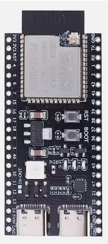
|MAX9814 microphone module|MAX9814 Microphone AGC Amplifier Board|1||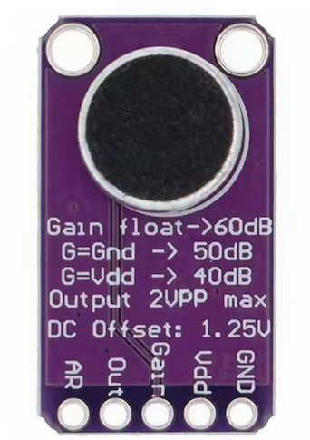|
|5V DC-DC converter | mini560PRO DC-DC 5V output 2A buck converter (step down converter) |1||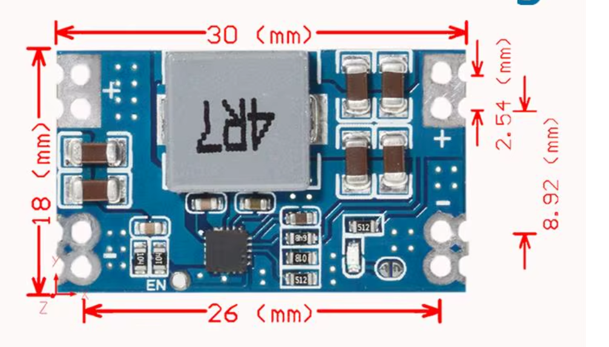|
|PCA9685 board | PCA9685 16 channel servo driver board | |RC servo only|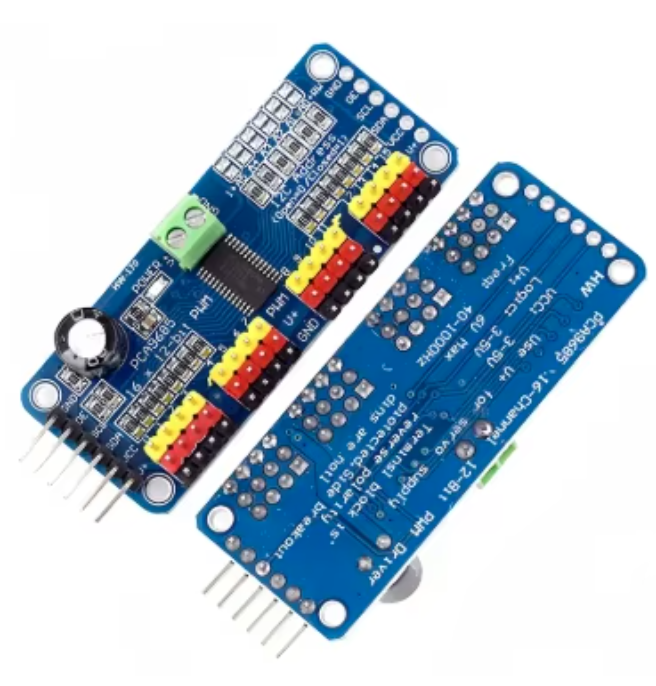|
WS2812B LED||1|
|**COMPONENTS**|
|MCP23017|MCP23017-E/SP DIP-28 16-Bit I/O Expander I2C|2||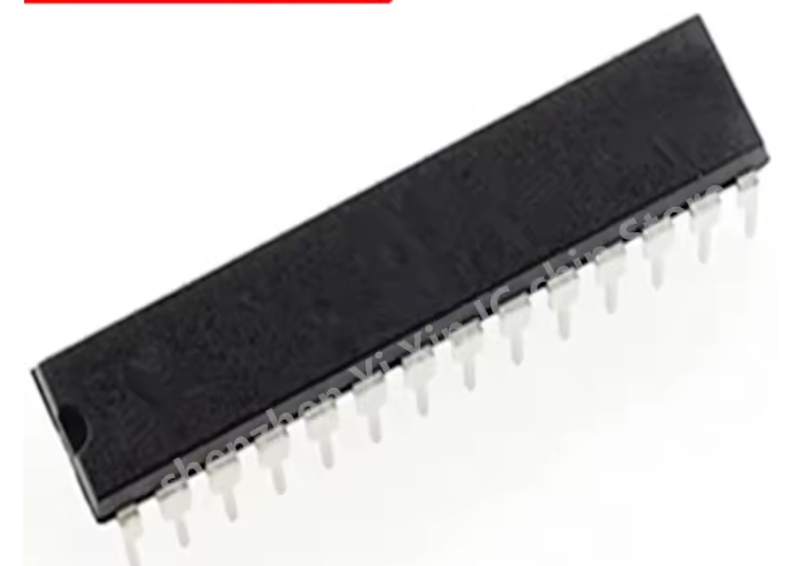|
|ULN2803|ULN2803APG DIP-18 eight Darlington transistor array|5||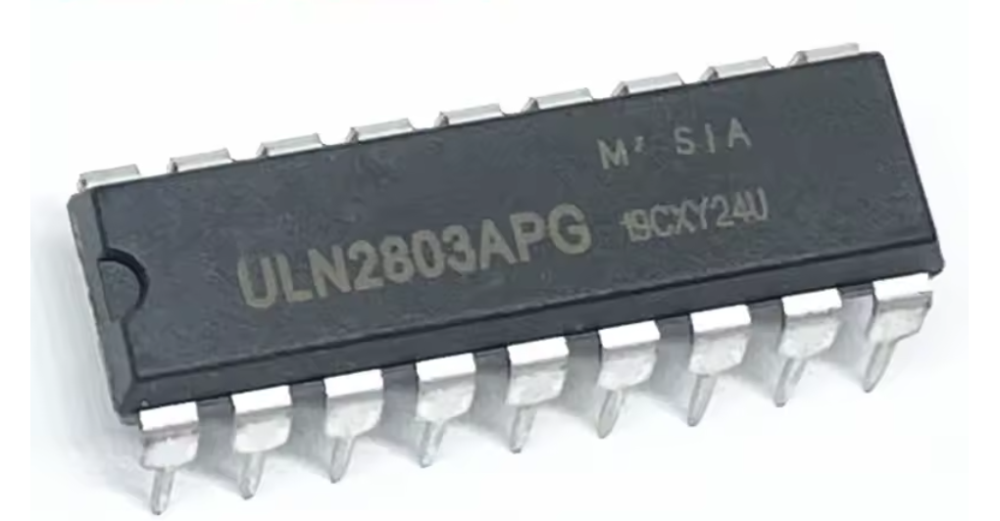|
|ULN2069B| ULN2069B DIP-16 4-channel darlington transistor array 1.5A |1||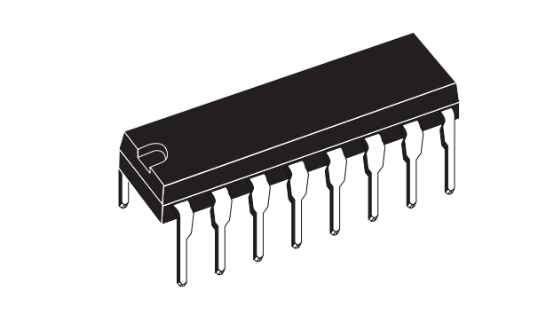
Resistors for internal I2C BUS| 3.3kOhm resistor 0.25W or 0.5W | 2|
Resistors for MIDI output|33Ohm and 10Ohm resistor 0.5W|1 each|
100nF capacitor| 100nF ceramic capacitor|2|
| **CONNECTORS** |
|8p small screw terminal| 8p screw terminal  2.54mm pitch|7||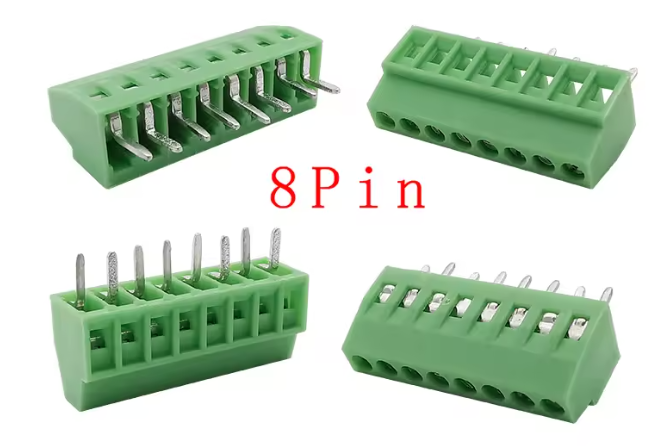|
|3p large screw terminal| 3p screw terminal 5.08mm pitch|6||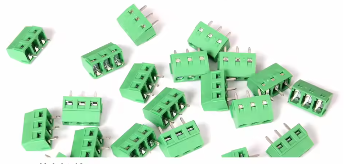|
|40 pin breakable|1x40P Male Breakable Pin Header Strip 2.54mm pitch for PCB Board DIY Soldering. Usually comes in 10 pcs pack|2||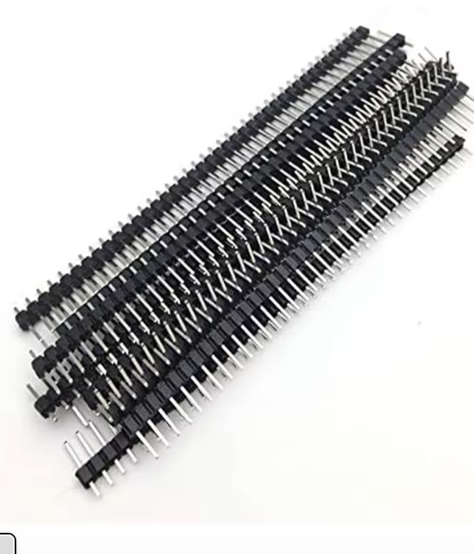|
|40 pin breakable yellow, red, black| Same as previous item but on yellow, red or black.|1| RC servo only| 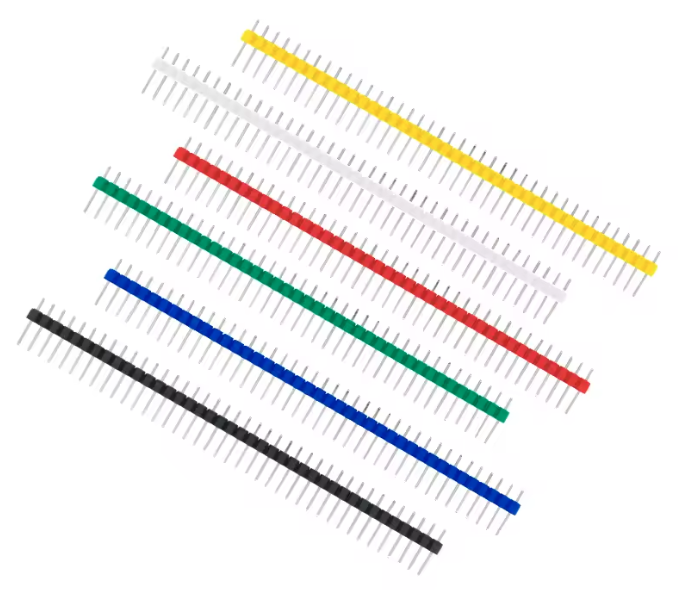|
|40 pin breakable right angle|Same as previous item but in right angle|1|RC servo only|
22x1 socket ESP32-S3|22x1p 2.54pitch single row female socket|2|Optional|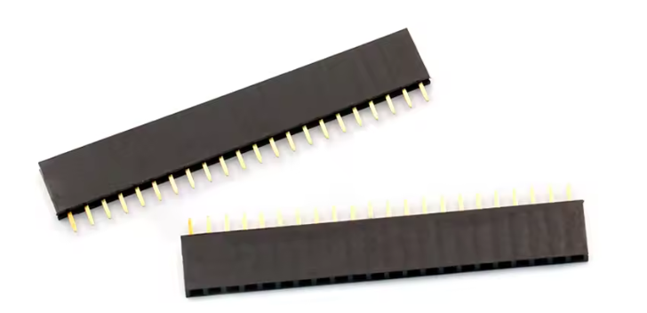|
|6 pin ribbon cable for PCA9685|6pin female-female 2.54pitch |1 for each PCA9685 board|RC servo only| 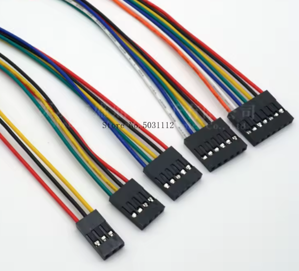|

Notes:

DIP-18,DIP-28 and DIP-16 ("Dual Inline Package") refers the the format of an integrated circuit with 2 rows of pins that fit through a hole as opposed to surface mounted (SMD) components. Make sure you select the DIP format of the component.

Resistance power, measured in Watts:
* 0.5W = 500mW
* 0.25W = 250mW

It may be cheaper to purchase a set of, say 300 resistors of 0.5W than purchasing single resistors.

Pitch = distance between pins:
* 2.54mm = 100mil = 0.1 inch
* 5.08mm = 200mil = 0.2 inch

## Electronic components for 16 channel expansion board
| Designator| Description| Quantity |  |
|-----------|------------|----------|-------|
Ribbon cable (male)| DB9 FC-10P Female 2.54mm Flat Ribbon Cable|1 ||
Ribbon cable (female)| DB9 FC-10P Male 2.54mm Flat Ribbon Cable|1||
MCP23017| same as above| 1||
ULN2003| ULN2003A 7-channel darlington transistor array |3 ||
3 pin screw terminal||1||
8 pin small screw terminal||3||
2 strips of 3 pins broken from 40p strip||||

# 10. Assembly

PENDING>>>

# 11. Some tips

The instructions call for soldering a bridge to select the VSUPPLY and the microphone gain. If you don't want to set that fixed, solder 3 pins in a row in those spaces and use a 2.54 jumper plug to make the connection. 

If a DC-DC 5V converter is installed, 5VIN can be used as a source for 5V up to 500mA output (probably more).

For the male pin headers or male pins on the board, buy a breakable strip of 40 male pins. They are cheap and come in 10 packs. Don't bother to buy 2x5 or 1x3 pin headers.

To solder the ESP32-S3 you may want to use a 22x1pin female socket, solder the socket and make the ESP32-S3 removable. Make sure you solder the female socket with the ESP32-S3 inserted, so the sockets will be in the correct position.

You have the permission to give away the surplus boards you bought (perhaps with a shipping fee). Make a fellow hobbyist happy.

